**窗体显示**

任何一个图形界面都包含一个主窗体，在主窗体内可以设置不同的组件。tkinter模块中提供了Tk类，负责窗体的创建以及相关的属性定义。

| 方法                                            | 描述                     |
| ----------------------------------------------- | ------------------------ |
| def title(self, string=None)                    | 设置窗体显示标题         |
| def iconbitmap(self, bitmap=None, default=None) | 设置窗体logo             |
| def geometry(self, newGeometry=None)            | 设置窗体大小             |
| def minsize(self, width=None, height=None)      | 设置窗体最小化尺寸       |
| def maxsize(self, width=None, height=None)      | 设置窗体最大化尺寸       |
| def mainloop(self, n=0)                         | 界面循环及时显示窗体变化 |

`mainloop()`方法的主要作用是进行窗体的显示，所有的窗体都是基于绘图的原理绘制的，所以调用此方法表示窗体进行持续的状态的显示变化。

---

【代码】创建窗体

```python
import tkinter

class MainForm:
    """
        窗体类
    """
    def __init__(self):
        self.root = tkinter.Tk()         # 创建窗体
        self.root.title("GUI编程")
        self.root.geometry("500x200")    # 初始化窗口尺寸
        self.root.maxsize(1000, 400)     # 最大尺寸
        self.root["background"] = "LightSlateGray"   # 浅青灰色
        self.root.mainloop()             # 显示窗体

def main():
    MainForm()

if __name__ == "__main__":
    main()
```

> 运行结果

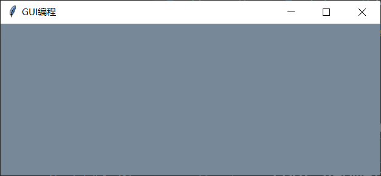

---


**基础控件**

在tkinter模块中提供了Label组件类。在一个窗体中如果要定义一些提示文字信息就可以利用标签。

所有的GUI组件一定要在窗体上进行各种配置，而每个组件本身有需要进行布局。如果标签没有进行布局的控制，就会按照基本的样式进行显示处理。

为了方便人机交互，基本都要求有一个文本输入。在tkinter模块中提供有Text组件类，这个类的最大特点就是可以进行单行文本、多行文本、图片、HTML代码的显示处理能力。

按钮是在图形界面之中最为常见的指令发送组件，在图形界面之中往往都是通过Text文本组件进行文字内容的输入，而后利用按钮进行相应的处理。在tkinter模块中使用Button可以实现按钮的定义。

---

【代码】基础控件

```python
import tkinter

class MainForm:
    def __init__(self):
        self.root = tkinter.Tk()
        self.root.title("GUI编程")
        self.root.geometry("500x200")

        # 标签
        self.label = tkinter.Label(
            self.root, text="用户名",
            width=10, height=5,
            font=("微软雅黑", 14)
        )

        # 文本
        self.text = tkinter.Text(
            self.root, width=20, height=1,
            font=("微软雅黑", 12)
        )
        self.text.insert(tkinter.CURRENT, "输入用户名")

        # 按钮
        self.button = tkinter.Button(self.root, text="登录")

        # 组件布局
        self.label.pack(side="left")
        self.text.pack(side="left")
        self.button.pack(side="left")

        self.root.mainloop()

def main():
    MainForm()

if __name__ == "__main__":
    main()
```

> 运行结果

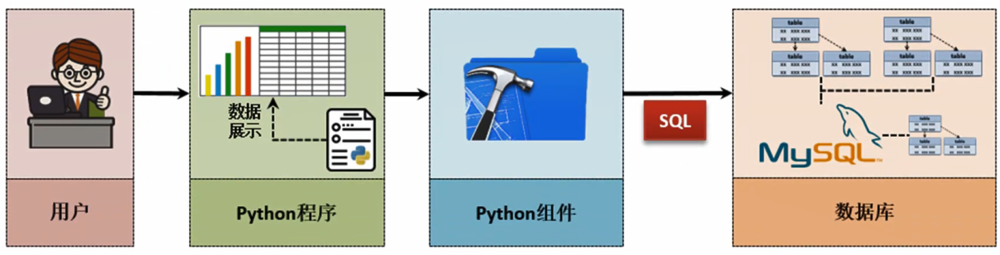

---

<div style="page-break-after: always;"></div>

## 14.2 事件处理

**事件处理**

图形界面中除了组件的基本展示之外，最为重要的就是要定义与组件有关的事件处理操作。在tkinter中可以方便地为每一个组件进行事件绑定，并且设置事件的相关处理函数，这样每当触发相应的事件之后就可以通过特定地函数实现事件处理。

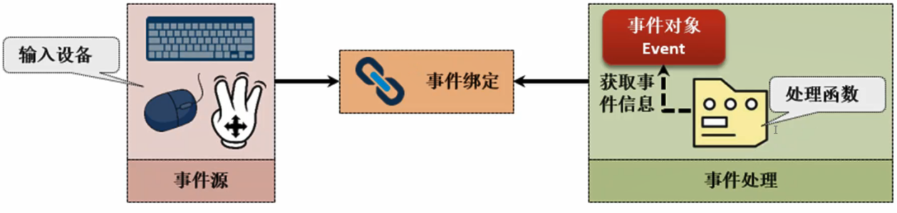

当事件触发后会产生一个事件对象，利用这个事件对象可以在处理函数中获得相应的数据信息（例如哪一个组件触发的操作、操作的坐标等）。

通过使用`bind()`方法可以进行事件的绑定，而在绑定的时候一定要有每一个方法对应的事件的类型，事件的类型是由tkinter规定好的。

| 事件类型      | 描述                                                         |
| ------------- | ------------------------------------------------------------ |
| Active        | 当组件由“未激活状态”变为“激活状态”时触发                     |
| Deactivate    | 当组件由“激活状态”变为“未激活状态”时触发                     |
| Button        | 当用户点击鼠标按键时触发，`<Button-1>`表示鼠标左键按下；`<Button-2>`表示鼠标中键按下；`<Button-3>`表示鼠标右键按下；`<Button-4>`表示鼠标滚轮上滚；`<Button-5>`表示鼠标滚轮下滚 |
| ButtonRelease | 鼠标按键松开时触发                                           |
| Configure     | 当组件尺寸改变时触发（界面移动或修改大小时会产生界面重绘事件） |
| Enter         | 当鼠标指针进入组件时触发                                     |
| Expose        | 当组件不再被覆盖时触发                                       |
| FocusIn       | 当组件获得焦点时触发                                         |
| FocusOut      | 当组件失去焦点时触发                                         |
| KeyPress      | 当键盘按下时触发，例如按键`y`按下被触发则使用`<KeyPress-y>`或`<Key-y>`定义，回车键为`<Key-Return>` |
| KeyRelease    | 当按键松开时触发                                             |
| Leave         | 当鼠标指针离开组件时触发                                     |
| Map           | 当组件被映射时触发                                           |
| Motion        | 当鼠标在组件内部移动时触发                                   |
| Unmap         | 当组件被取消映射时触发                                       |
| Visibility    | 当应用组件可见时触发                                         |
| MouseWheel    | 当鼠标在组件内部滚轮滚动时触发                               |

---

【代码】验证邮箱合法性

```python
import tkinter
import re

# 合法邮箱正则语法
EMAIL = "[a-zA-Z0-9]\\w+@\\w+\\.(cn|com|com.cn|gov|net)"

class MainForm:
    def __init__(self):
        self.root = tkinter.Tk()
        self.root.title("邮箱验证")
        self.root.geometry("500x200")

        self.text = tkinter.Text(
            self.root, width=500, height=2,
            font=("微软雅黑", 20)
        )
        # 提示信息
        self.text.insert("current", "输入邮箱")
        # 鼠标单击后删除文本组件中的全部内容
        self.text.bind("<Button-1>", 
            lambda event: self.text.delete("0.0", "end"))
        # 绑定键盘事件
        self.text.bind("<KeyPress>", 
            lambda event: self.keyboard_event_handler(event))
        self.text.bind("<KeyRelease>", 
            lambda event: self.keyboard_event_handler(event))
        self.text.pack()

        self.content = tkinter.StringVar()   # 修改标签文字
        
        self.label = tkinter.Label(
            self.root, width=200, height=200,
            textvariable=self.content,
            bg="#223011", fg="#ffffff",
            font=("微软雅黑", 20)
        )
        self.label.pack()

        self.root.mainloop()
    
    def keyboard_event_handler(self, event):
        """
            键盘处理时间
            Args:
                event: 事件
        """
        # 获取文本框数据
        email = self.text.get("0.0", "end")
        if re.match(EMAIL, email):
            self.content.set("验证成功！")
        else:
            self.content.set("格式错误！")

def main():
    MainForm()
    
if __name__ == "__main__":
    main()
```

> 运行结果

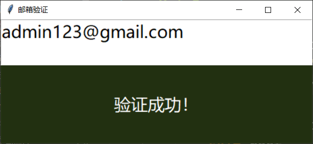

---

<div style="page-break-after: always;"></div>

## 14.3 GUI布局

**pack布局**

pack布局是GUI布局之中最为常见的一种形式，这种布局属于顺序式排列布局。如果没有引入布局管理器的概念，实际上组件是不会显示的。如果没有对布局管理器进行合理的配置，显示的效果就会非常混乱。

| 参数   | 取值范围                                   | 描述                                                 |
| ------ | ------------------------------------------ | ---------------------------------------------------- |
| fill   | none、x、y、both                           | 设置组件是否向水平或垂直方向填充，水平填充`fill="x"` |
| expand | yes（1）、no（0）                          | 设置组件是否可以展开，默认为不展开                   |
| side   | left、right、top、bottom                   | 设置组件的摆放位置                                   |
| anchor | n、s、w、e、nw、ne、sw、se、center（默认） | 可以在窗体中八个方位设置组件                         |

---

【代码】pack布局

```python
import tkinter

class MainForm:
    def __init__(self):
        self.root = tkinter.Tk()
        self.root.title("GUI编程")
        self.root.geometry("500x200")

        label = tkinter.Label(
            self.root, text="用户名",
            width=10, height=2,
            font=("微软雅黑", 14)
        )
        text = tkinter.Text(
            self.root, width=20, height=2,
            font=("微软雅黑", 14)
        )
        text.insert("current", "输入用户名")

        label.pack(side="top")
        text.pack(side="bottom")
        self.root.mainloop()

def main():
    MainForm()

if __name__ == "__main__":
    main()
```

> 运行结果

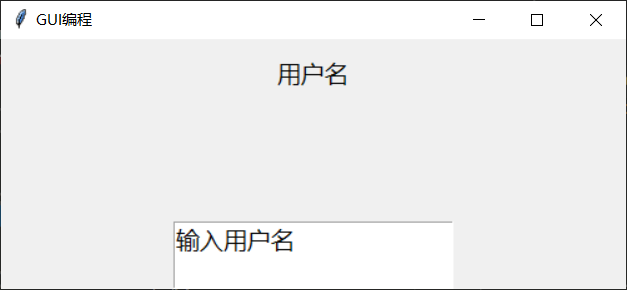

---


**grid布局**

grid布局利用表结构的形式来实现布局的管理，在一张数据表里面一定会有行和列，在使用grid布局的时候就可以通过行和列实现组件的摆放。

计算器实际上就属于一种grid布局的形式。

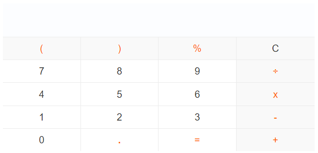

---

【代码】grid布局

```python
import tkinter

class MainForm:
    def __init__(self):
        self.root = tkinter.Tk()
        self.root.title("GUI编程")
        self.root.geometry("500x200")
        label1 = tkinter.Label(self.root, text="标签1")
        label2 = tkinter.Label(self.root, text="标签2")
        label1.grid(row=0, column=0)
        label2.grid(row=1, column=1)
        self.root.mainloop()

def main():
    MainForm()

if __name__ == "__main__":
    main()
```

> 运行结果

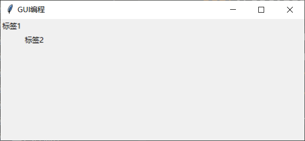

---


**place布局**

place布局是布局管理器之中最灵活的一种布局形式，它采用的是坐标点位置的布局操作。

---

【代码】place布局

```python
import tkinter

class MainForm:
    def __init__(self):
        self.root = tkinter.Tk()
        self.root.title("GUI编程")
        self.root.geometry("500x200")
        label = tkinter.Label(self.root, text="标签")
        label.place(x=100, y=50)
        self.root.mainloop()

def main():
    MainForm()

if __name__ == "__main__":
    main()
```

> 运行结果

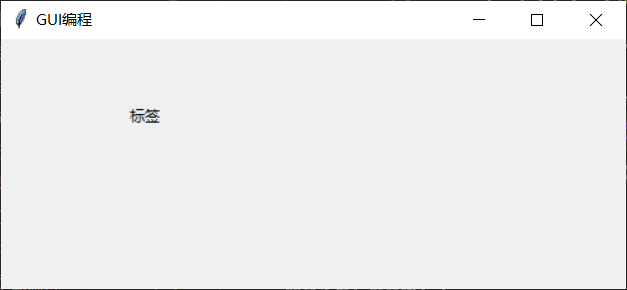

---


**Frame**

Frame是布局管理最为重要的一项布局技术，但是Frame本身并不是布局，而是一种内嵌的布局管理器。在一个窗体中针对不同的功能组件定义一个单独的区域，每一个区域相当于就是一个Frame，这些区域的内部都可以使用不同的布局管理器。

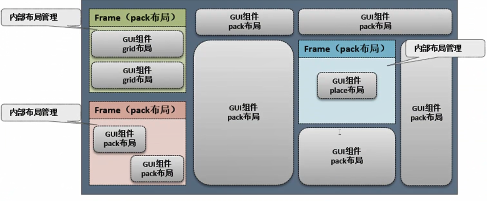

最具有代表性的Frame程序就是Windows中的计算器。

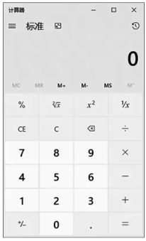

---

【代码】计算器

```python
import tkinter
import re

class MainForm:
    def __init__(self):
        self.root = tkinter.Tk()
        self.root.title("计算器")
        self.root.geometry("231x280")
        self.input_frame()      # 输入区
        self.button_frame()     # 按钮区
        self.root.mainloop()
    
    def input_frame(self):
        """
            输入区
        """
        # 创建内部容器
        self.in_frame = tkinter.Frame(self.root, width=20)
        self.content = tkinter.StringVar()
        # 单行输入
        self.entry = tkinter.Entry(
            self.in_frame, width=14,
            font=("微软雅黑", 20),
            textvariable=self.content
        )
        self.entry.pack(fill="x", expand=1)
        # 清除标记，每一次计算完成后清除
        self.clean = False
        self.in_frame.pack(side="top")
    
    def button_frame(self):
        """
            按钮区
        """
        self.btn_frame = tkinter.Frame(self.root, width=50)
        self.button_list = [[], [], [], []]     # 4行4列
        button = "123+456-789*0.=/"
        
        for row in range(4):
            for col in range(4):
                self.button_list[row].append(
                    tkinter.Button(
                        self.btn_frame,
                        text=button[4*row+col],
                        fg="black", width=3,
                        font=("微软雅黑", 20),
                    )
                )
        
        self.row = 0
        for group in self.button_list:
            self.column = 0
            for button in group:
                # 绑定事件
                button.bind("<Button-1>", lambda event: self.button_handler(event))
                button.grid(row=self.row, column=self.column)
                self.column += 1
            self.row += 1
        self.btn_frame.pack(side="bottom")

    def button_handler(self, event):
        """
            按键事件处理
            Args:
                event: 单击事件
        """
        op = event.widget["text"]   # 获取按钮内容

        if self.clean:      # 新一次计算
            self.content.set("")    # 清除数据
            self.clean = False
        
        if op != "=":
            self.entry.insert("end", op)
        elif op == "=":
            result = 0
            expression = self.entry.get()
            pattern = r"\+|\-|\*|\/"

            nums = re.split(pattern, expression)
            op = re.findall(pattern, expression)[0]

            if op == "+":
                result = float(nums[0]) + float(nums[1])
            elif op == "-":
                result = float(nums[0]) - float(nums[1])
            elif op == "*":
                result = float(nums[0]) * float(nums[1])
            elif op == "/":
                result = float(nums[0]) / float(nums[1])
                
            self.entry.insert("end", "=%s" % result)
            self.clean = True

def main():
    MainForm()

if __name__ == "__main__":
    main()
```

> 运行结果

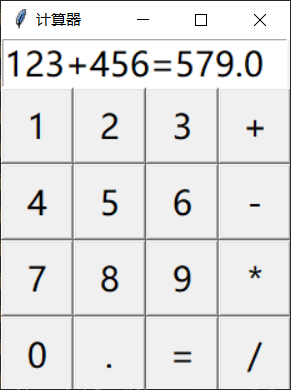

---

<div style="page-break-after: always;"></div>

## 14.4 GUI组件

**列表（Listbox）**

Listbox是进行列表显示的组件，可以向列表中添加多个列表项，这些列表项会依次排列。列表项可以进行动态的控制（添加、删除），还可以设置列表项是单选还是多选。

| 名称                               | 类型 | 描述                       |
| ---------------------------------- | :--: | -------------------------- |
| BROWSE                             | 常量 | 每次只能选择一项，可以拖动 |
| SINGLE                             | 常量 | 每次只能选择一项，不能拖动 |
| MULTIPLE                           | 常量 | 每次可以选择多项           |
| def insert(self, index, *elements) | 方法 | 追加列表项                 |
| def curselection(self)             | 方法 | 获取选中列表项索引         |
| def delete(self, first, last=None) | 方法 | 删除指定索引的列表项       |

---

【代码】Listbox

```python
import tkinter

class MainForm:
    def __init__(self):
        self.root = tkinter.Tk()
        self.root.geometry("500x200")
        self.src_list()     # 待选区
        self.dst_list()     # 已选区
        self.set_button()   # 按钮区
        self.root.mainloop()
    
    def src_list(self):
        """
            待选区列表
        """
        self.src_label = tkinter.Label(
            self.root,
            text="选择擅长的编程语言",
            bg="#223011", fg="#fff",
            font=("微软雅黑", 9)
        )
        self.src_label.grid(row=0, column=0)
        self.languages = [
            "Python", "Java", "JavaScript",
            "C", "C++", "PHP", "Go", 
        ]
        self.language_listbox = tkinter.Listbox(
            self.root, selectmode="multiple"
        )
        for language in self.languages:
            self.language_listbox.insert("end", language)
        # 双击选中
        self.language_listbox.bind(
            "<Double-Button-1>", self.add_handler
        )
        self.language_listbox.grid(row=1, column=0)
    
    def dst_list(self):
        """
            已选区列表
        """
        self.dst_label = tkinter.Label(
            self.root, text="擅长的编程语言",
            bg="#223011", fg="#fff",
            font=("微软雅黑", 9)
        )
        self.dst_label.grid(row=0, column=3)
        self.selected_listbox = tkinter.Listbox(
            self.root, selectmode="multiple"
        )
        self.selected_listbox.grid(row=1, column=3)
    
    def set_button(self):
        """
            设置按钮
        """
        self.add_btn = tkinter.Button(
            self.root, text="添加 >>",
            fg="#000", font=("微软雅黑", 9)
        )
        self.add_btn.bind("<Button-1>", self.add_handler)
        self.add_btn.grid(row=1, column=1)
    
    def add_handler(self, event):
        """
            添加按钮事件处理
        """
        # 获取全部被选中的数据索引
        for index in self.language_listbox.curselection():
            self.selected_listbox.insert(
                "end", self.language_listbox.get(index)
            )
        # 索引在每一次删除之后都会动态改变
        while True:
            # 有被选中的项
            if self.language_listbox.curselection():
                # 删除当前项
                self.language_listbox.delete(
                    self.language_listbox.curselection()[0]
                )
            else:
                break

def main():
    MainForm()

if __name__ == "__main__":
    main()
```

> 运行结果

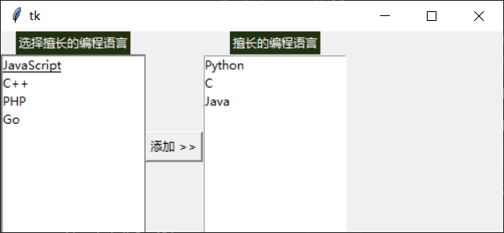

---


**单选钮（Radiobutton）**

Radiobutton实现了单选钮的操作，给定若干的选项，但是只允许选择一项，这些选项属于互斥的状态。

---

【代码】Radiobutton

```python
import tkinter

class MainForm:
    def __init__(self):
        self.root = tkinter.Tk()
        self.root.geometry("500x200")

        # 单选按钮需要设置显示内容和对应数据值
        self.sex = [("男", 0), ("女", 1)]

        self.label = tkinter.Label(
            self.root, text="选择性别：",
            font=("微软雅黑", 14)
        )
        self.label.grid(row=0, column=0)

        pos = 1
        for title, index in self.sex:
            radio = tkinter.Radiobutton(
                self.root, font=("微软雅黑", 14),
                text=title, value=index,
            )
            radio.grid(row=0, column=pos)
            pos += 1

        self.root.mainloop()

def main():
    MainForm()

if __name__ == "__main__":
    main()
```

> 运行结果

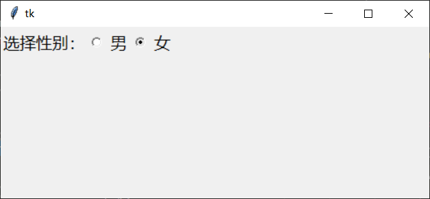

---


**复选框（Checkbutton）**

复选框每次可以同时选择多个数据项。

---

【代码】Checkbutton

```python
import tkinter

class MainForm:
    def __init__(self):
        self.root = tkinter.Tk()
        self.root.geometry("500x200")

        self.label = tkinter.Label(
            self.root, text="选择擅长的编程语言",
            font=("微软雅黑", 12)
        )
        self.label.pack(anchor="w")

        self.language = [
            ("Java", tkinter.IntVar()),
            ("Python", tkinter.IntVar()),
            ("C", tkinter.IntVar()),
            ("C++", tkinter.IntVar()),
            ("JavaScript", tkinter.IntVar())
        ]
        for title, status in self.language:
            check = tkinter.Checkbutton(
                self.root,
                text=title, variable=status,
                onvalue=1, offvalue=0,
                command=self.select_handler
            )
            check.pack(anchor="w")
        
        self.content = tkinter.StringVar()
        self.show_label = tkinter.Label(
            self.root, font=("微软雅黑", 12),
            textvariable=self.content,
        )
        self.show_label.pack(anchor="w")

        self.root.mainloop()
    
    def select_handler(self):
        result = "擅长的技术："
        for title, status in self.language:
            if status.get() == 1:   # 选中为1
                result += title + " "
        self.content.set(result)

def main():
    MainForm()

if __name__ == "__main__":
    main()
```

> 运行结果

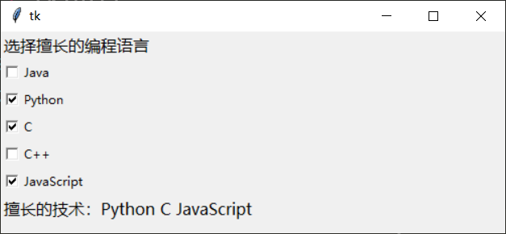

---


**滑块（Scale）**

tkinter.Scale是一个滑块组件，像操作系统中经常使用滑块拖动的形式修改音量大小。Scale定义了一个区间范围，区间的数值是通过Scale进行控制的。

---

【代码】Scale

```python
import tkinter

class MainForm:
    def __init__(self):
        self.root = tkinter.Tk()
        self.root.geometry("500x200")

        self.label = tkinter.Label(
            self.root, text="测试文本", 
            font=("微软雅黑", 1), fg="#f00"
        )
        self.label.pack(anchor="w")

        self.scale = tkinter.Scale(
            self.root, label="拖动调整文字大小",
            from_=0, to=20,
            orient=tkinter.HORIZONTAL,
            length=300, tickinterval=2,
            showvalue=True, resolution=True
        )
        self.scale.bind("<B1-Motion>", self.font_handler)
        self.scale.pack(anchor="s")

        self.root.mainloop()
    
    def font_handler(self, event):
        self.label.config(font=("微软雅黑", self.scale.get()))

def main():
    MainForm()

if __name__ == "__main__":
    main()
```

> 运行结果

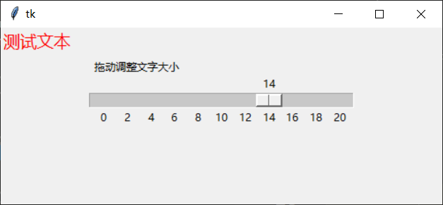

---


**滚动条（Scrollbar）**

Scrollbar是一个滚动条组件，它并不是一种固定的组件，而是一种辅助功能组件。例如列表项内容过多，通过滚动条的形式就可以方便地进行控制。

---

【代码】Scrollbar

```python
import tkinter

class MainForm:
    def __init__(self):
        self.root = tkinter.Tk()
        self.root.geometry("500x200")

        self.label = tkinter.Label(
            self.root, text="内容",
            font=("微软雅黑", 12)
        )
        self.label.pack(anchor="nw")

        self.frame = tkinter.Frame(self.root)   # 内部容器
        self.listbox = tkinter.Listbox(
            self.frame,
            height=5, width=80
        )
        for i in range(100):
            self.listbox.insert(tkinter.END, "item %d" % i)
        
        self.scrollbar = tkinter.Scrollbar(self.frame)
        self.scrollbar.config(command=self.listbox.yview)
        self.scrollbar.pack(side="right", fill="y")
        self.listbox.pack()
        self.frame.pack(anchor="w")

        self.root.mainloop()

def main():
    MainForm()

if __name__ == "__main__":
    main()
```

> 运行结果

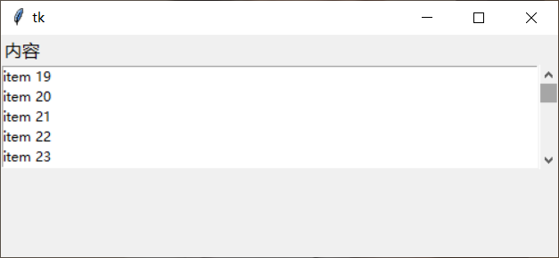

---


**菜单（Menu）**

菜单可以充分发挥出界面开发的优势，同时也可以极大地改善界面布局。

| 方法                                            | 描述           |
| ----------------------------------------------- | -------------- |
| def add_command(self, cnf={}, **kw)             | 追加菜单项     |
| def add_separator(self, cnf={}, **kw)           | 菜单分割线     |
| def add_cascade(self, cnt={}, **kw)             | 追加子菜单     |
| def post(self, x, y)                            | 弹出式菜单显示 |
| def insert(self, index, itemType, cnf={}, **kw) | 追加菜单项     |

---

【代码】Menu

```python
import tkinter

class MainForm:
    def __init__(self):
        self.root = tkinter.Tk()
        self.root.geometry("500x200")
        self.create_menu()
        self.root.mainloop()
    
    def create_menu(self):
        self.menu = tkinter.Menu(self.root)

        self.file_menu = tkinter.Menu(self.menu, tearoff=False)
        self.file_menu.add_command(label="打开", command=self.menu_handler)
        self.file_menu.add_command(label="保存", command=self.menu_handler)
        self.file_menu.add_separator()
        self.file_menu.add_command(label="关闭", command=self.root.quit)
        self.menu.add_cascade(label="文件", menu=self.file_menu)

        self.edit_menu = tkinter.Menu(self.menu, tearoff=False)
        self.edit_menu.add_command(label="剪切", command=self.menu_handler)
        self.edit_menu.add_command(label="复制", command=self.menu_handler)
        self.edit_menu.add_command(label="粘贴", command=self.menu_handler)
        self.edit_menu.add_separator()
        self.edit_menu.add_command(label="设置", command=self.root.quit)
        self.menu.add_cascade(label="编辑", menu=self.edit_menu)

        self.root.config(menu=self.menu)

        self.pop_menu = tkinter.Menu(self.root, tearoff=False)
        self.pop_menu.add_command(label="帮助", command=self.popup_handler)
        self.root.bind("<Button-3>", self.popup_handler)
    
    def menu_handler(self):
        pass

    def popup_handler(self, event):
        self.pop_menu.post(event.x_root, event.y_root)

def main():
    MainForm()

if __name__ == "__main__":
    main()
```

> 运行结果

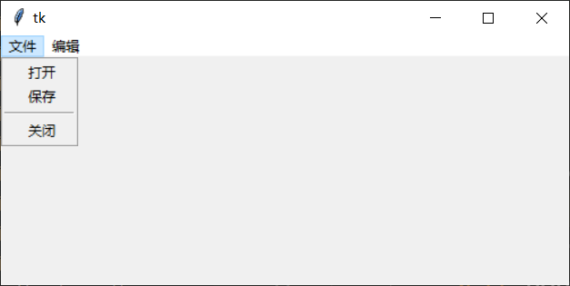

---

<div style="page-break-after: always;"></div>

## 14.5 graphics

**graphics**

graphics是一个第三方组件，这个组件提供有专门的绘图支持。

---

【代码】四则运算

```python
import graphics

def main():
    win = graphics.GraphWin("四则运算", 700, 230)

    # 数字1输入框
    graphics.Text(graphics.Point(80, 50), "数字1").draw(win)
    input_num1 = graphics.Entry(graphics.Point(160, 50), 8)
    input_num1.setFill("white")     # 输入框底色
    input_num1.setText("0.0")
    input_num1.draw(win)

    # 数字2输入框
    graphics.Text(graphics.Point(280, 50), "数字2").draw(win)
    input_num2 = graphics.Entry(graphics.Point(360, 50), 8)
    input_num2.setFill("white")     # 输入框底色
    input_num2.setText("0.0")
    input_num2.draw(win)

    # 提示信息
    graphics.Text(graphics.Point(80, 100), "【四则运算】").draw(win)

    # 加法
    graphics.Text(graphics.Point(120, 150), "加法").draw(win)
    output_add = graphics.Entry(graphics.Point(250, 150), 15)
    output_add.setFill("white")
    output_add.draw(win)

    # 减法
    graphics.Text(graphics.Point(400, 150), "减法").draw(win)
    output_sub = graphics.Entry(graphics.Point(530, 150), 15)
    output_sub.setFill("white")
    output_sub.draw(win)

    # 乘法
    graphics.Text(graphics.Point(120, 200), "乘法").draw(win)
    output_mul = graphics.Entry(graphics.Point(250, 200), 15)
    output_mul.setFill("white")
    output_mul.draw(win)

    # 除法
    graphics.Text(graphics.Point(400, 200), "除法").draw(win)
    output_div = graphics.Entry(graphics.Point(530, 200), 15)
    output_div.setFill("white")
    output_div.draw(win)

    # 鼠标单击开始计算
    win.getMouse()

    # 计算并显示结果
    output_add.setText(
        eval(input_num1.getText()) + eval(input_num2.getText())
    )
    output_sub.setText(
        eval(input_num1.getText()) - eval(input_num2.getText())
    )
    output_mul.setText(
        eval(input_num1.getText()) * eval(input_num2.getText())
    )
    output_div.setText(
        eval(input_num1.getText()) / eval(input_num2.getText())
    )

    win.mainloop()

if __name__ == "__main__":
    main()
```

> 运行结果


---

## 14.6 turtle

**turtle**

海龟绘图turtle模块是最有特色的一个第三方模块，这个模块可以让整个程序变得非常生动。

---

【代码】绘制五角星

```python
import turtle

def main():
    turtle.shape(name="turtle")     # 使用海龟作为画笔
    turtle.Screen().title("五角星")
    turtle.Screen().bgcolor("red")  # 背景色
    turtle.pensize(3)               # 画笔大小
    turtle.pencolor("yellow")       # 画笔颜色
    turtle.fillcolor("yellow")      # 填充色

    turtle.begin_fill()             # 开始填充
    for _ in range(5):              # 绘制5条线
        turtle.forward(320)         # 向前移动
        turtle.right(144)           # 向右旋转144°
    turtle.end_fill()               # 结束填充

    turtle.penup()                  # 抬起画笔
    turtle.goto(-200, -120)         # 移动位置
    turtle.color("white")
    turtle.write("Turtle", font=("微软雅黑", 20))
    turtle.mainloop()

if __name__ == "__main__":
    main()
```

> 运行结果

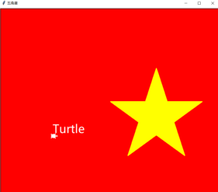

---

【代码】迷宫

- maze.txt

```
0 0 0 0 0 0 0 0 0 0 0 0 0 0 0 0 0 0 0 0 0 0 0 0 0 0 0 0 0 0 0 0 0
0 1 1 1 0 1 0 1 1 1 1 1 0 1 1 1 1 1 0 1 1 1 0 1 1 1 1 1 1 1 1 1 0
0 1 0 1 0 1 0 1 0 0 0 0 0 1 0 0 0 0 0 1 0 0 0 1 0 0 0 0 0 1 0 0 0
0 0 1 1 1 1 1 1 0 1 1 1 1 1 1 1 1 1 0 1 0 1 1 1 1 1 1 1 0 1 1 1 0
0 0 0 1 0 0 0 0 0 0 0 1 0 0 0 1 0 0 0 1 0 1 0 1 0 1 0 1 0 0 0 1 0
0 0 1 S 1 1 1 1 1 1 1 1 0 1 0 1 1 1 1 1 1 1 0 1 0 1 0 1 1 1 0 1 0
0 0 0 1 0 1 0 0 0 0 0 0 0 1 0 1 0 0 0 1 0 1 0 1 0 1 0 1 0 1 0 1 0
0 0 1 1 0 1 1 1 0 1 1 1 1 1 0 1 1 1 0 1 0 1 0 1 0 1 0 1 1 1 0 1 0
0 0 0 1 0 1 0 0 0 1 0 1 0 1 0 0 0 0 0 1 0 D 0 1 0 1 0 0 0 1 0 0 0
0 0 1 1 0 1 1 1 1 1 0 1 0 1 1 1 0 1 0 1 0 1 0 1 0 1 1 1 0 1 0 1 0
0 0 0 1 0 1 0 1 0 1 0 0 0 0 0 0 0 1 0 0 0 1 0 1 0 1 0 0 0 1 0 1 0
0 0 1 1 0 1 0 1 0 1 1 1 1 1 1 1 1 1 1 1 0 1 0 1 0 1 1 1 0 1 1 1 0
0 0 0 1 0 0 0 0 0 1 0 0 0 0 0 1 0 1 0 0 0 0 0 0 0 0 0 0 0 1 0 1 0
0 0 1 1 0 1 1 1 1 1 1 1 1 1 0 1 0 1 1 1 1 1 1 1 1 1 1 1 0 1 0 1 0
0 0 0 0 0 1 0 1 0 1 0 1 0 1 0 1 0 1 0 1 0 0 0 1 0 1 0 0 0 1 0 0 0
0 0 1 1 1 1 0 1 0 1 0 1 0 1 0 1 0 1 0 1 0 1 1 1 0 1 1 1 0 1 0 1 0
0 0 0 0 0 1 0 0 0 0 0 0 0 0 0 0 0 1 0 1 0 0 0 1 0 0 0 1 0 1 0 1 0
0 0 1 1 1 1 1 1 1 1 1 1 1 1 0 1 0 1 0 1 0 1 1 1 1 1 0 1 0 1 1 1 0
0 0 0 1 0 0 0 0 0 1 0 0 0 0 0 1 0 0 0 1 0 1 0 1 0 0 0 1 0 0 0 1 0
0 0 1 1 0 1 1 1 1 1 1 1 1 1 1 1 1 1 0 1 0 1 0 1 1 1 0 1 0 1 1 1 0
0 0 0 0 0 0 0 0 0 0 0 0 0 0 0 0 0 0 0 0 0 0 0 0 0 0 0 0 0 0 0 0 0
```

- maze.py

```python
import turtle
import random

MAZE_FILE = "maze.txt"

class Maze:
    CELL_SIZE = 20      # 单元格尺寸

    def __init__(self, path):
        """
            从文件中获取迷宫数据
           s Args:
                path (str): 迷宫数据路径
        """
        with open(path) as file:
            lines = file.readlines()
        self.maze_data = [line.strip().split(' ') for line in lines]
        self.row = len(self.maze_data)
        self.col = len(self.maze_data[0])
        self.src_x = self.src_y = 0     # 起点坐标
        self.src_row = self.src_col = 0 # 起点行列
    
    def goto(self, x, y, pen):
        pen.up()
        pen.goto(x, y)
        pen.down()

    def draw_maze(self):
        """
            绘制迷宫
        """
        self.screen = turtle.Screen()
        self.screen.title("迷宫")
        self.screen.colormode(255)       # 颜色模式
        self.screen.tracer(0)            # 关闭动画
        self.screen.setup(self.col * self.CELL_SIZE, self.row * self.CELL_SIZE)

        self.pen = turtle.Turtle()  # 画笔
        self.pen.pensize(self.CELL_SIZE * 0.2)  # 画笔大小
        self.pen.hideturtle()       # 隐藏海龟

        for i in range(self.row):
            for j in range(self.col):
                # 墙
                if self.maze_data[i][j] == '0':
                    self.draw_cell(j, i)
                # 起点(Src)
                elif self.maze_data[i][j] == 'S':
                    # 设置起点坐标
                    self.src_x = (j - self.col * 0.5 + 0.5) * self.CELL_SIZE
                    self.src_y = (self.row * 0.5 - i - 0.5) * self.CELL_SIZE
                    # 设置起点所在行列
                    self.src_row = i
                    self.src_col = j
                    self.draw_point(j, i, "purple")
                # 终点(Destination)
                elif self.maze_data[i][j] == 'D':
                    self.draw_point(j, i, "red")
        
    def draw_cell(self, col, row):
        """
            绘制单元格
            Args:
                col (int): 列
                row (int): 行
        """
        x = (col - self.col * 0.5) * self.CELL_SIZE
        y = (self.row * 0.5 - row) * self.CELL_SIZE
        self.goto(x, y, self.pen)

        n = random.randint(110, 150)
        self.pen.color((n, n, n), (n, n, n))
        self.pen.begin_fill()
        for _ in range(4):
            self.pen.forward(self.CELL_SIZE)
            self.pen.right(90)
        self.pen.end_fill()
    
    def draw_point(self, col, row, color):
        """
            绘制起点/终点
            Args:
                col (int): 列
                row (int): 行
                color (str): 点的颜色
        """
        x = (col - self.col * 0.5 + 0.5) * self.CELL_SIZE
        y = (self.row * 0.5 - row - 0.5) * self.CELL_SIZE
        self.goto(x, y, self.pen)
        self.pen.dot(int(self.CELL_SIZE * 0.5), color)
    
    def draw_path(self, col, row, color="blue"):
        """
            绘制路线
            Args:
                col (int): 列
                row (int): 行
                color (str): 路线颜色，默认为蓝色
        """
        x = (col - self.col * 0.5 + 0.5) * self.CELL_SIZE
        y = (self.row * 0.5 - row - 0.5) * self.CELL_SIZE
        self.pen.pencolor(color)
        self.pen.goto(x, y)
    
    def search_next(self, col, row):
        """
            递归搜索迷宫
            Args:
                col (int): 列
                row (int): 行
            Returns:
                [bool]: 找到终点返回True，未找到返回False
        """
        # 超出迷宫范围
        if not (0 <= row < self.row and 0 <= col < self.col):
            return False
        # 终点
        elif self.maze_data[row][col] == 'D':
            self.draw_path(col, row)
            return True
        # 如果是墙，或者已经走过
        elif self.maze_data[row][col] in ['0', 'visited']:
            return False
        
        # 走过当前位置
        self.draw_path(col, row)
        self.maze_data[row][col] = 'visited'

        # 向四个方向探索
        # 改变方向会影响优先级
        # 默认采用[上, 右, 下, 左]
        for x, y in [(0, -1), (1, 0), (0, 1), (-1, 0)]:
            # 递归探索
            foundDest = self.search_next(col + x, row + y)
            # 如果找到终点
            if foundDest:
                self.draw_path(col, row, 'red')
                return True
            else:
                self.draw_path(col, row, 'orange')
        return False
    
    def find_path(self):
        """
            自动寻找终点路线
            Returns:
                [bool]: 找到终点返回True，未找到返回False
        """
        self.goto(self.src_x, self.src_y, self.pen)
        self.pen.seth(90)           # 海龟方向默认朝上
        self.screen.tracer(1)       # 开启动画
        self.screen.delay(5)        # 延迟
        return self.search_next(self.src_col, self.src_row)

def main():
    maze = Maze(MAZE_FILE)
    maze.draw_maze()
    maze.find_path()
    turtle.done()

if __name__ == "__main__":
    main()
```

> 运行结果

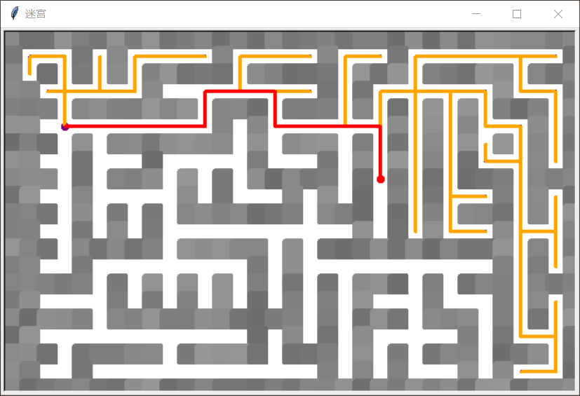

---