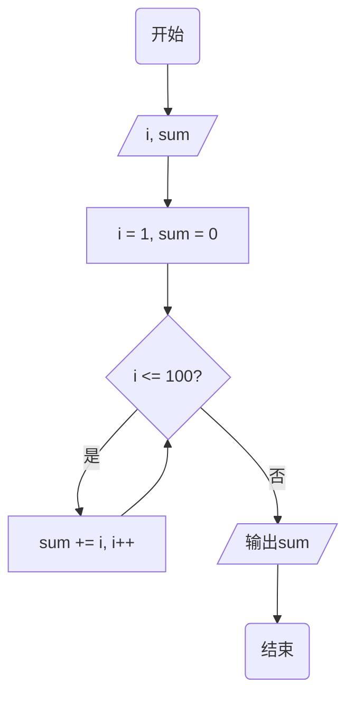
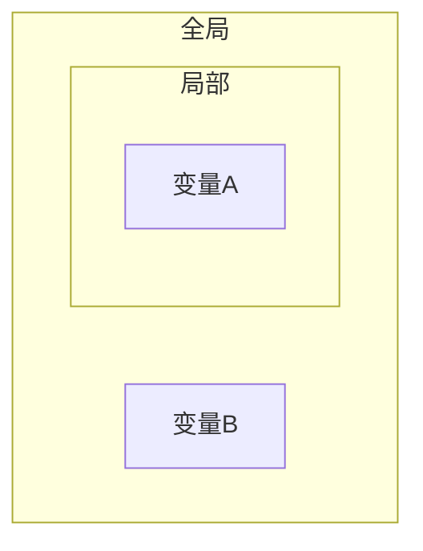
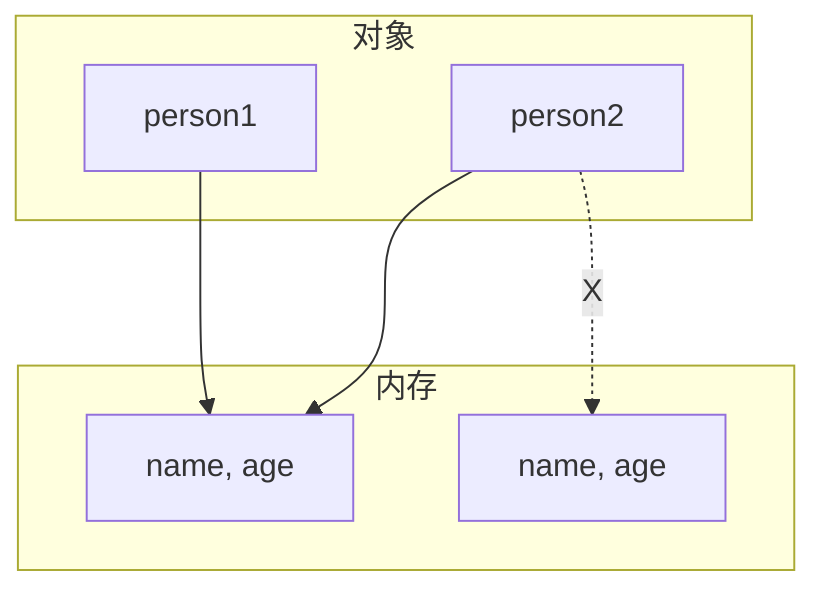
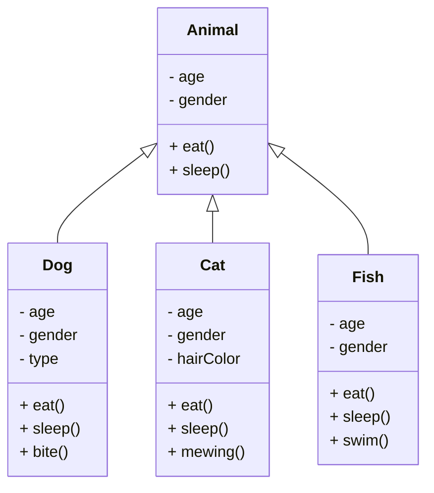
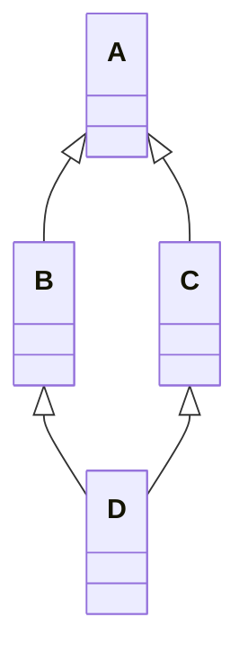

<center><h1>Python</h1></center>

<div style="border-bottom: none;"><center><h3>目录</h3></center></div>

[TOC]

<div style="page-break-after: always;"></div>

# 第1章 基础语法

## 1.1 Python简介

**编程简介**

程序（program）是为了让计算机执行某些操作或者解决问题而编写的一系列有序指令的集合。由于计算机只能够识别二进制数字0和1，因此需要使用特殊的编程语言来描述如何解决问题过程和方法。

算法（algorithm）是可完成特定任务的一系列步骤，算法的计算过程定义明确，通过一些值作为输入并产生一些值作为输出。

流程图（flow chart）是算法的一种图形化表示方式，使用一组预定义的符号来说明如何执行特定任务。

- 圆角矩形：开始和结束
- 矩形：数据处理
- 平行四边形：输入/输出
- 菱形：分支判断条件
- 流程线：步骤




**Python简介**

在当今的环境下Python是一个热门语言，在全世界的范围内，许多大学都开始使用Python作为基础语言的教程，同时在数据分析领域以及人工智能领域也取得了显著的成绩。

Python最大的特点就是简单。同样的一个功能，使用C语言实现需要20行代码，Java需要10行代码，Python的实现只需要4行代码，它从整体的代码量而言是非常简洁的。

- Python具有很强的可读性，比其他语言更有特色语法结构。
- Python是解释型语言，这意味着开发过程中没有了编译环节。
- Python是交互式语言，这意味着可以在提示符`>>>`后直接执行代码。
- Python是面向对象语言，这意味着支持面向对象的风格和代码封装。

虽然Python提供有交互式的命令模式，但是在很多的情况下，对于程序的编写往往是将其定义在源文件之中，在Python里面所有的源文件的后缀名称必须是`.py`。


**Hello World!**

输出的时候使用`print()`函数，函数就是一个完成特定功能的代码组织结构。

---

【代码】Hello World!

```python
print("Hello World!")
```

> 运行结果

```
Hello World!
```

---

<div style="page-break-after: always;"></div>

## 1.2 注释

**注释（Comment）**

在进行项目的开发过程中，不可能说一个项目编写完成一次后就在也不进行修改了。所以很多情况下，为了方便下一次的修改，会在一些关键性的代码上进行一些注释信息的定义，开发者根据这些注释的文字信息就可能直到这段代码的主要作用，方便代码的维护。

Python里面的注释分为两类：

1. 单行注释

    ```python
    # 注释内容
    ```

2. 多行注释

    ```python
    '''
    多行注释
    '''
    
    """
    多行注释
    """
    ```

---

【代码】注释

```python
"""
这是一条
多行注释
"""
print("Hello World!")       # 输出Hello World!
```

> 运行结果

```
Hello World!
```

---

<div style="page-break-after: always;"></div>

## 1.3 标识符

**标识符（Identifier）**

标识符的第一个字符必须是字母表中字母或下划线`_`，标识符的其它部分由字母、数字和下划线组成，标识符对大小写敏感。标识符不可以使用保留字或关键字。标识符应该准确、顾名思义，不要使用汉语拼音。

关键字（key word）也称保留字，关键字是编程语言内置的一些名称，具有特殊的用处和意义。保留字不能用作于标识符名称。Python的标准库提供了一个`keyword`模块，可以输出当前版本的所有关键字。

---

【代码】关键字

```python
import keyword
print(keyword.kwlist)
```

| 关键字 |       |        |          |         |
| :----: | :---: | :----: | :------: | :-----: |
| False  | None  |  True  |   and    |   as    |
| assert | break | class  | continue |   def   |
|  del   | elif  |  else  |  except  | finally |
|  for   | from  | global |    if    | import  |
|   in   |  is   | lambda | nonlocal |   not   |
|   or   | pass  | raise  |  return  |   try   |
| while  | with  | yield  |          |         |

---


**变量（Variable）**

在程序之中所谓的变量指的是可以被改变的内容，而常量指的是绝对不会被改变的内容。Python语言最大的特点是变量都是可以被直接定义的，不需要那些复杂的数据类型的声明，直接使用变量名称即可。

所有的变量实际上都会占据内存空间，当一些变量不再使用的时候，可以使用del关键字对内存空间进行删除。变量一旦被删除了，那么后续的代码部分将无法继续使用它。

---

【代码】变量

```python
num = 10
print(num)
del num
print(num)
```

> 运行结果

```
10
NameError: name 'a' is not defined
```

---

<div style="page-break-after: always;"></div>

## 1.4 数据类型

**数据类型**

Python中的变量不需要声明，但是每个变量在使用前都必须赋值，变量赋值以后该变量才会被创建。在Python中变量没有类型，我们所说的“类型”是变量所指的内存中对象的类型。使用type()函数可以获取变量的数据类型。

在Python中使用等号`=`用来给变量赋值，赋值运算符左边是一个变量名，赋值运算符右边是存储在变量中的值。

布尔是19世纪一位英国数学家的名字，在开发之中布尔主要用于程序的逻辑分支处理，数值包括`True`和`False`。

按照各个传统编程语言的做法来讲，`整数 / 整数 = 整数`。但是Python认为这个结果应该包含有小数（整数的结果变为浮点数类型）。

---

【代码】数据类型

```python
num = 123       # 整型
PI = 3.1415     # 浮点型
s = "hello"     # 字符串
flag = True     # 布尔

print(num)
print(PI)
print(s)
print(flag)

print(type(num))
print(type(PI))
print(type(s))
print(type(flag))

print(10 / 4)
print(type(10 / 4))
```

> 运行结果

```
123
3.1415
hello
True
<class 'int'>
<class 'float'>
<class 'str'>
<class 'bool'>
2.5
<class 'float'>
```

---


**字符串（String）**

字符串是开发中最为重要的概念，一个编程语言是否好用，很大程度上也是取决于是否提供有字符串类型。Python中可以直接使用引号（单引号或双引号）进行字符串的定义。Python并没有字符的概念，所以对于引号表示的含义是相同的。

使用`+`运算符可以进行字符串的连接处理。

---

【代码】字符串连接

```python
str = "Hello" + "World"
str += "!"
print(str)
```

> 运行结果

```
HelloWorld!
```

---


**转义字符（Escaping Character）**

在一个字符串描述的过程中，有可能会有一些特殊的字符的信息。

| 符号 | 描述                       |
| ---- | -------------------------- |
| \    | 续行符，实现字符串多行定义 |
| \\\  | 表示一个反斜杠`\`          |
| \'   | 表示一个单引号`'`          |
| \"   | 表示一个双引号`"`          |
| \n   | 换行                       |
| \v   | 纵向制表符                 |
| \t   | 横向制表符                 |
| \r   | 回车                       |
| \f   | 换页                       |
| \b   | 退格                       |

【代码】转义字符

```python
print("全球最大同性交友网站\n\"https://github.com\"")
```

> 运行结果

```
全球最大同性交友网站
"https://github.com"
```

---

<div style="page-break-after: always;"></div>

## 1.5 数据输入

**input()**

input()用于接受键盘输入。在所有编程语言里面，输入数据的类型是字符串类型。

---

【代码】数据输入

```python
data = input("输入数据：")
print(data)
print(type(data))
```

> 运行结果

```
输入数据：123
123
<class 'str'>
```

---


**转换函数**

很多时候可能需要的是各种类型，例如：整数、浮点数、布尔型，或者将其它类型变为字符串型。如果字符串不是由数字所组成，那么程序的执行就会产生异常。

| 函数        | 描述                       |
| :---------- | -------------------------- |
| int(数据)   | 将指定数据转为整型数据     |
| float(数据) | 将指定数据转为浮点型数据   |
| bool(数据)  | 将指定数据转为布尔型数据   |
| str(数据)   | 将指定数据转为字符串型数据 |

---

【代码】加法计算（Bug版本）

```python
num1 = float(input("输入第一个数字："))
num2 = float(input("输入第二个数字："))
result = num1 + num2
print(num1 + "+" + num2 + "=" + result)
```

> 运行结果

```
输入第一个数字：11.1
输入第二个数字：22.2
TypeError: unsupported operand type(s) for +: 'float' and 'str'
```

---

【代码】加法计算（正确版本）

```python
num1 = float(input("输入第一个数字："))
num2 = float(input("输入第二个数字："))
result = num1 + num2
print(str(num1) + "+" + str(num2) + "=" + str(result))
```

> 运行结果

```
输入第一个数字：11.1
输入第二个数字：22.2
11.1+22.2=33.3
```

---

<div style="page-break-after: always;"></div>

## 1.6 格式化输出

**格式化输出**

为了解决数据的输出问题，Python提供有格式化的输出操作。

| 标记 | 描述                               |
| :--: | ---------------------------------- |
|  %c  | 格式化字符                         |
|  %s  | 格式化字符串                       |
|  %d  | 格式化整型                         |
|  %f  | 格式化浮点型，可以设置保留精度     |
|  %e  | 科学计数法，使用小写字母e          |
|  %E  | 科学计数法，使用大写字母e          |
|  %g  | %f和%e的简写                       |
|  %G  | %f和%E的简写                       |
|  %u  | 格式化无符号整型                   |
|  %o  | 格式化无符号八进制数               |
|  %x  | 格式化无符号十六进制数             |
|  %X  | 格式化无符号十六进制数（大写字母） |

---

【代码】格式化字符串

```python
name = "小灰"
age = 16
height = 175.6

print("姓名：%s，年龄：%d，身高：%.2f" % (name, age, height))
```

> 运行结果

```
姓名：小灰，年龄：16，身高：175.60
```

---


**分隔符**

在默认情况下，使用`print()`输出数据时，都会使用换行作为分隔符号。如果不希望使用换行，则可以追加一个`end`参数。

---

【代码】分隔符

```python
sequence = "1 2 4 8 16 32 64"
print("序列：", end='')
print(sequence, end='...')
```

> 运行结果

```
序列：1 2 4 8 16 32 64...
```

---

<div style="page-break-after: always;"></div>

## 1.7 运算符

**算术运算符**

| 算术运算符 | 描述                                       |
| :--------: | ------------------------------------------ |
|     +      | 两个数相加                                 |
|     -      | 得到负数或一个数减去另一个数               |
|     *      | 两个数相乘或是返回一个被重复若干次的字符串 |
|     /      | 两数相除                                   |
|     %      | 返回除法的余数                             |
|     **     | 幂                                         |
|     //     | 整除（向下取整）                           |

---

【代码】计算圆的面积

```python
PI = 3.14159
r = float(input("输入半径："))
area = PI * r ** 2
print("面积 = %.2f" % area)
```

> 运行结果

```
输入半径：5
面积 = 78.54
```

---

【代码】逆序三位数

```python
num = int(input("输入一个正三位数："))
a = num // 100
b = num // 10 % 10
c = num % 10
print("逆序：%d" % (c*100 + b*10 + a))
```

> 运行结果

```
输入一个正三位数：520
逆序：25
```

---


**复合赋值运算符**

| 复合赋值运算符 | 描述                    |
| :----: | :---------------------- |
|   +=   | a += b等价于a = a + b   |
|   -=   | a -= b等价于a = a - b   |
|   *=   | a *= b等价于a = a * b   |
|   /=   | a /= b等价于a = a / b   |
|   %=   | a %= b等价于a = a % b   |
|  **=   | a \*\*= b等价于a = a \*\* b |
| //= | a //= b等价于a = a // b |


**比较运算符**

| 比较运算符 | 描述                           |
| :--------: | ------------------------------ |
|     ==     | 等于，比较对象是否相等         |
|     !=     | 不等于，比较两个对象是否不相等 |
|     >      | 大于                           |
|     <      | 小于                           |
|     >=     | 大于等于                       |
|     <=     | 小于等于                       |

<div style="page-break-after: always;"></div>

# 第2章 判断

## 2.1 逻辑运算符

**逻辑运算符**

Python中逻辑运算符有三种：

1. 逻辑与`and`：当多个条件同时为真，结果为真。

| 条件1 | 条件2 | 条件1 and 条件2 |
| :---: | :---: | :-------------: |
|   T   |   T   |        T        |
|   T   |   F   |        F        |
|   F   |   T   |        F        |
|   F   |   F   |        F        |

2. 逻辑或`or`：多个条件有一个为真时，结果为真。

| 条件1 | 条件2 | 条件1 or 条件2 |
| :---: | :---: | :------------: |
|   T   |   T   |       T        |
|   T   |   F   |       T        |
|   F   |   T   |       T        |
|   F   |   F   |       F        |

3. 逻辑非`not`：条件为真时，结果为假；条件为假时，结果为真。

| 条件 | not 条件 |
| :--: | :------: |
|  T   |    F     |
|  F   |    T     |

<div style="page-break-after: always;"></div>

## 2.2 if

**if**

分支结构最大特征就是可以进行指定条件的判断处理，关键字为`if`、`elif`、`else`。

每一个满足条件之后的语句都可以有多条，并且在Python里面是利用缩进来确定语句的关系。使用逻辑运算符可以进行若干个条件的连接。

---

【代码】if

```python
age = 15
if 0 < age < 18:
    print("未成年")
```

> 运行结果

```
未成年
```

---

【代码】if-else

```python
age = 30
if 0 < age < 18:
    print("未成年人")
else:
    print("成年人")
```

> 运行结果

```
成年人
```

---


---

【代码】多条件判断

```python
score = 76

if 90 <= score <= 100:
    print("优秀")
elif score >= 60:
    print("合格")
else:
    print("不合格")
```

> 运行结果

```
合格
```

---

【代码】判断整数奇偶

```python
num = int(input("输入一个正整数："))

if num > 0:
    if num % 2 == 0:
        print("%d是偶数" % num)
    else:
        print("%d是奇数" % num)
```

> 运行结果

```
输入一个正整数：66
66是偶数
```

---

<div style="page-break-after: always;"></div>

## 2.3 断言

**断言**

设置断言判断表达式`assert`，当满足条件的时候程序可以正常执行完毕，如果不满足条件，程序则会产生异常告诉给程序的开发者。当断言失败的时候，程序会自动中断执行。在进行的断言配置的时候可以发现没有错误的提示信息，很难知道那块代码出现了错误。

通过断言可以直接查找出程序的错误，但从另外一个角度来讲，断言由于不受到程序逻辑的控制，可能会造成许多的额外的问题，在实际的开发之中慎用。

---

【代码】断言

```python
import math

print("计算三角形面积")
a = float(input("第一条边："))
b = float(input("第二条边："))
c = float(input("第三条边："))

assert a + b > c, "边长不合法"
assert a + c > b, "边长不合法"
assert b + c > a, "边长不合法"

p = (a + b + c) / 2     # 半周长
area = math.sqrt(p * (p-a) * (p-b) * (p-c)) # 海伦公式
print("面积 = %.2f" % area)
```

> 运行结果

```
计算三角形面积
第一条边：1
第二条边：1
第三条边：2
AssertionError: 边长不合法
```

---

<div style="page-break-after: always;"></div>

# 第3章 循环

## 3.1 while

**while**

循环指的是某段代码可以被重复执行，一般在循环结构之中都需要定义一个循环的结束条件，只有循环结束条件不满足的时候循环才会执行，如果满足，循环则会退出。

while循环通过循环的结束判断条件来决定当前循环体代码是否要被执行。

```python
while condition:
    # code
```

---

【代码】计算5个人的平均身高

```python
total = 0
i = 1

while i <= 5:
    height = float(input("输入第%d个人的身高：" % i))
    total += height
    i += 1

average = total / 5
print("平均身高：%.2f" % average)
```

> 运行结果

```
输入第1个人的身高：160.8
输入第2个人的身高：175.2
输入第3个人的身高：171.2
输入第4个人的身高：181.3
输入第5个人的身高：164
平均身高：170.5
```

---

【代码】斐波那契数列（兔子数列）


```python
num1 = 0
num2 = 1
while num2 < 1000:
    print(num2, end=' ')
    num1, num2 = num2, num1 + num2
```

> 运行结果

```
1 1 2 3 5 8 13 21 34 55 89 144 233 377 610 987
```

---


**死循环**

对于循环的操作而言，一定要避免死循环所带来的问题。所谓的死循环指的就是循环结束条件没有得到正常的修改，导致程序无法结束。如果在执行中真的出现了死循环，命令行方式下可以直接按下`CTRL+C`来中断执行。


---

【代码】猜数字

```python
import random           # 随机模块

answer = random.randint(1, 100)     # 产生1-100之间的随机数
cnt = 0         # 猜测次数

while True:
    num = int(input("猜一个1-100之间的数字："))
    cnt += 1

    if num > answer:
        print("猜大了")
    elif num < answer:
        print("猜小了")
    else:       # 猜对了就跳出循环
        break

print("猜对了！你一共用了%d次猜对！" % cnt)
```

> 运行结果

```
猜一个1-100之间的数字：50
猜大了！
猜一个1-100之间的数字：25
猜小了！
猜一个1-100之间的数字：37
猜小了！
猜一个1-100之间的数字：43
猜小了！
猜一个1-100之间的数字：46
猜小了！
猜一个1-100之间的数字：48
猜小了！
猜一个1-100之间的数字：49
猜对了！你一共用了7次猜对！
```

---

<div style="page-break-after: always;"></div>

## 3.2 for

**for**

for循环的功能是在输出指定范围内的数据操作。在每一次for循环里面都会自动的获取给定范围中的每一个元素，并且在for语句里面进行相关的处理操作。

`range()`生成一个从0开始的数据范围，并且是按照线性的方式增长的。

`range()`也可以设置数据的开始值，默认从0开始。

`range()`也可以设置步长，默认步长为1。

```python
for _ in range(start, end, step):
    # code
```

---

【代码】for

```python
for i in range(5):
    print(i, end=' ')
print()

for i in range(10, 20):
    print(i, end=' ')
print()

for i in range(1, 10, 2):
    print(i, end=' ')
print()
```

> 运行结果

```
0 1 2 3 4 
10 11 12 13 14 15 16 17 18 19
1 3 5 7 9
```

---

【代码】计算1-100的累加和

```python
sum = 0
for i in range(1, 101):
    sum += i
print("累加：%d" % sum)
```

> 运行结果

```
累加：5050
```

---

【代码】计算$ 1 + {1 \over 2} + {1 \over 3} + ... + {1 \over n} $

```python
sum = 0
n = int(input("输入n："))

for i in range(1, n+1):
    sum += 1 / i
print(sum)
```

> 运行结果

```
输入n：10
2.9289682539682538
```

---

for循环主要是通过序列的形式完成的范围设置，而字符串也属于序列。


---

【代码】小写字母转大写

```python
str = "Hello World!"

for s in str:
    # 小写字母
    if 97 <= ord(s) <= 122:     # ord()：字符转ASCII码
        s = chr(ord(s) - 32)    # chr()：ASCII码转字符
    print(s, end='')
```

> 运行结果

```
HELLO WORLD!
```

---


**嵌套循环**

除了分支结构嵌套之外，也可以针对于循环结构进行嵌套，嵌套后的循环有可能导致程序的执行复杂度会提高。

---

【代码】九九乘法表


```python
for i in range(1, 10):
    for j in range(1, 10):
        print("%d*%d=%d" % (i, j, i*j), end='\t')
    print()
```

---

【代码】输出图案

```
*
**
***
****
*****
```

```python
for i in range(5):
    for j in range(i+1):
        print("*", end='')
    print()
```

---

<div style="page-break-after: always;"></div>

## 3.3 break or continue?

**循环控制**

循环控制语句的作用是控制当前的循环结构是否继续向下执行，如果不进行控制，那么会根据既定的结构重复执行。如果有一些特殊的情况导致循环的执行中断，就称为循环的控制语句。循环控制语句的关键字有`break`和`continue`。

`break`的作用是跳出当前循环，执行当前循环之后的语句。`break`只能跳出一层循环，如果是嵌套循环，那么需要按照嵌套的层次，逐步使用`break`来跳出。`break`语句只能在循环体内和`switch`语句内使用。

`continue`的作用是跳过本轮循环，开始下一轮循环的条件判断。`continue`终止当前轮的循环过程，但它并不跳出循环。

---

【代码】break

```python
for i in range(10):
    if i == 5:
        break
    print(i, end=' ')
```

> 运行结果

```
0 1 2 3 4 
```

---

【代码】continue

```python
for i in range(10):
    if i == 5:
        continue
    print(i, end=' ')
```

> 运行结果

```
0 1 2 3 4 6 7 8 9 
```

---

<div style="page-break-after: always;"></div>

# 第4章 数据结构

## 4.1 序列

**序列**

Python中序列类型包含字符串、列表、元组、字典。序列的核心意义在于可以进行多个数据的保存。

Python在整体设计的过程之中强调的是简单化。以多数据的存储为例，在许多的编程语言里面，都是利用了数组实现了数据的存储，但是数据有一个最大的问题在于：长度是固定的，无法进行容量的扩充。

在这样的背景下，很多的开发者就不得不去独立地进行一些动态数组的开发，所以就有了数据结构的概念，而数据存储的内容多了，就需要提升数据的操作性能，C、C++、Java等等都有这样的问题。

Python在设计的时候充分地考虑到了这些动态性的设计问题，所以才将这些可能动态修改的内容统一地称为序列，也就是说Python中的序列就是一个动态（或静态）的存储，而这些存储的操作结构都是内置的，开发者可以避免数据结构的开发所造成的困难，尤其是面对与非科班的人而言。

列表是对传统数组的一种使用包装，但是与传统数组最大的不同在于，Python中的列表的内容是允许进行动态修改的，并且Python中的列表也可以像传统数组那样机型索引的访问，这样就使得时间复杂度降低了许多。

<div style="page-break-after: always;"></div>

## 4.2 列表

列表（List）

列表使用`[]`进行列表的定义，Python的列表是对于传统数组的更高级的实现。列表可以通过索引的形式进行访问，索引下标是从0开始的，到列表长度-1结束。

在使用列表进行数据存储的时候，虽然大部分的情况下都会使用相同的数据类型，但是在列表里面却可以同时有不同的数据类型，这比其它语言里面提供的数据的功能强大。虽然提供有多个数据类型的保存使得程序存储更加灵活，但是从实际的开发角度而言，尽量让数据类型保持一致会比较合理。

在Python中列表除了正向索引访问之外，也可以进行反向索引访问。

---

【代码】列表

```python
lst = [1, 2, 3]

print(lst[0])
print(lst[1])
print(lst[2])

print(lst[-1])
print(lst[-2])
print(lst[-3])

print(lst[3])       # 越界
```

> 运行结果

```
1
2
3
3
2
1
IndexError: list index out of range
```

---

序列数据可以直接使用`*`进行重复定义，或者使用`+`进行与其它序列拼接。

---

【代码】序列重复/拼接

```python
lst = [1, 2, 3] * 3
print(lst)      # [1, 2, 3, 1, 2, 3, 1, 2, 3]

lst = [1, 2, 3] + [4, 5, 6]
print(lst)      # [1, 2, 3, 4, 5, 6]
```

> 运行结果

```
[1, 2, 3, 1, 2, 3, 1, 2, 3]
[1, 2, 3, 4, 5, 6]
```

---


**成员运算符**

在使用索引访问的时候都需要去考虑索引的设置错误的问题，但是使用了for循环之后，不再需要明确的进行索引的设置，避免了`IndexError`异常信息。

如果想要判断某一个数据是否在列表之中存在，最直接的方式就是直接进行列表的迭代操作（其它语言传统形式）。

---

【代码】迭代查找

```python
lst = ["C/C++", "Java", "Python", "JavaScript"]
key = "Python"      # 待查找关键词
flag = False        # 初始假设未找到

for item in lst:
    if item == key:
        flag = True
        break

if flag:
    print("数据存在")
else:
    print("数据不存在")
```

> 运行结果

```
数据存在
```

---

这种查询最大的问题在于需要进行整个列表数据的迭代，造成的结果就是时间复杂度的攀升$ O(n) $。在Python设计过程之中不希望开发者为这些复杂的执行效率犯愁，所以在使用列表判断某些数据是否存在的时候提供了专门的运算符。使用关键字`in`（在范围内）、`not in`（不在范围内）。

---

【代码】成员运算符

```python
lst = ["C/C++", "Java", "Python", "JavaScript"]
key = "Python"      # 待查找关键词

if key in lst:
    print("数据存在")
else:
    print("数据不存在")
```

> 运行结果

```
数据存在
```

---


**数据分片**

数据分片可以截取部分的列表内容。在默认情况下，数据的分片都是依照数值为1的间隔进行获取的，如果有需要也可以进行步长的修改。

```python
list[start : end : step]
```

---

【代码】列表的截取

```python
lst = list(range(10))

print("原始列表：", end='')
print(lst)

print("截取[2:7]：", end='')
print(lst[2:7])

print("截取[:5]：", end='')
print(lst[:5])

print("截取[3:]：", end='')
print(lst[3:])

print("截取[::2]：", end='')
print(lst[::2])
```

> 运行结果

```
原始列表：[0, 1, 2, 3, 4, 5, 6, 7, 8, 9]
截取[2:7]：[2, 3, 4, 5, 6]
截取[:5]：[0, 1, 2, 3, 4]
截取[3:]：[3, 4, 5, 6, 7, 8, 9]
截取[::2]：[0, 2, 4, 6, 8]
```

---


**列表操作函数**

Python中的列表设计非常到位，它可以实现内容动态扩充，可以进行后期的追加或者删除。

| 函数                | 描述                             |
| ------------------- | -------------------------------- |
| append(data)        | 在列表最后追加新内容             |
| clear()             | 清除列表数据                     |
| copy()              | 列表拷贝                         |
| count()             | 统计某一个数据在列表中的出现次数 |
| extend(列表)        | 为一个列表追加另外一个列表       |
| index(data)         | 从列表查询某个值第一次出现的位置 |
| insert(index, data) | 向列表中指定索引位置追加新数据   |
| pop(index)          | 从列表弹出并删除一个数据         |
| remove(data)        | 从列表删除数据                   |
| reverse()           | 列表数据反转                     |
| sort()              | 列表数据排序                     |

---

【代码】列表内容扩充

```python
lst = list(range(5))    # [0, 1, 2, 3, 4]
lst.append(5)           # [0, 1, 2, 3, 4, 5]
lst.insert(2, 6)        # [0, 1, 6, 2, 3, 4, 5]
print(lst)
print("列表长度：%d" % len(lst))
```

> 运行结果

```
[0, 1, 6, 2, 3, 4, 5]
列表长度：7
```

---

在使用`remove()`删除的时候，内容存在可以删除，不存在就会抛出`ValueError`异常信息，因此使用`remove()`操作之前一定要通过`in`判断。

如果不知道内容要进行数据的删除，最简单的原始的Python支持可以采用del关键字实现内容删除，而且使用`del`的时候只需要知道列表数据的索引即可实现。使用`del`关键字的确可以实现索引的删除，但是无法知道被删除了哪些数据。

`pop()`函数可以根据索引删除，而后告诉用户哪些数据被删除了。

---

【代码】删除元素

```python
lst = list(range(5))    # [0, 1, 2, 3, 4]
key = 3

if key in lst:
    lst.remove(key)
print(lst)              # [0, 1, 2, 4]

del lst[2]
print(lst)              # [0, 1, 4]

print(lst.pop(1))       # 1
print(lst)              # [0, 4]
```

> 运行结果

```
[0, 1, 2, 4]
[0, 1, 4]
1
[0, 4]
```

---

【代码】列表反转/排序

```python
lst = [7, 4, 0, 3, 6, 8, 9, 2]

print("原始列表：", end='')
print(lst)

print("反转：", end='')
lst.reverse()
print(lst)

print("排序（升序）：", end='')
lst.sort()
print(lst)

print("排序（降序）：", end='')
lst.sort(reverse=True)
print(lst)
```

> 运行结果

```
原始列表：[7, 4, 0, 3, 6, 8, 9, 2]
反转：[2, 9, 8, 6, 3, 0, 4, 7]
排序（升序）：[0, 2, 3, 4, 6, 7, 8, 9]
排序（降序）：[9, 8, 7, 6, 4, 3, 2, 0]
```

---

<div style="page-break-after: always;"></div>

## 4.3 元组

**元组（Tuple）**

列表是可以进行多个数据的保存，并且里面的内容都是可以修改和动态扩充的。与列表不一样，Python提供了一个不可变的数据的序列——元组，元组需要使用`()`进行定义。元组定义的时候如果只有一个内容，必须要有`,`。

---

【代码】

```python
tup = (0, 1, 2, 3, 4)
print(tup)
tup[0] = 5
```

> 运行结果

```
(0, 1, 2, 3, 4)
TypeError: 'tuple' object does not support item assignment
```

---

`tuple()`可以实现列表与元组的转换。

---

【代码】元组与列表的转换

```python
lst = list(range(5))
print(lst)
print(type(lst))

tup = tuple(lst)
print(tup)
print(type(tup))
```

> 运行结果

```
[0, 1, 2, 3, 4]
<class 'list'>
(0, 1, 2, 3, 4)
<class 'tuple'>
```

---


**序列统计函数**

| 函数  | 描述                                                       |
| ----- | ---------------------------------------------------------- |
| len() | 获取序列的长度                                             |
| max() | 获取序列中的最大值                                         |
| min() | 获取序列中的最小值                                         |
| sum() | 计算序列中的内容总和                                       |
| any() | 序列中有一个内容为True结果为True，全部为False时结果为False |
| all() | 序列中有一个内容为False结果为False，全部为True时结果为True |

---

【代码】序列统计函数

```python
lst = [4, 0, 1, 3, 2]
tup = (8, 5, 7, 9, 6)
str = "HelloWorld"

print("列表lst的长度 = %d" % len(lst))
print("元组tup的长度 = %d" % len(tup))
print("字符串str的长度 = %d" % len(str))

print("列表lst最大值：%d" % max(lst))
print("元组tup最小值 = %d" % min(tup))
print("字符串str最大值 = %c" % max(str))
print("字符串str最小值 = %c" % min(str))

print("列表lst总和：%d" % sum(lst))
print("元组tup总和：%d" % sum(tup))
```

> 运行结果

```
列表lst的长度 = 5
元组tup的长度 = 5
字符串str的长度 = 10
列表lst最大值：4
元组tup最小值 = 5
字符串str最大值 = r
字符串str最小值 = H
列表lst总和：10
元组tup总和：35
```

---

<div style="page-break-after: always;"></div>

## 4.4 字符串

**字符串（String）**

字符串是由若干个字符所组成的，使用引号进行一串内容的声明。

字符串也可以进行数据的分片操作和序列统计函数。

---

【代码】字符串

```python
info = "url: www.baidu.com"

print("字符串长度：%d" % len(info))

if "url: " in info:
    print(info[5:])
```

> 运行结果

```
字符串长度：18
www.baidu.com
```

---


**字符串格式化**

在Python默认的语言环境中有字符串格式化的处理支持。为了进一步完善对于字符串格式化的需求，又提供了`format()`。在`format()`里面出现的`{}`标记里面可以定义标记名称或者数据的填充序列顺序定义。

---

【代码】字符串格式化

```python
name = "小灰"
age = 16
height = 175.6

info = "姓名：%s，年龄：%d，身高：%.2f" % (name, age, height)
print(info)

info = "姓名：{}，年龄：{}，身高：{}".format(name, age, height)
print(info)
```

> 运行结果

```
姓名：小灰，年龄：16，身高：175.60
姓名：小灰，年龄：16，身高：175.6
```

---


**字符串数据处理函数**

| 函数                        | 描述                                                 |
| :-------------------------- | :--------------------------------------------------- |
| center()                    | 字符串居中显示                                       |
| find(data)                  | 字符串数据查找，查找到内容返回索引位置，找不到返回-1 |
| join(data)                  | 字符串连接                                           |
| split(data [, limit])       | 字符串拆分                                           |
| lower()                     | 字符串转小写                                         |
| upper()                     | 字符串转大写                                         |
| capitalize()                | 首字母大写                                           |
| replace(old, new [, limit]) | 字符串替换                                           |
| strip()                     | 删除左右空格                                         |

1. 字符串大小写转换。

---

【代码】字符串大小写转换

```python
str = "Hello World!"
print(str.upper())
print(str.lower())
```

> 运行结果

```
HELLO WORLD!
hello world!
```

---

2. 字符串查找`find()`：在进行数据内容查询的时候，如果内容存在就返回索引位置，不存在则返回-1。

---

【代码】字符串查找

```python
str = "Hello World!"
print(str.find("Wor"))
print(str.find("Python"))
```

> 运行结果

```
6
-1
```

---

3. 字符串连接`join()`：使用一个特定的字符串连接序列中的若干内容。

---

【代码】字符串连接

```python
lst = ["www", "baidu", "com"]
url = ".".join(lst)
print(url)
```

> 运行结果

```
www.baidu.com
```

---

4. 字符串拆分`split()`。

---

【代码】字符串拆分

```python
ip = "127.0.0.1"
print("ip信息：%s" % ip.split("."))

date_time = "2021/03/31 17:32:53"
item = date_time.split(" ")
print("date信息：%s" % item[0].split("/"))
print("time信息：%s" % item[1].split(":"))
```

> 运行结果

```
ip信息：['127', '0', '0', '1']
date信息：['2021', '03', '31']
time信息：['17', '32', '53']
```

---

5. 字符串替换`replace()`：使用一个字符串去替换其它的字符串，在进行字符串替换的时候可以设置替换的次数。`replace()`的替换是进行全匹配的替换操作。

---

【代码】字符串替换

```python
str = "Hello World, Hello Python!"
print("全部替换：" + str.replace("Hello", "Hey"))
print("部分替换：" + str.replace("Hello", "Hey", 1))
```

> 运行结果

```
全部替换：Hey World, Hey Python!
部分替换：Hey World, Hello Python!
```

---

6. 字符串去除前后空格`strip()`：在进行用户键盘数据输入的过程中，有可能用户在输入信息时会添加许多无用的空格，导致数据的判断错误。对于用户输入数据需要进行左右空格的删除（中间的空格不会被删除）。

---

【代码】模拟登陆

```python
while True:
    info = input("Username:Password >>> ")

    if len(info) == 0 or info.find(":") == -1:
        print("输入格式错误！")
    else:
        data = info.split(":")
        username = data[0]
        password = data[1]
        if username == "admin" and password == "123456":
            print("欢迎【%s】成功登录！" % username)
            break
        else:
            print("用户名或密码错误！")
```

> 运行结果

```
Username:Password >>> hey:
用户名或密码错误！
Username:Password >>> admin
输入格式错误！
Username:Password >>> admin:123456
欢迎【admin】成功登录！
```

---

<div style="page-break-after: always;"></div>

## 4.5 字典

**字典（Dictionary）**

字典是一个在开发之中极为重要的类型，字典提供了非常方便地数据内容查找操作。字典的本质就是一个数据查找的序列，与之前的列表或者元组不同的地方在于，其它的结构保存数据的目的都是为了输出使用，而字典是为了查询使用。

字典严格意义上来讲属于一种哈希表的结构，在哈希表进行数据存储的时候往往都需要一个哈希算法进行数据存储位置的计算。

字典是一个二元偶对象的集合，所以里面保存的数据都是成对的，所有的数据内容都按照`key=value`的形式进行存放。考虑到用户使用的方便，key的类型可以使数字、字符串或者是元组，但是最为常见的还是字符串。

在使用字典进行查询的时候如果指定的key不存在，则在代码执行会出现`KeyError`错误提示信息，也就是原生的数据查询方式是有可能会抛出异常的。

字典的本质是根据`key查找对应的value`，一旦key重复的时候，使用新的数据覆盖掉旧的数据。

---

【代码】字典

```python
info = {"name": "小灰", "age": 16, "height": 175.6}
print(info)
print(info["age"])

info["height"] = 180
print(info)
```

> 运行结果

```
{'name': '小灰', 'age': 16, 'height': 175.6}
16
{'name': '小灰', 'age': 16, 'height': 180}
```

---

既然字典是一个序列，那么字典可以使用in进行判断指定key是否存在，通过这样的机制可以避免由于key不存在所带来的`KeyError`异常的抛出。

同样，字典也可以使用for循环迭代输出，但是迭代的知识字典中全部的key。

---

【代码】迭代输出

```python
info = {"name": "小灰", "age": 16, "height": 175.6}
for key in info:
    print("%s: %s" % (key, info[key]))
```

> 运行结果

```
name: 小灰
age: 16
height: 175.6
```

---

在进行字典数据迭代输出的时候，最好的做法是每一次迭代直接返回当前完整的`key:value`的映射项，此时的处理就需要依赖`items()`来完成。

---

【代码】items()迭代输出

```python
info = {"name": "小灰", "age": 16, "height": 175.6}
for key, value in info.items():
    print("%s: %s" % (key, value))
```

> 运行结果

```
name: 小灰
age: 16
height: 175.6
```

---


**字典操作函数**

| 函数                     | 描述                                                      |
| ------------------------ | --------------------------------------------------------- |
| clear()                  | 清空字典数据                                              |
| update({k:v, ...})       | 更新字典数据                                              |
| fromkeys(seq[, value])   | 创建字典，使用序列中的数据作为key，所有key拥有相同的value |
| get(key[, defaultvalue]) | 根据key获取数据                                           |
| pop(key)                 | 弹出字典中指定的key数据                                   |
| popitem()                | 从字典中弹出一组映射项                                    |
| keys()                   | 返回字典中全部key数据                                     |
| values()                 | 返回字典中全部的value数据                                 |

1. 字典数据更新`update()`：Python中的字典是可以进行存储数据的动态扩充的，`update()`除了拥有表面上的更新之外，也拥有数据的扩充操作。

---

【代码】字典数据更新

```python
info = {"name": "小灰", "age": 16, "height": 175.6}
info.update({"city": "Shanghai", "job": "programmer"})
print(info)
```

> 运行结果

```
{'name': '小灰', 'age': 16, 'height': 175.6, 'city': 'Shanghai', 'job': 'programmer'}
```

---

2. 字典数据删除：`pop()`可以根据key进行弹出操作。

---

【代码】字典数据删除

```python
info = {"name": "小灰", "age": 16, "height": 175.6}
print(info.pop("age"))
print(info)
```

> 运行结果

```
16
{'name': '小灰', 'height': 175.6}
```

---

3. 字典数据获取`get()`：可以通过key获取数据，如果key则返回None。

---

【代码】字典数据获取

```python
info = {"name": "小灰", "age": 16, "height": 175.6}
print(info.get("name"))
print(info.get("job"))
```

> 运行结果

```
小灰
None
```

---

<div style="page-break-after: always;"></div>

# 第5章 函数

## 5.1 函数

**函数（Function）**

当开始定义函数的时候，意味着已经开始向结构化可重用程序开发迈进了。在整个Python中提供有大量的系统函数，例如：`print()`、`len()`等都属于Python内置的函数。

除了内置的函数之外，用户也可以进行自定义函数，定义函数的目的是为了让一段代码可以被重复使用。

使用`def`关键字可以定义函数：

```python
def func_name([param_list]):
    # code
```


当调用函数时，程序控制权会转移给被调用的函数，当函数执行结束后，函数会把程序序控制权交还给其调用者。

```mermaid
graph TB
	subgraph Callee
		code2 --> code3
	end

	subgraph Caller
		code1 --> call
		call --> code5
	end
	
	call --> code2
	code3 --> call
```


**函数设计方法**

使用函数有以下好处：

1. 避免代码复制，代码复制是程序质量不良的表现
2. 便于代码维护
3. 避免重复造轮子，提高开发效率

在设计函数的时候需要考虑以下的几点要素：

1. 确定函数的功能
2. 确定函数的参数
    - 是否需要参数
    - 参数个数
    - 参数类型
3. 确定函数的返回值
    - 是否需要返回值
    - 返回值类型

---

【代码】函数实现返回最大值

```python
def get_max(num1, num2):
    # if num1 > num2:
    #     return num1
    # else:
    #     return num2

    return num1 if num1 > num2 else num2

print(get_max(4, 12))
print(get_max(54, 33))
print(get_max(0, -12))
print(get_max(-999, -774))
```

> 运行结果

```
12
54
0
-774
```

---

【代码】函数实现累加和

```python
def get_sum(start, end):
    total = 0
    for i in range(start, end+1):
        total += i
    return total

print("1-100的累加和 = %d" % get_sum(1, 100))
print("1024-2048的累加和 = %d" % get_sum(1024, 2048))
```

> 运行结果

```
1-100的累加和 = 5050
1024-2048的累加和 = 1574400
```

---

【代码】函数实现输出i行j列由自定义字符组成的图案

```python
def print_chars(row, col, c):
    for i in range(row):
        for j in range(col):
            print(c, end='')
        print()

print_chars(5, 10, '?')
```

> 运行结果

```
??????????
??????????
??????????
??????????
??????????
```

---


**主函数**

Python是为数不多的直接定义完源代码就可以执行的编程语言，很多编程语言对于程序的执行都有非常严格的标准，例如C、C++、Java等都有主函数（主方法）来标记程序的起点。

在现实的开发之中主函数是很有必要的，可以区分出其它的结构，在模块中更需要主函数的使用。

在Python中如果想实现主函数的定义，必须借助于全局变量`__name__`的返回内容，而后采用自定义的函数形式实现，返回的`__main__`是一个字符串，这个内容是会改变的，跟程序身处的结构有关。

在很多的编程语言都将主函数通过`main`这个标识符来定义,所以定义的`main()`是符合一般的习惯的。在进行复杂开发的时候，强烈建议使用主函数作为程序的起点。

---

【代码】主函数

```python
def main():
    pass

if __name__ == "__main__":
    main()
```

---

<div style="page-break-after: always;"></div>

## 5.2 变量作用域

**变量作用域**

一个变量会根据其自身所处的位置由不同的作用范围，不同范围内使用的变量采用就近取用的原则。

变量作用域采用`LEGB`原则：

- Local：函数内部变量名称。
- Enclosing Function Locals：外部嵌套函数变量名称。
- Global：函数所在模块或程序文件的变量名称。
- Builtin：内置模块的变量名称。



在一个Python源文件之中可以存在有若干个函数（或者类），每一个函数里面有可能定义自己的变量，但是这个变量不是公共的。局部变量只能被一个函数所使用的，其它的函数都无法进行操作。

---

【代码】局部变量

```python
def foo():
    num = 123

def main():
    print(num)

if __name__ == "__main__":
    main()
```

> 运行结果

```
NameError: name 'num' is not defined
```

---

如果希望在函数中访问全局的变量，可以通过`global`关键字实现。

---

【代码】全局变量

```python
num = 123       # 全局变量

def foo():
    num = 321   # 局部变量
    print("foo(): %d" % num)    # 321

def bar():
    global num  # 调用全局变量
    num = 456
    print("bar(): %d" % num)    # 456

def main():
    foo()
    print(num)  # 123
    bar()
    print(num)  # 456

if __name__ == "__main__":
    main()
```

> 运行结果

```
foo(): 321
123
bar(): 456
456
```

---

<div style="page-break-after: always;"></div>

## 5.3 函数参数

**参数默认值**

在进行函数参数定义的时候，也可以设置默认值。当参数没有传递的时候就利用默认值来进行参数内容的填充，如果在参数上定义了默认值，那么该参数一定要放在参数列表的最后。

---

【代码】参数默认值

```python
def set_date(year=1970, month=1, day=1):
    print("%04d-%02d-%02d" % (year, month, day))

def main():
    set_date(2021, 4, 1)
    set_date(2021, 3)
    set_date(2021)
    set_date()

if __name__ == "__main__":
    main()
```

> 运行结果

```
2021-04-01
2021-03-01
2021-01-01
1970-01-01
```

---


**可变参数**

在Python中提供有可变参数形式，所有可变参数都使用元组进行接收。

---

【代码】可变参数

```python
def calculate(operator, *nums):
    """
        定义一个可变参数的数学计算
        通过传入的运算符和运算数进行计算
        Args:
            operator (str): 运算符
            nums (tuple): 运算数（可变参数）
        Return:
            计算结果
    """
    if operator == '+':
        result = 0
        for num in nums:
            result += num
    elif operator == '*':
        result = 1
        for num in nums:
            result *= num
    return result

def main():
    print("累加：%d" % calculate('+', 1, 2, 3, 4, 5))
    print("阶乘：%d" % calculate('*', 1, 2, 3, 4, 5))

if __name__ == "__main__":
    main()
```

> 运行结果

```
累加：15
阶乘：120
```

---

在进行参数传递的时候也可以使用`**`来标记关键字参数（字典）

---

【代码】关键字参数

```python
def print_scores(name, **scores):
    print(name)
    for key, value in scores.items():
        print("\t|- %s: %s" % (key, value))

def main():
    print_scores("小灰", Python=100, Java=95)
    print_scores("小白", 数据结构=78, 算法=82)

if __name__ == "__main__":
    main()
```

> 运行结果

```
小灰
        |- Python: 100
        |- Java: 95
小白
        |- 数据结构: 78
        |- 算法: 82
```

---

<div style="page-break-after: always;"></div>

## 5.4 lambda表达式

**lambda函数**

`lambda`指的是函数式编程，函数式编程最简单的理解就是没有名字的函数。`lambda`定义简单，只使用一次。

```python
lambda param1, param2, ...: statement
```

一般而言，`lambda`函数都比较短，但是一般的普通函数内容都会比较多。

---

【代码】lambda函数

```python
def main():
    add = lambda x, y: x + y
    print(add(10, 20))

if __name__ == "__main__":
    main()
```

> 运行结果

```
30
```

---

<div style="page-break-after: always;"></div>

## 5.5 递归

**递归（Recursion）**

要理解递归，先得理解递归（见5.5章节）。

在函数的内部，直接或者间接的调用自己的过程就叫作递归。对于一些问题，使用递归可以简洁易懂的解决问题，但是递归的缺点是性能低，占用大量系统栈空间。

递归算法很多时候可以处理一些特别复杂、难以直接解决的问题。

比如：

- 迷宫
- 汉诺塔
- 八皇后
- 排序
- 搜索

在定义递归函数时，一定要确定一个结束条件，否则会造成无限递归的情况，最终会导致栈溢出。


---

【代码】无限递归

```python
def tell_story():
    print("从前有座山")
    print("山里有座庙")
    print("庙里有个老和尚和小和尚")
    print("老和尚在对小和尚讲故事")
    print("他讲的故事是：")
    tell_story()

def main():
    tell_story()

if __name__ == "__main__":
    main()
```

> 运行结果

```
从前有座山
山里有座庙
庙里有个老和尚和小和尚
老和尚对小和尚在讲故事
他讲的故事是：
从前有座山
山里有座庙
庙里有个老和尚和小和尚
老和尚对小和尚在讲故事
他讲的故事是：
...
```

---

递归函数一般需要定义递归的出口，即结束条件，确保递归能够在适合的地方退出。

Python有一个比较大的优势在于所保存的数据没用长度的限制，很多编程语言里，由于数据类型范围的限制，一旦处理不当，就可能造成数据溢出的问题。

---

【代码】阶乘

```python
def factorial(n):
    if n == 0 or n == 1:
        return 1
    return n * factorial(n-1)

def main():
    print("40! = %d" % factorial(40))

if __name__ == "__main__":
    main()
```

> 运行结果

```
40! = 815915283247897734345611269596115894272000000000
```


---

【代码】斐波那契数列（递归）

```python
def fibonacci(n):
    if n == 1 or n == 2:
        return 1
    return fibonacci(n-2) + fibonacci(n-1)

def main():
    n = 7
    print("斐波那契数列第%d位：%d" % (n, fibonacci(n)))

if __name__ == "__main__":
    main()
```

> 运行结果

```
斐波那契数列第7位：13
```


---

【代码】斐波那契数列（迭代）

```python
def fibonacci(n):
    f = [0] * n
    f[0] = f[1] = 1
    for i in range(2, n):
        f[i] = f[i-2] + f[i-1]
    return f[n-1]

def main():
    n = 7
    print("斐波那契数列第%d位：%d" % (n, fibonacci(n)))

if __name__ == "__main__":
    main()
```

> 运行结果

```
斐波那契数列第7位：13
```

---

【代码】阿克曼函数
$$
A(m, n) =
\begin{cases}
	n + 1 & m = 0 \\
	A(m-1, 1) & m > 0, n = 0 \\
	A(m-1, A(m, n-1)) & m > 0, n > 0 \\
\end{cases}
$$

```python
def A(m, n):
    if m == 0:
        return n + 1
    elif m > 0 and n == 0:
        return A(m-1, 1)
    else:
        return A(m-1, A(m, n-1))

def main():
    print(A(3, 4))

if __name__ == "__main__":
    main()
```

> 运行结果

```
125
```

|  m\n  |      0      |         1         |         2         |            3            |         4         |                           n                            |
| :---: | :---------: | :---------------: | :---------------: | :---------------------: | :---------------: | :----------------------------------------------------: |
| **0** |      1      |         2         |         3         |            4            |         5         |                       $ n + 1 $                        |
| **1** |      2      |         3         |         4         |            5            |         6         |                  $ 2 + (n + 3) - 3 $                   |
| **2** |      3      |         5         |         7         |            9            |        11         |                    $ 2(n + 3) - 3 $                    |
| **3** |      5      |        13         |        29         |           61            |        125        |                   $ 2^{n + 3} - 3 $                    |
| **4** |     13      |       65533       | $ 2^{65536} - 3 $ | $ A(3, 2^{65536} - 3) $ | $ A(3, A(4, 3)) $ | $ \underbrace{2^{2^{.^{.^{.{^2}}}}}}_{n+3\ twos} - 3 $ |
| **5** |    65533    |  $ A(4, 65533) $  | $ A(4, A(5, 1)) $ |    $ A(4, A(5, 2)) $    | $ A(4, A(5, 3)) $ |                       $ \dots $                        |
| **6** | $ A(5, 1) $ | $ A(5, A(5, 1)) $ | $ A(5, A(6, 1)) $ |    $ A(5, A(6, 2)) $    | $ A(5, A(6, 3)) $ |                       $ \dots $                        |


---

【代码】汉诺塔


```python
move = 0            # 移动次数

def hanoi(n, src, mid, dst):
    global move
    """
        汉诺塔算法
        把 n 个盘子从 src 借助 mid 移到 dst

        Args:
            n (int): 层数
            src (str): 起点柱子
            mid (str): 临时柱子
            dst (str): 目标柱子
    """
    if n == 1:
        print("%d号盘：%c -> %c" % (n, src, dst))
        move += 1
    else:
        # 把前 n-1 个盘子从 src 借助 dst 移到 mid
        hanoi(n-1, src, dst, mid)
        # 移动第 n 个盘子
        print("%d号盘：%c -> %c" % (n, src, dst))
        move += 1
        # 把刚才的 n-1 个盘子从 mid 借助 src 移到 dst
        hanoi(n-1, mid, src, dst)

def main():
    hanoi(4, 'A', 'B', 'C')
    print("步数 ==> %d" % move)

if __name__ == "__main__":
    main()
```

> 运行结果

```
1号盘：A -> B
2号盘：A -> C
1号盘：B -> C
3号盘：A -> B
1号盘：C -> A
2号盘：C -> B
1号盘：A -> B
4号盘：A -> C
1号盘：B -> C
2号盘：B -> A
1号盘：C -> A
3号盘：B -> C
1号盘：A -> B
2号盘：A -> C
1号盘：B -> C
步数 ==> 15
```

---

<div style="page-break-after: always;"></div>

# 第6章 模块

## 6.1 模块导入

**模块（Module）**

模块是进行大型项目拆分组织的一种有效技术手段，它可以将一个庞大的代码分割成若干个小的组成单元，方便进行代码的开发与维护。利用模块的划分，在进行代码维护的时候，可以保证局部的更新不影响其它的程序的运行操作。

使用`import`关键字可以进行模块的导入，`import`可以同时导入多个模块，但是从开发的角度来讲，强烈建议分开导入。

```python
import package.module [as alias] [, ...]
```

---

【代码】模块导入

- algorithm/search.py

```python
def sequence_search(list, key):
    """
        顺序查找
        Args:
            list (list): 待查找数组
            key (int): 关键字
    """
    for i in range(len(list)):
        if list[i] == key:
            return i
    return -1

def binary_search(list, key):
    """
        二分查找
        Args:
            list (list): 待查找数组
            key (int): 关键字
    """
    start = 0
    end = len(list) - 1
    while start <= end:
        mid = (start + end) // 2
        if list[mid] == key:
            return mid
        elif list[mid] < key:
            start = mid + 1
        else:
            end = mid - 1
    return -1
```

- import_as.py

```python
import algorithm.search as search

def main():
    list = [40, 9, 20, 93, 7, 34, 85, 91]
    key = 34
    print("%d所在位置：%d" % (key, search.sequence_search(list, key)))

if __name__ == "__main__":
    main()
```

> 运行结果

```
34所在位置：5
```

---

在Python里有一个作者写的Python开发禅道（开发的19条哲学），如果想看到这个彩蛋的信息，可以在Python的交互模式输入`import this`。

```
>>> import this
The Zen of Python, by Tim Peters

Beautiful is better than ugly.
Explicit is better than implicit.
Simple is better than complex.
Complex is better than complicated.
Flat is better than nested.
Sparse is better than dense.
Readability counts.
Special cases aren't special enough to break the rules.
Although practicality beats purity.
Errors should never pass silently.
Unless explicitly silenced.
In the face of ambiguity, refuse the temptation to guess.
There should be one-- and preferably only one --obvious way to do it.
Although that way may not be obvious at first unless you're Dutch.
Now is better than never.
Although never is often better than *right* now.
If the implementation is hard to explain, it's a bad idea.
If the implementation is easy to explain, it may be a good idea.
Namespaces are one honking great idea -- let's do more of those!
```


**from-import模块导入**

使用import导入模块之后需要采用`module_name.func()`形式进行调用，每一次调用函数非常麻烦。`from-import`导入语法可以简化调用语句。

```python
from package.module import name [as alias] [, ...]
```

在实践中, `from-import`不是良好的编程风格，因为如果导入的变量与作用域中现有变量同名，那么变量就会被悄悄覆盖掉。使用`import`语句的时候就不会发生这种问题，通过`module.var`或`module.func()`获取的变量或方法不会与现有作用域冲突。

---

【代码】from-import导入

- algorithm/search.py

```python
def sequence_search(list, key):
    """
        顺序查找
        Args:
            list (list): 待查找数组
            key (int): 关键字
    """
    for i in range(len(list)):
        if list[i] == key:
            return i
    return -1

def binary_search(list, key):
    """
        二分查找
        Args:
            list (list): 待查找数组
            key (int): 关键字
    """
    start = 0
    end = len(list) - 1
    while start <= end:
        mid = (start + end) // 2
        if list[mid] == key:
            return mid
        elif list[mid] < key:
            start = mid + 1
        else:
            end = mid - 1
    return -1
```

- from_import.py

```python
from algorithm.search import binary_search

def main():
    list = [7, 9, 20, 34, 40, 85, 91, 93]
    key = 34
    print("%d所在位置：%d" % (key, binary_search(list, key)))

if __name__ == "__main__":
    main()
```

> 运行结果

```
34所在位置：3
```

---

<div style="page-break-after: always;"></div>

## 6.2 math模块

**math模块**

现代计算机的基础学科就是数学，如果没有数学理论作为基础，计算机是无法的得到正常发展的。数学模块只提供了数学的基本计算功能，在很多的开发之中，有可能会需要使用到更加复杂的数学逻辑的时候就需要采用一些第三方模块进行数学计算了。

---

【代码】math模块

```python
import math

def main():
    print("累加：%d" % math.fsum(range(101)))
    print("阶乘：%d" % math.factorial(10))
    print("乘方：%d" % math.pow(2, 10))
    print("对数：%f" % math.log(10))
    print("余数：%d" % math.fmod(22, 5))

if __name__ == "__main__":
    main()
```

> 运行结果

```
累加：5050
阶乘：3628800
乘方：1024
对数：2.302585
余数：2
```

---

<div style="page-break-after: always;"></div>

## 6.3 random模块

**random模块**

随机数可以在一个指定的范围之内随机地生成一些数字供使用。例如，手机验证码发送来的数字就是使用随机数的方式生成的。

| 函数名                                  | 描述                                                         |
| --------------------------------------- | ------------------------------------------------------------ |
| random()                                | 生成一个0到1的随机浮点数：$ 0.0 \le n \le 1.0 $              |
| uniform(x, y)                           | 生成一个在指定范围内的随机浮点数n，如果$ x < y $，则$ x \le n \le y $；如果$ x > y $，则$ y \le n \le x $ |
| randint(x, y)                           | 生成一个指定范围内的随机整数$ x \le n \le y $                |
| random.randrange([start], stop[, step]) | 从指定范围内，按照step递增数据，并从里面抽取随机数           |
| choice(sequence)                        | 从序列中随机抽取数据                                         |
| shuffle(x [, random])                   | 将一个列表中的元素打乱                                       |
| sample(sequence, k)                     | 从指定序列中随机获取指定序列分片                             |

---

【代码】random模块

```python
import random

def main():
    lst = [random.randint(1, 100) for _ in range(10)]
    print("初始序列：%s" % lst)
    print("随机抽取：", end='')
    for _ in range(5):
        print(random.choice(lst), end=' ')

if __name__ == "__main__":
    main()
```

> 运行结果

```
初始序列：[85, 83, 83, 29, 2, 93, 30, 65, 41, 54]
随机抽取：41 93 2 54 93
```

---

<div style="page-break-after: always;"></div>

## 6.4 time模块

**time模块**

`time`模块是Python内置的一个实现时间的操作模块，用于描述日期时间的数据类型分为三种：

1.  时间戳（timestamp）：从1970年1月1日00时00分00秒开始的按秒计算的时间偏移量。

---

【代码】计算操作耗时

```python
import time

def main():
    start = time.time()
    print("【开始】%s" % start)
    sum = 0
    for i in range(99999999):
        sum += i
    end = time.time()
    print("【结束】%s" % end)
    print("【耗时】%.2fs" % (end - start))

if __name__ == "__main__":
    main()
```

> 运行结果

```
【开始】1617327695.1819823
【结束】1617327701.1566718
【耗时】5.97s
```

---

2. 时间元组：保存日期时间数据的元素结构对象。

| 属性    | 描述            | 数值                 |
| :------ | --------------- | -------------------- |
| tm_year | 年（4位数字）   | yyyy                 |
| tm_mon  | 月（1~2位数字） | 1~12                 |
| tm_mday | 日（1~2位数字） | 1~32                 |
| tm_hour | 时（1~2位数字） | 0~23                 |
| tm_min  | 分（1~2位数字） | 0~59                 |
| tm_sec  | 秒（1~2位数字） | 0~61（60或61是闰秒） |
| tm_wday | 一周第几天      | 0~6（0表示周一）     |
| tm_yday | 一年第几天      | 1~366                |

---

【代码】时间戳与时间元组的转换

```python
import time

def main():
    current_time = time.time()
    current_time_tuple = time.localtime(current_time)
    print("时间戳转换时间元组：" + str(current_time_tuple))

if __name__ == "__main__":
    main()
```

> 运行结果

```
时间戳转换时间元组：time.struct_time(tm_year=2021, tm_mon=4, tm_mday=2, tm_hour=9, tm_min=45, tm_sec=16, tm_wday=4, tm_yday=92, tm_isdst=0)
```

---

3. 格式化日期时间：可以按照指定的标记进行格式化处理。时间戳与时间元组更多情况下还是描述程序层次上的概念，格式化日期时间可以给出人们都认可的显示格式。

---

【代码】格式化日期时间

```python
import time

def main():
    current_time = time.time()
    current_time_tuple = time.localtime(current_time)

    print(time.strftime("%Y-%m-%d %H:%M:%S", current_time_tuple))
    print("date: %s" % time.strftime("%F", current_time_tuple))
    print("time: %s" % time.strftime("%T", current_time_tuple))

if __name__ == "__main__":
    main()
```

> 运行结果

```
2021-04-02 09:49:01
date: 2021-04-02
time: 09:49:01
```

---

<div style="page-break-after: always;"></div>

## 6.5 calendar模块

**calendar模块**

`calendar`模块可以进行年历和日历的显示，同时也可以实现闰年的判断。

---

【代码】calendar模块

```python
import calendar

def main():
    calendar.setfirstweekday(calendar.SUNDAY)
    print(calendar.month(2021, 4))

    print("2020是闰年吗？%s" % calendar.isleap(2020))
    print("2000-3000年间闰年数量：%d" % calendar.leapdays(2000, 3000))

    print(calendar.calendar(2021))

if __name__ == "__main__":
    main()
```

> 运行结果

```
     April 2021
Su Mo Tu We Th Fr Sa
             1  2  3
 4  5  6  7  8  9 10
11 12 13 14 15 16 17
18 19 20 21 22 23 24
25 26 27 28 29 30

2020是闰年吗？True
2000-3000年间闰年数量：243
                                  2021

      January                   February                   March
Su Mo Tu We Th Fr Sa      Su Mo Tu We Th Fr Sa      Su Mo Tu We Th Fr Sa
                1  2          1  2  3  4  5  6          1  2  3  4  5  6
 3  4  5  6  7  8  9       7  8  9 10 11 12 13       7  8  9 10 11 12 13
10 11 12 13 14 15 16      14 15 16 17 18 19 20      14 15 16 17 18 19 20
17 18 19 20 21 22 23      21 22 23 24 25 26 27      21 22 23 24 25 26 27
24 25 26 27 28 29 30      28                        28 29 30 31
31

       April                      May                       June
Su Mo Tu We Th Fr Sa      Su Mo Tu We Th Fr Sa      Su Mo Tu We Th Fr Sa
             1  2  3                         1             1  2  3  4  5
 4  5  6  7  8  9 10       2  3  4  5  6  7  8       6  7  8  9 10 11 12
11 12 13 14 15 16 17       9 10 11 12 13 14 15      13 14 15 16 17 18 19
18 19 20 21 22 23 24      16 17 18 19 20 21 22      20 21 22 23 24 25 26
25 26 27 28 29 30         23 24 25 26 27 28 29      27 28 29 30
                          30 31

        July                     August                  September
Su Mo Tu We Th Fr Sa      Su Mo Tu We Th Fr Sa      Su Mo Tu We Th Fr Sa
             1  2  3       1  2  3  4  5  6  7                1  2  3  4
 4  5  6  7  8  9 10       8  9 10 11 12 13 14       5  6  7  8  9 10 11
11 12 13 14 15 16 17      15 16 17 18 19 20 21      12 13 14 15 16 17 18
18 19 20 21 22 23 24      22 23 24 25 26 27 28      19 20 21 22 23 24 25
25 26 27 28 29 30 31      29 30 31                  26 27 28 29 30

      October                   November                  December
Su Mo Tu We Th Fr Sa      Su Mo Tu We Th Fr Sa      Su Mo Tu We Th Fr Sa
                1  2          1  2  3  4  5  6                1  2  3  4
 3  4  5  6  7  8  9       7  8  9 10 11 12 13       5  6  7  8  9 10 11
10 11 12 13 14 15 16      14 15 16 17 18 19 20      12 13 14 15 16 17 18
17 18 19 20 21 22 23      21 22 23 24 25 26 27      19 20 21 22 23 24 25
24 25 26 27 28 29 30      28 29 30                  26 27 28 29 30 31
31
```

---

<div style="page-break-after: always;"></div>

## 6.6 copy模块

**copy模块**

copy是一个专门进行内容复制的处理模块。

拷贝分为浅拷贝（shallow copy）和深拷贝（deep copy）两种：

1. 浅拷贝：只是复制第一层的内容，而更深入的数据嵌套关系不会拷贝。
2. 深拷贝：会进行完整的复制。

拷贝和引用的关系：

- 引用的本质在于将同一块内存空间，交给不同的对象进行同时操作，当一个对象修改了内存数据之后，其它对象的内存数据也会同时发生改变。


---

【代码】引用传递

```python
def main():
    info = dict(name="小灰", age=16, skills=["Python", "C/C++"])
    copy_info = info        # 引用传递
    copy_info["skills"].append("Java")
    print(info)

if __name__ == "__main__":
    main()
```

> 运行结果

```
{'name': '小灰', 'age': 16, 'skills': ['Python', 'C/C++', 'Java']}
```

---

- 拷贝和引用传递是不同的，拷贝是将原始的内存的数据进行一份复制，而后为其分配单独的对象的指向。


---

【代码】浅拷贝

```python
import copy

def main():
    info = dict(name="小灰", age=16, skills=["Python", "C/C++"])
    copy_info = copy.copy(info)     # 浅拷贝
    copy_info.pop("age")
    copy_info["skills"].append("Java")
    print(info)
    print(copy_info)

if __name__ == "__main__":
    main()
```

> 运行结果

```
{'name': '小灰', 'age': 16, 'skills': ['Python', 'C/C++', 'Java']}
{'name': '小灰', 'skills': ['Python', 'C/C++', 'Java']}
```

---


---

【代码】深拷贝

```python
import copy

def main():
    info = dict(name="小灰", age=16, skills=["Python", "C/C++"])
    copy_info = copy.deepcopy(info)     # 深拷贝
    copy_info.pop("age")
    copy_info["skills"].append("Java")
    print(info)
    print(copy_info)

if __name__ == "__main__":
    main()
```

> 运行结果

```
{'name': '小灰', 'age': 16, 'skills': ['Python', 'C/C++']}
{'name': '小灰', 'skills': ['Python', 'C/C++', 'Java']}
```

---

<div style="page-break-after: always;"></div>

## 6.7 MapReduce数据处理

**MapReduce**

Python在数据分析领域上使用非常广泛，并且实现简单。在Python中可以进行大量数据的快速处理，进行数据的过滤、分析操作。在数据量小的情况下可以方便地使用for循环进行数据的逐个处理，但是在数据量大的情况下，就需要使用一些特定的处理函数进行过滤、分析、统计等操作。

在Python中默认提供有了`filter()`、`map()`函数，但是要进行统计处理，则需要导入`reduce()`函数。

| 函数名                     | 描述                     |
| -------------------------- | ------------------------ |
| filter(function, sequence) | 对传入的序列数据进行过滤 |
| map(function, sequence)    | 对传入的序列数据进行处理 |
| reduce(function, sequence) | 对传入的序列数据进行统计 |

在进行数据处理的过程之中都需要有一个处理函数，这个处理函数就定义了数据该如何进行处理或统计，一般而言这样的函数都比较短，所以大部分情况下都可以利用`lambda`函数来完成。

---

【代码】MapReduce数据处理

```python
from functools import reduce

def main():
    lst = list(range(10))

    filter_lst = list(filter(lambda x: x % 2 ==0, lst))
    print("过滤出偶数：%s" % filter_lst)

    map_lst = list(map(lambda x: x ** 2, filter_lst))
    print("平方：%s" % map_lst)

    result = reduce(lambda x, y: x+y, map_lst)
    print("求和：%d" % result)

if __name__ == "__main__":
    main()
```

> 运行结果

```
过滤出偶数：[0, 2, 4, 6, 8]
平方：[0, 4, 16, 36, 64]
求和：120
```

---

<div style="page-break-after: always;"></div>

## 6.8 pip模块管理工具

**pip**

Python本地有一些系统模块开发者可以直接进行使用，但是开发者仅仅是依靠系统模块是不够的，需要大量的使用第三方模块。为了解决这些模块的管理问题，在Python中内置了`pip`管理工具。通过此工具可以直接连接到Python远程服务模块仓库，通过仓库下载所需要的模块。

在Python安装的时候会自动进行`pip`工具的相关安装，输入`pip --help`查看`pip`的相关命令选项。

| 功能           | 命令                                                      |
| -------------- | --------------------------------------------------------- |
| 搜索模块       | pip search 模块名                                         |
| 安装模块       | pip install 模块名                                        |
| 查看已安装模块 | pip list                                                  |
| 列出过期模块   | pip list --outdated                                       |
| 更新模块       | pip install --upgrade 模块名                              |
| 卸载模块       | pip uninstall 模块名 [-y]缺省参数-y则需要用户手动确认删除 |

<div style="page-break-after: always;"></div>

## 6.9 jieba分词

**jieba**

分词是一种数学的应用，它可以直接根据词语之间的数学关系进行文字或单词的抽象。例如对“中华人民共和国”进行分词处理，可以拆分为`中华`、`华人`、`人民`、`共和`、`共和国`、`中华人民共和国`。如果没有分词，就无法进行搜索引擎的开发。

jieba是在中文自然语言处理中用得最多的工具包之一，它以分词起家，目前已经能够实现包括分词、词性标注以及命名实体识别等多种功能。

考虑到分词的效果与性能，在`jieba`组件中提供有3种分词模式：

1. 精确模式：将句子进行最精确的切分，分词速度相对较低。
2. 全模式：基于词汇列表将句子中所有可以成词的词语都扫描出来，该模式处理速度非常快，但是不能有效解决歧义的问题。
3. 搜索引擎模式：在精确模式的基础上，对长词进行再次切分，该模式适用于搜索引擎构建索引的分词。

---

【代码】统计《西游记》中出现次数最多的20个词语

```python
import jieba

PATH = "西游记.txt"     # 文件路径

def main():
    word_frequence = {}     # 词频表

    # 打开文件
    with open(file=PATH, mode="r", encoding="UTF-8") as file:
        line = file.readline()  # 读取一行数据
        while line:
            words = jieba.lcut(line)    # 分词
            for word in words:
                if len(word) == 1:  # 舍弃长度为1的词
                    continue
                else:
                    # dict.get(key, default=None)
                    word_frequence[word] = word_frequence.get(word, 0) + 1
            line = file.readline()

        # 获取所有数据项
        items = list(word_frequence.items())
        # 根据出现次数降序排序
        items.sort(key=lambda x: x[1], reverse=True)

        # 取前20项
        for i in range(20):
            word, count = items[i]
            print("%s: %s" % (word, count))

if __name__ == "__main__":
    main()
```

> 运行结果

```
行者: 4078
八戒: 1677
师父: 1604
三藏: 1324
一个: 1089
大圣: 889
唐僧: 802
那里: 767
怎么: 754
菩萨: 730
我们: 725
沙僧: 721
不知: 657
和尚: 644
妖精: 631
两个: 594
甚么: 551
长老: 512
不是: 507
只见: 485
```

---

<div style="page-break-after: always;"></div>

# 第7章 面向对象

## 7.1 面向过程与面向对象

**面向过程（Procedure Oriented）**

面向过程是一种以过程为中心的编程思想，以什么正在发生为主要目标进行编程，分析出解决问题所需要的步骤，然后用函数把这些步骤一步一步实现，使用的时候一个一个依次调用。

C语言就是一种面向过程的编程语言，但是面向过程的缺陷是数据和函数并不完全独立，使用两个不同的实体表示信息及其操作。


**面向对象（Object Oriented）**

面向对象是相对于面向过程来讲的，面向对象方法把相关的数据和方法组织为一个整体来看待，从更高的层次来进行系统建模，更贴近事物的自然运行模式。

在面向对象中，把构成问题的事物分解成各个对象，建立对象的目的不是为了完成一个步骤，而是为了描叙某个事物在整个解决问题的步骤中的行为。

Java、C++、Python等都是面向对象的编程语言，面向对象的优势在于只是用一个实体就能同时表示信息及其操作。

面向对象三大特性：

1. 封装（encapsulation）：数据和代码捆绑，避免外界干扰和不确定性访问。
2. 继承（inheritance）：让某种类型对象获得另一类型对象的属性和方法。
3. 多态（polymorphism）：同一事物表现出不同事物的能力。

<div style="page-break-after: always;"></div>

## 7.2 类和对象

类（class）表示同一类具有相同特征和行为的对象的集合，类定义了对象的属性和方法。

对象（object）是类的实例，对象拥有属性和方法。

类的设计需要使用关键字`class`，类名是一个标识符，遵循大驼峰命名法。类中可以包含属性和方法。其中，属性通过变量表示，又称实例变量；方法用于描述行为，又称实例方法。

在程序之中如果需要使用类，那么一般都会通过对象来进行操作。

```python
obj_name = class_name([param])
```

当实例化了一个对象之后，就可以通过此对象进行类中成员的访问：

- 对象.属性：访问类中的属性内容，如果程序中访问了没有定义的实例属性，那么将引发`AttributeError`异常。
- 对象.方法()：调用类中的方法。对于类中每一个方法的当前对象都会有Python自己来负责该对象的传入，这一操作不是由用户负责的。


---

【代码】类和对象

```python
class Person:
    name = ""
    age = 0
    gender = ""

    def eat(self):
        print("吃饭")
    
    def sleep(self):
        print("睡觉")

def main():
    person = Person()
    
    person.name = "小灰"
    person.age = 16
    person.gender = "男"
    
    print("姓名：%s，年龄：%d，性别：%s" % (
            person.name, person.age, person.gender))
    person.eat()
    person.sleep()

if __name__ == "__main__":
    main()
```

> 运行结果

```
姓名：小灰，年龄：16，性别：男
吃饭
睡觉
```

---


**垃圾回收机制（Garbage Collection）**

引用传递的本质在于将同一块空间修改权力交由不同的对象来完成，在这样的处理之中就有可能产生垃圾空间。在Python的引用数据处理之中都会存在有一个引用计数器，当引用计数器为0的时候就表示该对象已经成为了垃圾，等待进行回收。

---

【代码】垃圾回收机制

```python
class Person:
    pass

def main():
    person1 = Person()
    person2 = Person()

    print("【引用传递前地址】person1: %d, person2: %d" % (
            id(person1), id(person2)))
    person2 = person1
    print("【引用传递后地址】person1: %d, person2: %d" % (
            id(person1), id(person2)))

if __name__ == "__main__":
    main()
```

> 运行结果

```
【引用传递前地址】person1: 1988221852552, person2: 1988222686536
【引用传递后地址】person1: 1988221852552, person2: 1988221852552
```



---

在开发之中，实际上对于垃圾空间应该尽可能少的产生，虽然Python提供有垃圾收集机制，但是垃圾的回收与释放依然需要占用系统资源。

<div style="page-break-after: always;"></div>

## 7.3 封装

**封装（Encapsulation）**

封装是面向对象方法的重要原则，就是把对象的属性和方法结合为一个独立的整体，并尽可能隐藏对象的内部实现细节。

封装可以认为是一个保护屏障，防止该类的数据被外部类随意访问。要访问该类的数据，必须通过严格的接口控制。合适的封装可以让代码更容易理解和维护，也加强了程序的安全性。

---

【代码】

```python
class Person:
    def set_name(self, name):
        self.__name = name
    
    def get_name(self):
        return self.__name
    
    def set_age(self, age):
        self.__age = age
    
    def get_age(self):
        return self.__age

def main():
    person = Person()
    person.set_name("小灰")
    person.set_age(16)
    print("姓名：%s，年龄：%d" % (
            person.get_name(), person.get_age()))

if __name__ == "__main__":
    main()
```

> 运行结果

```
姓名：小灰，年龄：16
```

---

<div style="page-break-after: always;"></div>

## 7.4 构造方法与析构方法

**构造方法（Constructor）**

构造指的是对象在实例化的过程之中执行的某些操作的统称，为了实现构造的处理，在类中提供了构造方法，构造方法的主要用处就是进行类中的属性初始化操作。

构造方法规则如下：

1. 构造方法的名称必须为`__init__()`。
2. 构造方法是类对象操作的起点，不允许有返回值。
3. 一个类中只允许定义最多1个构造方法。

在Python的每一个类中都会存在一个构造方法，如果类中没有明确地定义构造方法的话，系统则会自动地生成一个无参的构造方法。每当使用“类()”的时候都会默认调用类中的构造方法。

---

【代码】构造方法

```python
class Person:
    def __init__(self, name, age):
        self.__name = name
        self.__age = age
    
    def get_info(self):
        return "姓名：%s，年龄：%d" % (self.__name, self.__age)

def main():
    person = Person("小灰", 16)
    print(person.get_info())

if __name__ == "__main__":
    main()
```

> 运行结果

```
姓名：小灰，年龄：16
```

---


**析构方法（Destructor）**

在对象实例化的时候会触发构造方法的执行，与之对应的操作称为“析构”，当对象不再使用的时候进行某些收尾处理的操作。析构方法名称也要要求，必须为`__del__()`。

---

【代码】析构方法

```python
class Person:
    def __init__(self):
        print("构造方法被执行了")
    
    def __del__(self):
        print("析构方法被执行了")

def main():
    person = Person()
    del person

if __name__ == "__main__":
    main()
```

> 运行结果

```
构造方法被执行了
析构方法被执行了
```

---


**匿名对象**

对象的名称只是一个地址的信息，真正的内容是保存在内存中的，如果不需要名称就可以使用匿名对象。

匿名对象使用完成之后由于没有其它对象进行引用，那么就有可能被垃圾回收，同时也会调用析构方法。

如果一个对象要被反复使用，那么可以定义有名对象；如果一个对象只是用一次，就采用匿名对象完成操作即可。

---

【代码】匿名对象

```python
class Person:
    def __init__(self, name, age):
        self.__name = name
        self.__age = age
    
    def get_info(self):
        return "姓名：%s，年龄：%d" % (self.__name, self.__age)

def main():
    print(Person("小灰", 16).get_info())

if __name__ == "__main__":
    main()
```

> 运行结果

```
姓名：小灰，年龄：16
```

---

<div style="page-break-after: always;"></div>

## 7.5 继承

**继承（Inheritance）**

继承是面向对象的三大特征之一，程序中的继承是类与类之间的特征和行为的一种赠予或获取。两个类之间的继承必须满足`is a`的关系。子类继承自父类，父类也称基类或超类，子类也称派生类。在Python中一个子类允许同时继承多个父类。




为了可以不断消除程序之中出现的重复，各个编程语言都尽可能提供更多的简化重复定义的代码操作。在程序开发的领域里面最重要的一句话：`不要重复发明轮子`，需要在已有的基础上持续的发展，而不是所有的开发都从零开始。

产生继承关系后，子类可以使用父类中的属性和方法，也可以定义子类独有的属性和方法。

```python
class subclass(superclass1, ...):
    # code
```

在进行继承的时候，子类会继承父类之中全部定义的结构。

但是对于构造方法的继承是比较特殊的，需要考虑两种情况：

1. 当父类定义了构造方法，但是子类没有定义构造方法时，实例化子类对象会自动调用父类中提供的无参构造方法。
2. 当子类定义了构造方法时，将不再默认调用父类中的任何构造方法，但是可以手动调用。如果有需要也可以通过super类的实例实现子类调用父类结构的需求。

---

【代码】继承

```python
class Animal:
    def __init__(self, name, age):
        self.__name = name
        self.__age = age
    
    def set_name(self, name):
        self.__name = name

    def get_name(self):
        return self.__name
    
    def set_age(self, age):
        self.__age = age

    def get_age(self):
        return self.__age

    def eat(self):
        print("吃饭")
    
    def sleep(self):
        print("睡觉")
    
class Dog(Animal):
    def __init__(self, name, age, type):
        super().__init__(name, age)
        self.__type = type
    
    def set_type(self, type):
        self.__type = type

    def get_type(self):
        return self.__type
    
    def bite(self):
        print("咬人")

def main():
    dog = Dog("狗子", 3, "哈士奇")
    
    print("姓名：%s，年龄：%d，品种：%s" % (
            dog.get_name(), dog.get_age(), dog.get_type()))

    dog.eat()
    dog.sleep()
    dog.bite()

if __name__ == "__main__":
    main()
```

> 运行结果

```
姓名：狗子，年龄：3，品种：哈士奇
吃饭
睡觉
咬人
```

---


**多继承**

多继承指一个子类可以同时继承多个父类的内容，在多继承实现中只需要编写多个父类的名称即可。

利用多继承的最大优势在于可以在进行子类操作的时候将多个父类中定义的结构全部保留继续使用。

---

【代码】多继承

```python
class Date:
    def set_date(self, year=1970, month=1, day=1):
        self.__year = year
        self.__month = month
        self.__day = day
    
    def get_date(self):
        return "%04d/%02d/%02d" % (
            self.__year, self.__month, self.__day)
    
class Time:
    def set_time(self, hour=0, minute=0, second=0):
        self.__hour = hour
        self.__minute = minute
        self.__second = second
    
    def get_time(self):
        return "%02d:%02d:%02d" % (
            self.__hour, self.__minute, self.__second)

class DateTime(Date, Time):
    def __init__(self, year=1970, month=1, day=1, 
                       hour=0, minute=0, second=0):
        super().set_date(year, month, day)
        super().set_time(hour, minute, second)
    
    def __repr__(self):
        return super().get_date() + " " + super().get_time()

def main():
    date_time = DateTime(2021, 4, 6, 14, 38, 40)
    print(date_time)

if __name__ == "__main__":
    main()
```

> 运行结果

```
2021/04/06 14:38:40
```

---

但是在多继承的实现结构之中会存在一个比较麻烦的问题，一旦两个父类（甚至爷爷类）定义了相同方法的时候，会出现二义性问题。Python采用`MRO (Method Resolution Order)`算法去解决。

在Python 2.x中，对于类实际分为两种类型：

- 经典类（不继承`object`类）：解决MRO问题时，使用深度优先算法。
- 新式类（继承`object`类）：解决MRO问题时，使用广度优先算法。



MRO访问路径：

- 经典类：B-A-C（深度优先算法）
- 新式类：B-C-A（广度优先算法）

在Python 3.x中，所有的类都被默认继承`object`父类，所以采用的全部都是广度优先的MRO算法路径。

<div style="page-break-after: always;"></div>

## 7.6 多态

**多态（Polymorphism）**

多态是同一个行为具有多个不同表现形式或形态的能力。


在类继承的结构之中，很难保证父类中的某些操作方法可以被子类继续拿来使用。这个时候子类为保留住原始的方法名称，同时也为了可以对功能实现进一步的扩充，就可以利用方法覆写。

---

【代码】多态

```python
import math

class Shape:
    def get_area(self):
        pass

class Rectangle(Shape):
    def __init__(self, width, length):
        self.__width = width
        self.__length = length
    
    def get_area(self):
        return self.__length * self.__width

class Circle(Shape):
    def __init__(self, radius):
        self.__radius = radius
    
    def get_area(self):
        return math.pi * self.__radius ** 2

def shape_area(obj):
    if isinstance(obj, Shape):
        return obj.get_area()

def main():
    print("长方形面积：%.2f" % shape_area(Rectangle(6, 11)))
    print("圆形面积：%.2f" % shape_area(Circle(5)))

if __name__ == "__main__":
    main()
```

> 运行结果

```
长方形面积：66.00
圆形面积：78.54
```

---

<div style="page-break-after: always;"></div>

# 第8章 测试

## 8.1 功能测试

**功能测试**

当开发者编写完成一个功能之后实际上该操作代码是不可能立即被使用的，往往都需要进行各种测试，以保证程序的正确性。程序的测试分为非标准化和标准化两种分类。

之前所编写的代码都有相应的主函数进行功能调用，如果调用的结果与预期的相符，那么就认为改代码没有任何问题，这种操作就属于一种最简单的功能测试。所以这样的测试是正确的，但是却少了通用性。

在Python中为了方便进行通用性测试，提供了`doctest`和`unittest`两类第三方测试工具。


**doctest文档测试**

`doctest`是一种基于文档模式实现的测试操作，可以将所有需要测试的代码放在文档里面编写测试程序。如果测试正确，那么代码可以正常执行完毕，但是如果出现测试失败的情况则会将错误信息输出。

---

【代码】doctest文档测试

```python
import doctest

def multiply(item1, item2):
    """
        乘法运算：
        如果item1和item2都是数字，那么结果为两数之和
        如果item1是序列，item2是数字，那么结果为重复item2次的序列

        >>> multiply(5, 6)
        30
        >>> multiply('Hello', 3)
        'HelloHelloHello'
    """
    return item1 * item2

def main():
    doctest.testmod(verbose=True)   # 生成详细输出

if __name__ == "__main__":
    main()
```

> 运行结果

```
Trying:
    multiply(5, 6)
Expecting:
    30
ok
Trying:
    multiply('Hello', 3)
Expecting:
    'HelloHelloHello'
ok
2 items had no tests:
    __main__
    __main__.main
1 items passed all tests:
   2 tests in __main__.multiply
2 tests in 3 items.
2 passed and 0 failed.
Test passed.
```

---


**unittest用例测试**

`unittest`实现的是单元测试组件，在实际项目的开发过程之中，更加推荐此类形式实现测试用例（use case）的编写。这个组件是需要单独定义专属的测试类的。

---

【代码】unittest用例测试

- caesar_cipher.py

```python
class CaesarCipher:
    """
        凯撒加密
    """
    def __init__(self, key=3):
        """
            凯撒加密
            Args:
                key (int): 默认位移量为3
        """
        self.key = key
    
    def encrypt(self, plaintext):
        """
            凯撒加密
            加密算法：ciphertext[i] = (plaintext[i] + Key) % 128
            Args:
                plaintext (str): 明文
            Returns:
                [str]: 密文
        """
        ciphertext = ""
        for i in range(len(plaintext)):
            ciphertext += chr((ord(plaintext[i]) + self.key) % 128)
        return ciphertext
    
    def decrypt(self, ciphertext):
        """
            凯撒解密
            解密算法：plaintext[i] = (ciphertext[i] - key + 128) % 128
            Args:
                ciphertext (str): 密文
            Returns:
                [str]: 明文
        """
        plaintext = ""
        for i in range(len(ciphertext)):
            plaintext += chr((ord(ciphertext[i]) - self.key + 128) % 128)
        return plaintext
```

- test_caesar_cipher.py

```python
from caesar_cipher import CaesarCipher
import unittest

class TestCaesarCipher(unittest.TestCase):  # 继承TestCase父类
    def test_encrypt(self):
        caesar_cipher = CaesarCipher()
        self.assertEqual(
            caesar_cipher.encrypt("Hello World!"), 
            "Khoor#Zruog$"
        )
    
    def test_decrypt(self):
        caesar_cipher = CaesarCipher()
        self.assertEqual(
            caesar_cipher.decrypt("Khoor#Zruog$"),
            "Hello World!"
        )
```

- 命令行方式运行

```shell
python -m unittest
```

> 运行结果

```
..
---
Ran 2 tests in 0.000s

OK
```

---

<div style="page-break-after: always;"></div>

## 8.2 性能测试

**性能测试**

功能测试只能保证代码的执行是否正确，代码的执行是否快是性能测试的主要目的。性能测试主要是分析功能的执行速度、CPU占用率等。

在Python中提供了一个`profile`性能分析模块，与之对应的还有一个`cProfile`模块（通过C语言编写的测试模块）。

---

【代码】性能分析

```python
import random
import cProfile

def bubble_sort(list):
    n = len(list)
    for i in range(n):
        for j in range(n-i-1):
            if list[j] > list[j+1]:
                list[j], list[j+1] = list[j+1], list[j]

lst = random.choices(range(1000), k=10000)
cProfile.run("bubble_sort(lst)")
```

> 运行结果

```
         5 function calls in 8.845 seconds

   Ordered by: standard name

   ncalls  tottime  percall  cumtime  percall filename:lineno(function)
        1    0.000    0.000    8.845    8.845 <string>:1(<module>)
        1    8.845    8.845    8.845    8.845 test_bubble_sort.py:4(bubble_sort)
        1    0.000    0.000    8.845    8.845 {built-in method builtins.exec}
        1    0.000    0.000    0.000    0.000 {built-in method builtins.len}
        1    0.000    0.000    0.000    0.000 {method 'disable' of '_lsprof.Profiler' objects}
```

> ncalls：函数调用次数。
>
> tottime：函数总共运行的时间。
>
> percall：函数运行一次的平均时间，等同于tottime / ncalls。
>
> cumtime：函数总计运行时间。
>
> percall：函数运行一次的平均时间，等同于cumtime / ncalls。
>
> filename:lineno(function)：函数所在文件名称、代码行数、函数名称。

---

<div style="page-break-after: always;"></div>

# 第9章 正则表达式

## 9.1 正则表达式

【代码】

```python

```

> 运行结果

```

```


【代码】

```python

```

> 运行结果

```

```


【代码】

```python

```

> 运行结果

```

```

