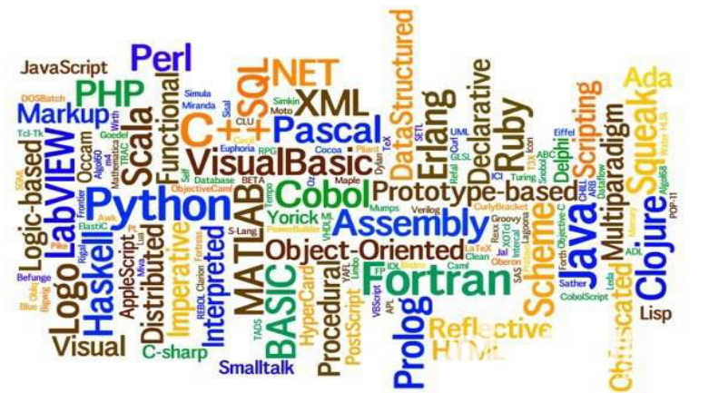

<center><h1>Python</h1></center>

<div style="border-bottom: none;"><center><h3>目录</h3></center></div>

[TOC]

<div style="page-break-after: always;"></div>

# 第1章 基础语法

## 1.1 Python简介

**编程简介**

程序（program）是为了让计算机执行某些操作或者解决问题而编写的一系列有序指令的集合。由于计算机只能够识别二进制数字0和1，因此需要使用特殊的编程语言来描述如何解决问题过程和方法。

算法（algorithm）是可完成特定任务的一系列步骤，算法的计算过程定义明确，通过一些值作为输入并产生一些值作为输出。

流程图（flow chart）是算法的一种图形化表示方式，使用一组预定义的符号来说明如何执行特定任务。

- 圆角矩形：开始和结束
- 矩形：数据处理
- 平行四边形：输入/输出
- 菱形：分支判断条件
- 流程线：步骤





**Python简介**

在当今的环境下Python是一个热门语言，在全世界的范围内，许多大学都开始使用Python作为基础语言的教程，同时在数据分析领域以及人工智能领域也取得了显著的成绩。

Python最大的特点就是简单。同样的一个功能，使用C语言实现需要20行代码，Java需要10行代码，Python的实现只需要4行代码，它从整体的代码量而言是非常简洁的。

- Python具有很强的可读性，比其他语言更有特色语法结构。
- Python是解释型语言，这意味着开发过程中没有了编译环节。
- Python是交互式语言，这意味着可以在提示符`>>>`后直接执行代码。
- Python是面向对象语言，这意味着支持面向对象的风格和代码封装。

虽然Python提供有交互式的命令模式，但是在很多的情况下，对于程序的编写往往是将其定义在源文件之中，在Python里面所有的源文件的后缀名称必须是`.py`。


**Hello World!**

输出的时候使用`print()`函数，函数就是一个完成特定功能的代码组织结构。

---

【代码】Hello World!

```python
print("Hello World!")
```

> 运行结果

```
Hello World!
```

---

<div style="page-break-after: always;"></div>

## 1.2 注释

**注释（Comment）**

在进行项目的开发过程中，不可能说一个项目编写完成一次后就在也不进行修改了。所以很多情况下，为了方便下一次的修改，会在一些关键性的代码上进行一些注释信息的定义，开发者根据这些注释的文字信息就可能直到这段代码的主要作用，方便代码的维护。

Python里面的注释分为两类：

1. 单行注释

    ```python
    # 注释内容
    ```

2. 多行注释

    ```python
    '''
    多行注释
    '''
    
    """
    多行注释
    """
    ```

---

【代码】注释

```python
"""
这是一条
多行注释
"""
print("Hello World!")       # 输出Hello World!
```

> 运行结果

```
Hello World!
```

---

<div style="page-break-after: always;"></div>

## 1.3 标识符

**标识符（Identifier）**

标识符的第一个字符必须是字母表中字母或下划线`_`，标识符的其它部分由字母、数字和下划线组成，标识符对大小写敏感。标识符不可以使用保留字或关键字。标识符应该准确、顾名思义，不要使用汉语拼音。

关键字（key word）也称保留字，关键字是编程语言内置的一些名称，具有特殊的用处和意义。保留字不能用作于标识符名称。Python的标准库提供了一个`keyword`模块，可以输出当前版本的所有关键字。

---

【代码】关键字

```python
import keyword
print(keyword.kwlist)
```

| 关键字 |       |        |          |         |
| :----: | :---: | :----: | :------: | :-----: |
| False  | None  |  True  |   and    |   as    |
| assert | break | class  | continue |   def   |
|  del   | elif  |  else  |  except  | finally |
|  for   | from  | global |    if    | import  |
|   in   |  is   | lambda | nonlocal |   not   |
|   or   | pass  | raise  |  return  |   try   |
| while  | with  | yield  |          |         |

---


**变量（Variable）**

在程序之中所谓的变量指的是可以被改变的内容，而常量指的是绝对不会被改变的内容。Python语言最大的特点是变量都是可以被直接定义的，不需要那些复杂的数据类型的声明，直接使用变量名称即可。

所有的变量实际上都会占据内存空间，当一些变量不再使用的时候，可以使用del关键字对内存空间进行删除。变量一旦被删除了，那么后续的代码部分将无法继续使用它。

---

【代码】变量

```python
num = 10
print(num)
del num
print(num)
```

> 运行结果

```
10
NameError: name 'a' is not defined
```

---

<div style="page-break-after: always;"></div>

## 1.4 数据类型

**数据类型**

Python中的变量不需要声明，但是每个变量在使用前都必须赋值，变量赋值以后该变量才会被创建。在Python中变量没有类型，我们所说的“类型”是变量所指的内存中对象的类型。使用type()函数可以获取变量的数据类型。

在Python中使用等号`=`用来给变量赋值，赋值运算符左边是一个变量名，赋值运算符右边是存储在变量中的值。

布尔是19世纪一位英国数学家的名字，在开发之中布尔主要用于程序的逻辑分支处理，数值包括`True`和`False`。

按照各个传统编程语言的做法来讲，`整数 / 整数 = 整数`。但是Python认为这个结果应该包含有小数（整数的结果变为浮点数类型）。

---

【代码】数据类型

```python
num = 123       # 整型
PI = 3.1415     # 浮点型
s = "hello"     # 字符串
flag = True     # 布尔

print(num)
print(PI)
print(s)
print(flag)

print(type(num))
print(type(PI))
print(type(s))
print(type(flag))

print(10 / 4)
print(type(10 / 4))
```

> 运行结果

```
123
3.1415
hello
True
<class 'int'>
<class 'float'>
<class 'str'>
<class 'bool'>
2.5
<class 'float'>
```

---


**字符串（String）**

字符串是开发中最为重要的概念，一个编程语言是否好用，很大程度上也是取决于是否提供有字符串类型。Python中可以直接使用引号（单引号或双引号）进行字符串的定义。Python并没有字符的概念，所以对于引号表示的含义是相同的。

使用`+`运算符可以进行字符串的连接处理。

---

【代码】字符串连接

```python
str = "Hello" + "World"
str += "!"
print(str)
```

> 运行结果

```
HelloWorld!
```

---


**转义字符（Escaping Character）**

在一个字符串描述的过程中，有可能会有一些特殊的字符的信息。

| 符号 | 描述                       |
| ---- | -------------------------- |
| \    | 续行符，实现字符串多行定义 |
| \\\  | 表示一个反斜杠`\`          |
| \'   | 表示一个单引号`'`          |
| \"   | 表示一个双引号`"`          |
| \n   | 换行                       |
| \v   | 纵向制表符                 |
| \t   | 横向制表符                 |
| \r   | 回车                       |
| \f   | 换页                       |
| \b   | 退格                       |

【代码】转义字符

```python
print("全球最大同性交友网站\n\"https://github.com\"")
```

> 运行结果

```
全球最大同性交友网站
"https://github.com"
```

---

<div style="page-break-after: always;"></div>

## 1.5 数据输入

**input()**

input()用于接受键盘输入。在所有编程语言里面，输入数据的类型是字符串类型。

---

【代码】数据输入

```python
data = input("输入数据：")
print(data)
print(type(data))
```

> 运行结果

```
输入数据：123
123
<class 'str'>
```

---


**转换函数**

很多时候可能需要的是各种类型，例如：整数、浮点数、布尔型，或者将其它类型变为字符串型。如果字符串不是由数字所组成，那么程序的执行就会产生异常。

| 函数        | 描述                       |
| :---------- | -------------------------- |
| int(数据)   | 将指定数据转为整型数据     |
| float(数据) | 将指定数据转为浮点型数据   |
| bool(数据)  | 将指定数据转为布尔型数据   |
| str(数据)   | 将指定数据转为字符串型数据 |

---

【代码】加法计算（Bug版本）

```python
num1 = float(input("输入第一个数字："))
num2 = float(input("输入第二个数字："))
result = num1 + num2
print(num1 + "+" + num2 + "=" + result)
```

> 运行结果

```
输入第一个数字：11.1
输入第二个数字：22.2
TypeError: unsupported operand type(s) for +: 'float' and 'str'
```

---

【代码】加法计算（正确版本）

```python
num1 = float(input("输入第一个数字："))
num2 = float(input("输入第二个数字："))
result = num1 + num2
print(str(num1) + "+" + str(num2) + "=" + str(result))
```

> 运行结果

```
输入第一个数字：11.1
输入第二个数字：22.2
11.1+22.2=33.3
```

---

<div style="page-break-after: always;"></div>

## 1.6 格式化输出

**格式化输出**

为了解决数据的输出问题，Python提供有格式化的输出操作。

| 标记 | 描述                               |
| :--: | ---------------------------------- |
|  %c  | 格式化字符                         |
|  %s  | 格式化字符串                       |
|  %d  | 格式化整型                         |
|  %f  | 格式化浮点型，可以设置保留精度     |
|  %e  | 科学计数法，使用小写字母e          |
|  %E  | 科学计数法，使用大写字母e          |
|  %g  | %f和%e的简写                       |
|  %G  | %f和%E的简写                       |
|  %u  | 格式化无符号整型                   |
|  %o  | 格式化无符号八进制数               |
|  %x  | 格式化无符号十六进制数             |
|  %X  | 格式化无符号十六进制数（大写字母） |

---

【代码】格式化字符串

```python
name = "小灰"
age = 16
height = 175.6

print("姓名：%s，年龄：%d，身高：%.2f" % (name, age, height))
```

> 运行结果

```
姓名：小灰，年龄：16，身高：175.60
```

---


**分隔符**

在默认情况下，使用`print()`输出数据时，都会使用换行作为分隔符号。如果不希望使用换行，则可以追加一个`end`参数。

---

【代码】分隔符

```python
sequence = "1 2 4 8 16 32 64"
print("序列：", end='')
print(sequence, end='...')
```

> 运行结果

```
序列：1 2 4 8 16 32 64...
```

---

<div style="page-break-after: always;"></div>

## 1.7 运算符

**算术运算符**

| 算术运算符 | 描述                                       |
| :--------: | ------------------------------------------ |
|     +      | 两个数相加                                 |
|     -      | 得到负数或一个数减去另一个数               |
|     *      | 两个数相乘或是返回一个被重复若干次的字符串 |
|     /      | 两数相除                                   |
|     %      | 返回除法的余数                             |
|     **     | 幂                                         |
|     //     | 整除（向下取整）                           |

---

【代码】计算圆的面积

```python
PI = 3.14159
r = float(input("输入半径："))
area = PI * r ** 2
print("面积 = %.2f" % area)
```

> 运行结果

```
输入半径：5
面积 = 78.54
```

---

【代码】逆序三位数

```python
num = int(input("输入一个正三位数："))
a = num // 100
b = num // 10 % 10
c = num % 10
print("逆序：%d" % (c*100 + b*10 + a))
```

> 运行结果

```
输入一个正三位数：520
逆序：25
```

---


**复合赋值运算符**

| 复合赋值运算符 | 描述                    |
| :----: | :---------------------- |
|   +=   | a += b等价于a = a + b   |
|   -=   | a -= b等价于a = a - b   |
|   *=   | a *= b等价于a = a * b   |
|   /=   | a /= b等价于a = a / b   |
|   %=   | a %= b等价于a = a % b   |
|  **=   | a \*\*= b等价于a = a \*\* b |
| //= | a //= b等价于a = a // b |


**比较运算符**

| 比较运算符 | 描述                           |
| :--------: | ------------------------------ |
|     ==     | 等于，比较对象是否相等         |
|     !=     | 不等于，比较两个对象是否不相等 |
|     >      | 大于                           |
|     <      | 小于                           |
|     >=     | 大于等于                       |
|     <=     | 小于等于                       |

<div style="page-break-after: always;"></div>

# 第2章 判断

## 2.1 逻辑运算符

**逻辑运算符**

Python中逻辑运算符有三种：

1. 逻辑与`and`：当多个条件同时为真，结果为真。

| 条件1 | 条件2 | 条件1 and 条件2 |
| :---: | :---: | :-------------: |
|   T   |   T   |        T        |
|   T   |   F   |        F        |
|   F   |   T   |        F        |
|   F   |   F   |        F        |

2. 逻辑或`or`：多个条件有一个为真时，结果为真。

| 条件1 | 条件2 | 条件1 or 条件2 |
| :---: | :---: | :------------: |
|   T   |   T   |       T        |
|   T   |   F   |       T        |
|   F   |   T   |       T        |
|   F   |   F   |       F        |

3. 逻辑非`not`：条件为真时，结果为假；条件为假时，结果为真。

| 条件 | not 条件 |
| :--: | :------: |
|  T   |    F     |
|  F   |    T     |

<div style="page-break-after: always;"></div>

## 2.2 if

**if**

分支结构最大特征就是可以进行指定条件的判断处理，关键字为`if`、`elif`、`else`。

每一个满足条件之后的语句都可以有多条，并且在Python里面是利用缩进来确定语句的关系。使用逻辑运算符可以进行若干个条件的连接。

---

【代码】if

```python
age = 15
if 0 < age < 18:
    print("未成年")
```

> 运行结果

```
未成年
```

---

【代码】if-else

```python
age = 30
if 0 < age < 18:
    print("未成年人")
else:
    print("成年人")
```

> 运行结果

```
成年人
```

---


---

【代码】多条件判断

```python
score = 76

if 90 <= score <= 100:
    print("优秀")
elif score >= 60:
    print("合格")
else:
    print("不合格")
```

> 运行结果

```
合格
```

---

【代码】判断整数奇偶

```python
num = int(input("输入一个正整数："))

if num > 0:
    if num % 2 == 0:
        print("%d是偶数" % num)
    else:
        print("%d是奇数" % num)
```

> 运行结果

```
输入一个正整数：66
66是偶数
```

---

<div style="page-break-after: always;"></div>

## 2.3 断言

**断言**

设置断言判断表达式`assert`，当满足条件的时候程序可以正常执行完毕，如果不满足条件，程序则会产生异常告诉给程序的开发者。当断言失败的时候，程序会自动中断执行。在进行的断言配置的时候可以发现没有错误的提示信息，很难知道那块代码出现了错误。

通过断言可以直接查找出程序的错误，但从另外一个角度来讲，断言由于不受到程序逻辑的控制，可能会造成许多的额外的问题，在实际的开发之中慎用。

---

【代码】断言

```python
import math

print("计算三角形面积")
a = float(input("第一条边："))
b = float(input("第二条边："))
c = float(input("第三条边："))

assert a + b > c, "边长不合法"
assert a + c > b, "边长不合法"
assert b + c > a, "边长不合法"

p = (a + b + c) / 2     # 半周长
area = math.sqrt(p * (p-a) * (p-b) * (p-c)) # 海伦公式
print("面积 = %.2f" % area)
```

> 运行结果

```
计算三角形面积
第一条边：1
第二条边：1
第三条边：2
AssertionError: 边长不合法
```

---

<div style="page-break-after: always;"></div>

# 第3章 循环

## 3.1 while

**while**

循环指的是某段代码可以被重复执行，一般在循环结构之中都需要定义一个循环的结束条件，只有循环结束条件不满足的时候循环才会执行，如果满足，循环则会退出。

while循环通过循环的结束判断条件来决定当前循环体代码是否要被执行。

```python
while condition:
    # code
```

---

【代码】计算5个人的平均身高

```python
total = 0
i = 1

while i <= 5:
    height = float(input("输入第%d个人的身高：" % i))
    total += height
    i += 1

average = total / 5
print("平均身高：%.2f" % average)
```

> 运行结果

```
输入第1个人的身高：160.8
输入第2个人的身高：175.2
输入第3个人的身高：171.2
输入第4个人的身高：181.3
输入第5个人的身高：164
平均身高：170.5
```

---

【代码】斐波那契数列（兔子数列）


```python
num1 = 0
num2 = 1
while num2 < 1000:
    print(num2, end=' ')
    num1, num2 = num2, num1 + num2
```

> 运行结果

```
1 1 2 3 5 8 13 21 34 55 89 144 233 377 610 987
```

---


**死循环**

对于循环的操作而言，一定要避免死循环所带来的问题。所谓的死循环指的就是循环结束条件没有得到正常的修改，导致程序无法结束。如果在执行中真的出现了死循环，命令行方式下可以直接按下`CTRL+C`来中断执行。


---

【代码】猜数字

```python
import random           # 随机模块

answer = random.randint(1, 100)     # 产生1-100之间的随机数
cnt = 0         # 猜测次数

while True:
    num = int(input("猜一个1-100之间的数字："))
    cnt += 1

    if num > answer:
        print("猜大了")
    elif num < answer:
        print("猜小了")
    else:       # 猜对了就跳出循环
        break

print("猜对了！你一共用了%d次猜对！" % cnt)
```

> 运行结果

```
猜一个1-100之间的数字：50
猜大了！
猜一个1-100之间的数字：25
猜小了！
猜一个1-100之间的数字：37
猜小了！
猜一个1-100之间的数字：43
猜小了！
猜一个1-100之间的数字：46
猜小了！
猜一个1-100之间的数字：48
猜小了！
猜一个1-100之间的数字：49
猜对了！你一共用了7次猜对！
```

---

<div style="page-break-after: always;"></div>

## 3.2 for

**for**

for循环的功能是在输出指定范围内的数据操作。在每一次for循环里面都会自动的获取给定范围中的每一个元素，并且在for语句里面进行相关的处理操作。

`range()`生成一个从0开始的数据范围，并且是按照线性的方式增长的。

`range()`也可以设置数据的开始值，默认从0开始。

`range()`也可以设置步长，默认步长为1。

```python
for _ in range(start, end, step):
    # code
```

---

【代码】for

```python
for i in range(5):
    print(i, end=' ')
print()

for i in range(10, 20):
    print(i, end=' ')
print()

for i in range(1, 10, 2):
    print(i, end=' ')
print()
```

> 运行结果

```
0 1 2 3 4 
10 11 12 13 14 15 16 17 18 19
1 3 5 7 9
```

---

【代码】计算1-100的累加和

```python
sum = 0
for i in range(1, 101):
    sum += i
print("累加：%d" % sum)
```

> 运行结果

```
累加：5050
```

---

【代码】计算$ 1 + {1 \over 2} + {1 \over 3} + ... + {1 \over n} $

```python
sum = 0
n = int(input("输入n："))

for i in range(1, n+1):
    sum += 1 / i
print(sum)
```

> 运行结果

```
输入n：10
2.9289682539682538
```

---

for循环主要是通过序列的形式完成的范围设置，而字符串也属于序列。


---

【代码】小写字母转大写

```python
str = "Hello World!"

for s in str:
    # 小写字母
    if 97 <= ord(s) <= 122:     # ord()：字符转ASCII码
        s = chr(ord(s) - 32)    # chr()：ASCII码转字符
    print(s, end='')
```

> 运行结果

```
HELLO WORLD!
```

---


**嵌套循环**

除了分支结构嵌套之外，也可以针对于循环结构进行嵌套，嵌套后的循环有可能导致程序的执行复杂度会提高。

---

【代码】九九乘法表


```python
for i in range(1, 10):
    for j in range(1, 10):
        print("%d*%d=%d" % (i, j, i*j), end='\t')
    print()
```

---

【代码】输出图案

```
*
**
***
****
*****
```

```python
for i in range(5):
    for j in range(i+1):
        print("*", end='')
    print()
```

---

<div style="page-break-after: always;"></div>

## 3.3 break or continue?

**循环控制**

循环控制语句的作用是控制当前的循环结构是否继续向下执行，如果不进行控制，那么会根据既定的结构重复执行。如果有一些特殊的情况导致循环的执行中断，就称为循环的控制语句。循环控制语句的关键字有`break`和`continue`。

`break`的作用是跳出当前循环，执行当前循环之后的语句。`break`只能跳出一层循环，如果是嵌套循环，那么需要按照嵌套的层次，逐步使用`break`来跳出。`break`语句只能在循环体内和`switch`语句内使用。

`continue`的作用是跳过本轮循环，开始下一轮循环的条件判断。`continue`终止当前轮的循环过程，但它并不跳出循环。

---

【代码】break

```python
for i in range(10):
    if i == 5:
        break
    print(i, end=' ')
```

> 运行结果

```
0 1 2 3 4 
```

---

【代码】continue

```python
for i in range(10):
    if i == 5:
        continue
    print(i, end=' ')
```

> 运行结果

```
0 1 2 3 4 6 7 8 9 
```

---

<div style="page-break-after: always;"></div>

# 第4章 数据结构

## 4.1 序列

**序列**

Python中序列类型包含字符串、列表、元组、字典。序列的核心意义在于可以进行多个数据的保存。

Python在整体设计的过程之中强调的是简单化。以多数据的存储为例，在许多的编程语言里面，都是利用了数组实现了数据的存储，但是数据有一个最大的问题在于：长度是固定的，无法进行容量的扩充。

在这样的背景下，很多的开发者就不得不去独立地进行一些动态数组的开发，所以就有了数据结构的概念，而数据存储的内容多了，就需要提升数据的操作性能，C、C++、Java等等都有这样的问题。

Python在设计的时候充分地考虑到了这些动态性的设计问题，所以才将这些可能动态修改的内容统一地称为序列，也就是说Python中的序列就是一个动态（或静态）的存储，而这些存储的操作结构都是内置的，开发者可以避免数据结构的开发所造成的困难，尤其是面对与非科班的人而言。

列表是对传统数组的一种使用包装，但是与传统数组最大的不同在于，Python中的列表的内容是允许进行动态修改的，并且Python中的列表也可以像传统数组那样机型索引的访问，这样就使得时间复杂度降低了许多。

<div style="page-break-after: always;"></div>

## 4.2 列表

列表（List）

列表使用`[]`进行列表的定义，Python的列表是对于传统数组的更高级的实现。列表可以通过索引的形式进行访问，索引下标是从0开始的，到列表长度-1结束。

在使用列表进行数据存储的时候，虽然大部分的情况下都会使用相同的数据类型，但是在列表里面却可以同时有不同的数据类型，这比其它语言里面提供的数据的功能强大。虽然提供有多个数据类型的保存使得程序存储更加灵活，但是从实际的开发角度而言，尽量让数据类型保持一致会比较合理。

在Python中列表除了正向索引访问之外，也可以进行反向索引访问。

---

【代码】列表

```python
lst = [1, 2, 3]

print(lst[0])
print(lst[1])
print(lst[2])

print(lst[-1])
print(lst[-2])
print(lst[-3])

print(lst[3])       # 越界
```

> 运行结果

```
1
2
3
3
2
1
IndexError: list index out of range
```

---

序列数据可以直接使用`*`进行重复定义，或者使用`+`进行与其它序列拼接。

---

【代码】序列重复/拼接

```python
lst = [1, 2, 3] * 3
print(lst)      # [1, 2, 3, 1, 2, 3, 1, 2, 3]

lst = [1, 2, 3] + [4, 5, 6]
print(lst)      # [1, 2, 3, 4, 5, 6]
```

> 运行结果

```
[1, 2, 3, 1, 2, 3, 1, 2, 3]
[1, 2, 3, 4, 5, 6]
```

---


**成员运算符**

在使用索引访问的时候都需要去考虑索引的设置错误的问题，但是使用了for循环之后，不再需要明确的进行索引的设置，避免了`IndexError`异常信息。

如果想要判断某一个数据是否在列表之中存在，最直接的方式就是直接进行列表的迭代操作（其它语言传统形式）。

---

【代码】迭代查找

```python
lst = ["C/C++", "Java", "Python", "JavaScript"]
key = "Python"      # 待查找关键词
flag = False        # 初始假设未找到

for item in lst:
    if item == key:
        flag = True
        break

if flag:
    print("数据存在")
else:
    print("数据不存在")
```

> 运行结果

```
数据存在
```

---

这种查询最大的问题在于需要进行整个列表数据的迭代，造成的结果就是时间复杂度的攀升$ O(n) $。在Python设计过程之中不希望开发者为这些复杂的执行效率犯愁，所以在使用列表判断某些数据是否存在的时候提供了专门的运算符。使用关键字`in`（在范围内）、`not in`（不在范围内）。

---

【代码】成员运算符

```python
lst = ["C/C++", "Java", "Python", "JavaScript"]
key = "Python"      # 待查找关键词

if key in lst:
    print("数据存在")
else:
    print("数据不存在")
```

> 运行结果

```
数据存在
```

---


**数据分片**

数据分片可以截取部分的列表内容。在默认情况下，数据的分片都是依照数值为1的间隔进行获取的，如果有需要也可以进行步长的修改。

```python
list[start : end : step]
```

---

【代码】列表的截取

```python
lst = list(range(10))

print("原始列表：", end='')
print(lst)

print("截取[2:7]：", end='')
print(lst[2:7])

print("截取[:5]：", end='')
print(lst[:5])

print("截取[3:]：", end='')
print(lst[3:])

print("截取[::2]：", end='')
print(lst[::2])
```

> 运行结果

```
原始列表：[0, 1, 2, 3, 4, 5, 6, 7, 8, 9]
截取[2:7]：[2, 3, 4, 5, 6]
截取[:5]：[0, 1, 2, 3, 4]
截取[3:]：[3, 4, 5, 6, 7, 8, 9]
截取[::2]：[0, 2, 4, 6, 8]
```

---


**列表操作函数**

Python中的列表设计非常到位，它可以实现内容动态扩充，可以进行后期的追加或者删除。

| 函数                | 描述                             |
| ------------------- | -------------------------------- |
| append(data)        | 在列表最后追加新内容             |
| clear()             | 清除列表数据                     |
| copy()              | 列表拷贝                         |
| count()             | 统计某一个数据在列表中的出现次数 |
| extend(列表)        | 为一个列表追加另外一个列表       |
| index(data)         | 从列表查询某个值第一次出现的位置 |
| insert(index, data) | 向列表中指定索引位置追加新数据   |
| pop(index)          | 从列表弹出并删除一个数据         |
| remove(data)        | 从列表删除数据                   |
| reverse()           | 列表数据反转                     |
| sort()              | 列表数据排序                     |

---

【代码】列表内容扩充

```python
lst = list(range(5))    # [0, 1, 2, 3, 4]
lst.append(5)           # [0, 1, 2, 3, 4, 5]
lst.insert(2, 6)        # [0, 1, 6, 2, 3, 4, 5]
print(lst)
print("列表长度：%d" % len(lst))
```

> 运行结果

```
[0, 1, 6, 2, 3, 4, 5]
列表长度：7
```

---

在使用`remove()`删除的时候，内容存在可以删除，不存在就会抛出`ValueError`异常信息，因此使用`remove()`操作之前一定要通过`in`判断。

如果不知道内容要进行数据的删除，最简单的原始的Python支持可以采用del关键字实现内容删除，而且使用`del`的时候只需要知道列表数据的索引即可实现。使用`del`关键字的确可以实现索引的删除，但是无法知道被删除了哪些数据。

`pop()`函数可以根据索引删除，而后告诉用户哪些数据被删除了。

---

【代码】删除元素

```python
lst = list(range(5))    # [0, 1, 2, 3, 4]
key = 3

if key in lst:
    lst.remove(key)
print(lst)              # [0, 1, 2, 4]

del lst[2]
print(lst)              # [0, 1, 4]

print(lst.pop(1))       # 1
print(lst)              # [0, 4]
```

> 运行结果

```
[0, 1, 2, 4]
[0, 1, 4]
1
[0, 4]
```

---

【代码】列表反转/排序

```python
lst = [7, 4, 0, 3, 6, 8, 9, 2]

print("原始列表：", end='')
print(lst)

print("反转：", end='')
lst.reverse()
print(lst)

print("排序（升序）：", end='')
lst.sort()
print(lst)

print("排序（降序）：", end='')
lst.sort(reverse=True)
print(lst)
```

> 运行结果

```
原始列表：[7, 4, 0, 3, 6, 8, 9, 2]
反转：[2, 9, 8, 6, 3, 0, 4, 7]
排序（升序）：[0, 2, 3, 4, 6, 7, 8, 9]
排序（降序）：[9, 8, 7, 6, 4, 3, 2, 0]
```

---

<div style="page-break-after: always;"></div>

## 4.3 元组

**元组（Tuple）**

列表是可以进行多个数据的保存，并且里面的内容都是可以修改和动态扩充的。与列表不一样，Python提供了一个不可变的数据的序列——元组，元组需要使用`()`进行定义。元组定义的时候如果只有一个内容，必须要有`,`。

---

【代码】

```python
tup = (0, 1, 2, 3, 4)
print(tup)
tup[0] = 5
```

> 运行结果

```
(0, 1, 2, 3, 4)
TypeError: 'tuple' object does not support item assignment
```

---

`tuple()`可以实现列表与元组的转换。

---

【代码】元组与列表的转换

```python
lst = list(range(5))
print(lst)
print(type(lst))

tup = tuple(lst)
print(tup)
print(type(tup))
```

> 运行结果

```
[0, 1, 2, 3, 4]
<class 'list'>
(0, 1, 2, 3, 4)
<class 'tuple'>
```

---


**序列统计函数**

| 函数  | 描述                                                       |
| ----- | ---------------------------------------------------------- |
| len() | 获取序列的长度                                             |
| max() | 获取序列中的最大值                                         |
| min() | 获取序列中的最小值                                         |
| sum() | 计算序列中的内容总和                                       |
| any() | 序列中有一个内容为True结果为True，全部为False时结果为False |
| all() | 序列中有一个内容为False结果为False，全部为True时结果为True |

---

【代码】序列统计函数

```python
lst = [4, 0, 1, 3, 2]
tup = (8, 5, 7, 9, 6)
str = "HelloWorld"

print("列表lst的长度 = %d" % len(lst))
print("元组tup的长度 = %d" % len(tup))
print("字符串str的长度 = %d" % len(str))

print("列表lst最大值：%d" % max(lst))
print("元组tup最小值 = %d" % min(tup))
print("字符串str最大值 = %c" % max(str))
print("字符串str最小值 = %c" % min(str))

print("列表lst总和：%d" % sum(lst))
print("元组tup总和：%d" % sum(tup))
```

> 运行结果

```
列表lst的长度 = 5
元组tup的长度 = 5
字符串str的长度 = 10
列表lst最大值：4
元组tup最小值 = 5
字符串str最大值 = r
字符串str最小值 = H
列表lst总和：10
元组tup总和：35
```

---

<div style="page-break-after: always;"></div>

## 4.4 字符串

**字符串（String）**

字符串是由若干个字符所组成的，使用引号进行一串内容的声明。

字符串也可以进行数据的分片操作和序列统计函数。

---

【代码】字符串

```python
info = "url: www.baidu.com"

print("字符串长度：%d" % len(info))

if "url: " in info:
    print(info[5:])
```

> 运行结果

```
字符串长度：18
www.baidu.com
```

---


**字符串格式化**

在Python默认的语言环境中有字符串格式化的处理支持。为了进一步完善对于字符串格式化的需求，又提供了`format()`。在`format()`里面出现的`{}`标记里面可以定义标记名称或者数据的填充序列顺序定义。

---

【代码】字符串格式化

```python
name = "小灰"
age = 16
height = 175.6

info = "姓名：%s，年龄：%d，身高：%.2f" % (name, age, height)
print(info)

info = "姓名：{}，年龄：{}，身高：{}".format(name, age, height)
print(info)
```

> 运行结果

```
姓名：小灰，年龄：16，身高：175.60
姓名：小灰，年龄：16，身高：175.6
```

---


**字符串数据处理函数**

| 函数                        | 描述                                                 |
| :-------------------------- | :--------------------------------------------------- |
| center()                    | 字符串居中显示                                       |
| find(data)                  | 字符串数据查找，查找到内容返回索引位置，找不到返回-1 |
| join(data)                  | 字符串连接                                           |
| split(data [, limit])       | 字符串拆分                                           |
| lower()                     | 字符串转小写                                         |
| upper()                     | 字符串转大写                                         |
| capitalize()                | 首字母大写                                           |
| replace(old, new [, limit]) | 字符串替换                                           |
| strip()                     | 删除左右空格                                         |

1. 字符串大小写转换。

---

【代码】字符串大小写转换

```python
str = "Hello World!"
print(str.upper())
print(str.lower())
```

> 运行结果

```
HELLO WORLD!
hello world!
```

---

2. 字符串查找`find()`：在进行数据内容查询的时候，如果内容存在就返回索引位置，不存在则返回-1。

---

【代码】字符串查找

```python
str = "Hello World!"
print(str.find("Wor"))
print(str.find("Python"))
```

> 运行结果

```
6
-1
```

---

3. 字符串连接`join()`：使用一个特定的字符串连接序列中的若干内容。

---

【代码】字符串连接

```python
lst = ["www", "baidu", "com"]
url = ".".join(lst)
print(url)
```

> 运行结果

```
www.baidu.com
```

---

4. 字符串拆分`split()`。

---

【代码】字符串拆分

```python
ip = "127.0.0.1"
print("ip信息：%s" % ip.split("."))

date_time = "2021/03/31 17:32:53"
item = date_time.split(" ")
print("date信息：%s" % item[0].split("/"))
print("time信息：%s" % item[1].split(":"))
```

> 运行结果

```
ip信息：['127', '0', '0', '1']
date信息：['2021', '03', '31']
time信息：['17', '32', '53']
```

---

5. 字符串替换`replace()`：使用一个字符串去替换其它的字符串，在进行字符串替换的时候可以设置替换的次数。`replace()`的替换是进行全匹配的替换操作。

---

【代码】字符串替换

```python
str = "Hello World, Hello Python!"
print("全部替换：" + str.replace("Hello", "Hey"))
print("部分替换：" + str.replace("Hello", "Hey", 1))
```

> 运行结果

```
全部替换：Hey World, Hey Python!
部分替换：Hey World, Hello Python!
```

---

6. 字符串去除前后空格`strip()`：在进行用户键盘数据输入的过程中，有可能用户在输入信息时会添加许多无用的空格，导致数据的判断错误。对于用户输入数据需要进行左右空格的删除（中间的空格不会被删除）。

---

【代码】模拟登陆

```python
while True:
    info = input("Username:Password >>> ")

    if len(info) == 0 or info.find(":") == -1:
        print("输入格式错误！")
    else:
        data = info.split(":")
        username = data[0]
        password = data[1]
        if username == "admin" and password == "123456":
            print("欢迎【%s】成功登录！" % username)
            break
        else:
            print("用户名或密码错误！")
```

> 运行结果

```
Username:Password >>> hey:
用户名或密码错误！
Username:Password >>> admin
输入格式错误！
Username:Password >>> admin:123456
欢迎【admin】成功登录！
```

---

<div style="page-break-after: always;"></div>

## 4.5 字典

**字典（Dictionary）**

字典是一个在开发之中极为重要的类型，字典提供了非常方便地数据内容查找操作。字典的本质就是一个数据查找的序列，与之前的列表或者元组不同的地方在于，其它的结构保存数据的目的都是为了输出使用，而字典是为了查询使用。

字典严格意义上来讲属于一种哈希表的结构，在哈希表进行数据存储的时候往往都需要一个哈希算法进行数据存储位置的计算。

字典是一个二元偶对象的集合，所以里面保存的数据都是成对的，所有的数据内容都按照`key=value`的形式进行存放。考虑到用户使用的方便，key的类型可以使数字、字符串或者是元组，但是最为常见的还是字符串。

在使用字典进行查询的时候如果指定的key不存在，则在代码执行会出现`KeyError`错误提示信息，也就是原生的数据查询方式是有可能会抛出异常的。

字典的本质是根据`key查找对应的value`，一旦key重复的时候，使用新的数据覆盖掉旧的数据。

---

【代码】字典

```python
info = {"name": "小灰", "age": 16, "height": 175.6}
print(info)
print(info["age"])

info["height"] = 180
print(info)
```

> 运行结果

```
{'name': '小灰', 'age': 16, 'height': 175.6}
16
{'name': '小灰', 'age': 16, 'height': 180}
```

---

既然字典是一个序列，那么字典可以使用in进行判断指定key是否存在，通过这样的机制可以避免由于key不存在所带来的`KeyError`异常的抛出。

同样，字典也可以使用for循环迭代输出，但是迭代的知识字典中全部的key。

---

【代码】迭代输出

```python
info = {"name": "小灰", "age": 16, "height": 175.6}
for key in info:
    print("%s: %s" % (key, info[key]))
```

> 运行结果

```
name: 小灰
age: 16
height: 175.6
```

---

在进行字典数据迭代输出的时候，最好的做法是每一次迭代直接返回当前完整的`key:value`的映射项，此时的处理就需要依赖`items()`来完成。

---

【代码】items()迭代输出

```python
info = {"name": "小灰", "age": 16, "height": 175.6}
for key, value in info.items():
    print("%s: %s" % (key, value))
```

> 运行结果

```
name: 小灰
age: 16
height: 175.6
```

---


**字典操作函数**

| 函数                     | 描述                                                      |
| ------------------------ | --------------------------------------------------------- |
| clear()                  | 清空字典数据                                              |
| update({k:v, ...})       | 更新字典数据                                              |
| fromkeys(seq[, value])   | 创建字典，使用序列中的数据作为key，所有key拥有相同的value |
| get(key[, defaultvalue]) | 根据key获取数据                                           |
| pop(key)                 | 弹出字典中指定的key数据                                   |
| popitem()                | 从字典中弹出一组映射项                                    |
| keys()                   | 返回字典中全部key数据                                     |
| values()                 | 返回字典中全部的value数据                                 |

1. 字典数据更新`update()`：Python中的字典是可以进行存储数据的动态扩充的，`update()`除了拥有表面上的更新之外，也拥有数据的扩充操作。

---

【代码】字典数据更新

```python
info = {"name": "小灰", "age": 16, "height": 175.6}
info.update({"city": "Shanghai", "job": "programmer"})
print(info)
```

> 运行结果

```
{'name': '小灰', 'age': 16, 'height': 175.6, 'city': 'Shanghai', 'job': 'programmer'}
```

---

2. 字典数据删除：`pop()`可以根据key进行弹出操作。

---

【代码】字典数据删除

```python
info = {"name": "小灰", "age": 16, "height": 175.6}
print(info.pop("age"))
print(info)
```

> 运行结果

```
16
{'name': '小灰', 'height': 175.6}
```

---

3. 字典数据获取`get()`：可以通过key获取数据，如果key则返回None。

---

【代码】字典数据获取

```python
info = {"name": "小灰", "age": 16, "height": 175.6}
print(info.get("name"))
print(info.get("job"))
```

> 运行结果

```
小灰
None
```

---

<div style="page-break-after: always;"></div>

# 第5章 函数

## 5.1 函数

**函数（Function）**

当开始定义函数的时候，意味着已经开始向结构化可重用程序开发迈进了。在整个Python中提供有大量的系统函数，例如：`print()`、`len()`等都属于Python内置的函数。

除了内置的函数之外，用户也可以进行自定义函数，定义函数的目的是为了让一段代码可以被重复使用。

使用`def`关键字可以定义函数：

```python
def func_name([param_list]):
    # code
```


当调用函数时，程序控制权会转移给被调用的函数，当函数执行结束后，函数会把程序序控制权交还给其调用者。

```mermaid
graph TB
	subgraph Callee
		code2 --> code3
	end

	subgraph Caller
		code1 --> call
		call --> code5
	end
	
	call --> code2
	code3 --> call
```


**函数设计方法**

使用函数有以下好处：

1. 避免代码复制，代码复制是程序质量不良的表现
2. 便于代码维护
3. 避免重复造轮子，提高开发效率

在设计函数的时候需要考虑以下的几点要素：

1. 确定函数的功能
2. 确定函数的参数
    - 是否需要参数
    - 参数个数
    - 参数类型
3. 确定函数的返回值
    - 是否需要返回值
    - 返回值类型

---

【代码】函数实现返回最大值

```python
def get_max(num1, num2):
    # if num1 > num2:
    #     return num1
    # else:
    #     return num2

    return num1 if num1 > num2 else num2

print(get_max(4, 12))
print(get_max(54, 33))
print(get_max(0, -12))
print(get_max(-999, -774))
```

> 运行结果

```
12
54
0
-774
```

---

【代码】函数实现累加和

```python
def get_sum(start, end):
    total = 0
    for i in range(start, end+1):
        total += i
    return total

print("1-100的累加和 = %d" % get_sum(1, 100))
print("1024-2048的累加和 = %d" % get_sum(1024, 2048))
```

> 运行结果

```
1-100的累加和 = 5050
1024-2048的累加和 = 1574400
```

---

【代码】函数实现输出i行j列由自定义字符组成的图案

```python
def print_chars(row, col, c):
    for i in range(row):
        for j in range(col):
            print(c, end='')
        print()

print_chars(5, 10, '?')
```

> 运行结果

```
??????????
??????????
??????????
??????????
??????????
```

---


**主函数**

Python是为数不多的直接定义完源代码就可以执行的编程语言，很多编程语言对于程序的执行都有非常严格的标准，例如C、C++、Java等都有主函数（主方法）来标记程序的起点。

在现实的开发之中主函数是很有必要的，可以区分出其它的结构，在模块中更需要主函数的使用。

在Python中如果想实现主函数的定义，必须借助于全局变量`__name__`的返回内容，而后采用自定义的函数形式实现，返回的`__main__`是一个字符串，这个内容是会改变的，跟程序身处的结构有关。

在很多的编程语言都将主函数通过`main`这个标识符来定义,所以定义的`main()`是符合一般的习惯的。在进行复杂开发的时候，强烈建议使用主函数作为程序的起点。

---

【代码】主函数

```python
def main():
    pass

if __name__ == "__main__":
    main()
```

---

<div style="page-break-after: always;"></div>

## 5.2 变量作用域

**变量作用域**

一个变量会根据其自身所处的位置由不同的作用范围，不同范围内使用的变量采用就近取用的原则。

变量作用域采用`LEGB`原则：

- Local：函数内部变量名称。
- Enclosing Function Locals：外部嵌套函数变量名称。
- Global：函数所在模块或程序文件的变量名称。
- Builtin：内置模块的变量名称。


在一个Python源文件之中可以存在有若干个函数（或者类），每一个函数里面有可能定义自己的变量，但是这个变量不是公共的。局部变量只能被一个函数所使用的，其它的函数都无法进行操作。

---

【代码】局部变量

```python
def foo():
    num = 123

def main():
    print(num)

if __name__ == "__main__":
    main()
```

> 运行结果

```
NameError: name 'num' is not defined
```

---

如果希望在函数中访问全局的变量，可以通过`global`关键字实现。

---

【代码】全局变量

```python
num = 123       # 全局变量

def foo():
    num = 321   # 局部变量
    print("foo(): %d" % num)    # 321

def bar():
    global num  # 调用全局变量
    num = 456
    print("bar(): %d" % num)    # 456

def main():
    foo()
    print(num)  # 123
    bar()
    print(num)  # 456

if __name__ == "__main__":
    main()
```

> 运行结果

```
foo(): 321
123
bar(): 456
456
```

---

<div style="page-break-after: always;"></div>

## 5.3 函数参数

**参数默认值**

在进行函数参数定义的时候，也可以设置默认值。当参数没有传递的时候就利用默认值来进行参数内容的填充，如果在参数上定义了默认值，那么该参数一定要放在参数列表的最后。

---

【代码】参数默认值

```python
def set_date(year=1970, month=1, day=1):
    print("%04d-%02d-%02d" % (year, month, day))

def main():
    set_date(2021, 4, 1)
    set_date(2021, 3)
    set_date(2021)
    set_date()

if __name__ == "__main__":
    main()
```

> 运行结果

```
2021-04-01
2021-03-01
2021-01-01
1970-01-01
```

---


**可变参数**

在Python中提供有可变参数形式，所有可变参数都使用元组进行接收。

---

【代码】可变参数

```python
def calculate(operator, *nums):
    """
        定义一个可变参数的数学计算
        通过传入的运算符和运算数进行计算
        Args:
            operator (str): 运算符
            nums (tuple): 运算数（可变参数）
        Return:
            计算结果
    """
    if operator == '+':
        result = 0
        for num in nums:
            result += num
    elif operator == '*':
        result = 1
        for num in nums:
            result *= num
    return result

def main():
    print("累加：%d" % calculate('+', 1, 2, 3, 4, 5))
    print("阶乘：%d" % calculate('*', 1, 2, 3, 4, 5))

if __name__ == "__main__":
    main()
```

> 运行结果

```
累加：15
阶乘：120
```

---

在进行参数传递的时候也可以使用`**`来标记关键字参数（字典）

---

【代码】关键字参数

```python
def print_scores(name, **scores):
    print(name)
    for key, value in scores.items():
        print("\t|- %s: %s" % (key, value))

def main():
    print_scores("小灰", Python=100, Java=95)
    print_scores("小白", 数据结构=78, 算法=82)

if __name__ == "__main__":
    main()
```

> 运行结果

```
小灰
        |- Python: 100
        |- Java: 95
小白
        |- 数据结构: 78
        |- 算法: 82
```

---

<div style="page-break-after: always;"></div>

## 5.4 lambda表达式

**lambda函数**

`lambda`指的是函数式编程，函数式编程最简单的理解就是没有名字的函数。`lambda`定义简单，只使用一次。

```python
lambda param1, param2, ...: statement
```

一般而言，`lambda`函数都比较短，但是一般的普通函数内容都会比较多。

---

【代码】lambda函数

```python
def main():
    add = lambda x, y: x + y
    print(add(10, 20))

if __name__ == "__main__":
    main()
```

> 运行结果

```
30
```

---

<div style="page-break-after: always;"></div>

## 5.5 递归

**递归（Recursion）**

要理解递归，先得理解递归（见5.5章节）。

在函数的内部，直接或者间接的调用自己的过程就叫作递归。对于一些问题，使用递归可以简洁易懂的解决问题，但是递归的缺点是性能低，占用大量系统栈空间。

递归算法很多时候可以处理一些特别复杂、难以直接解决的问题。

比如：

- 迷宫
- 汉诺塔
- 八皇后
- 排序
- 搜索

在定义递归函数时，一定要确定一个结束条件，否则会造成无限递归的情况，最终会导致栈溢出。


---

【代码】无限递归

```python
def tell_story():
    print("从前有座山")
    print("山里有座庙")
    print("庙里有个老和尚和小和尚")
    print("老和尚在对小和尚讲故事")
    print("他讲的故事是：")
    tell_story()

def main():
    tell_story()

if __name__ == "__main__":
    main()
```

> 运行结果

```
从前有座山
山里有座庙
庙里有个老和尚和小和尚
老和尚对小和尚在讲故事
他讲的故事是：
从前有座山
山里有座庙
庙里有个老和尚和小和尚
老和尚对小和尚在讲故事
他讲的故事是：
...
```

---

递归函数一般需要定义递归的出口，即结束条件，确保递归能够在适合的地方退出。

Python有一个比较大的优势在于所保存的数据没用长度的限制，很多编程语言里，由于数据类型范围的限制，一旦处理不当，就可能造成数据溢出的问题。

---

【代码】阶乘

```python
def factorial(n):
    if n == 0 or n == 1:
        return 1
    return n * factorial(n-1)

def main():
    print("40! = %d" % factorial(40))

if __name__ == "__main__":
    main()
```

> 运行结果

```
40! = 815915283247897734345611269596115894272000000000
```


---

【代码】斐波那契数列（递归）

```python
def fibonacci(n):
    if n == 1 or n == 2:
        return 1
    return fibonacci(n-2) + fibonacci(n-1)

def main():
    n = 7
    print("斐波那契数列第%d位：%d" % (n, fibonacci(n)))

if __name__ == "__main__":
    main()
```

> 运行结果

```
斐波那契数列第7位：13
```


---

【代码】斐波那契数列（迭代）

```python
def fibonacci(n):
    f = [0] * n
    f[0] = f[1] = 1
    for i in range(2, n):
        f[i] = f[i-2] + f[i-1]
    return f[n-1]

def main():
    n = 7
    print("斐波那契数列第%d位：%d" % (n, fibonacci(n)))

if __name__ == "__main__":
    main()
```

> 运行结果

```
斐波那契数列第7位：13
```

---

【代码】阿克曼函数
$$
A(m, n) =
\begin{cases}
	n + 1 & m = 0 \\
	A(m-1, 1) & m > 0, n = 0 \\
	A(m-1, A(m, n-1)) & m > 0, n > 0 \\
\end{cases}
$$

```python
def A(m, n):
    if m == 0:
        return n + 1
    elif m > 0 and n == 0:
        return A(m-1, 1)
    else:
        return A(m-1, A(m, n-1))

def main():
    print(A(3, 4))

if __name__ == "__main__":
    main()
```

> 运行结果

```
125
```

|  m\n  |      0      |         1         |         2         |            3            |         4         |                           n                            |
| :---: | :---------: | :---------------: | :---------------: | :---------------------: | :---------------: | :----------------------------------------------------: |
| **0** |      1      |         2         |         3         |            4            |         5         |                       $ n + 1 $                        |
| **1** |      2      |         3         |         4         |            5            |         6         |                  $ 2 + (n + 3) - 3 $                   |
| **2** |      3      |         5         |         7         |            9            |        11         |                    $ 2(n + 3) - 3 $                    |
| **3** |      5      |        13         |        29         |           61            |        125        |                   $ 2^{n + 3} - 3 $                    |
| **4** |     13      |       65533       | $ 2^{65536} - 3 $ | $ A(3, 2^{65536} - 3) $ | $ A(3, A(4, 3)) $ | $ \underbrace{2^{2^{.^{.^{.{^2}}}}}}_{n+3\ twos} - 3 $ |
| **5** |    65533    |  $ A(4, 65533) $  | $ A(4, A(5, 1)) $ |    $ A(4, A(5, 2)) $    | $ A(4, A(5, 3)) $ |                       $ \dots $                        |
| **6** | $ A(5, 1) $ | $ A(5, A(5, 1)) $ | $ A(5, A(6, 1)) $ |    $ A(5, A(6, 2)) $    | $ A(5, A(6, 3)) $ |                       $ \dots $                        |


---

【代码】汉诺塔

给定三根柱子，其中A柱子从大到小套有n个圆盘，问题是如何借助B柱子，将圆盘从A搬到C。

> 规则：
>
> - 一次只能搬动一个圆盘
> - 不能将大圆盘放在小圆盘上面


递归算法求解汉诺塔问题：

1. 将前n-1个圆盘从A柱借助于C柱搬到B柱。
2. 将最后一个圆盘直接从A柱搬到C柱。
3. 将n-1个圆盘从B柱借助于A柱搬到C柱。

```python
move = 0            # 移动次数

def hanoi(n, src, mid, dst):
    global move
    """
        汉诺塔算法
        把 n 个盘子从 src 借助 mid 移到 dst

        Args:
            n (int): 层数
            src (str): 起点柱子
            mid (str): 临时柱子
            dst (str): 目标柱子
    """
    if n == 1:
        print("%d号盘：%c -> %c" % (n, src, dst))
        move += 1
    else:
        # 把前 n-1 个盘子从 src 借助 dst 移到 mid
        hanoi(n-1, src, dst, mid)
        # 移动第 n 个盘子
        print("%d号盘：%c -> %c" % (n, src, dst))
        move += 1
        # 把刚才的 n-1 个盘子从 mid 借助 src 移到 dst
        hanoi(n-1, mid, src, dst)

def main():
    hanoi(4, 'A', 'B', 'C')
    print("步数 ==> %d" % move)

if __name__ == "__main__":
    main()
```

> 运行结果

```
1号盘：A -> B
2号盘：A -> C
1号盘：B -> C
3号盘：A -> B
1号盘：C -> A
2号盘：C -> B
1号盘：A -> B
4号盘：A -> C
1号盘：B -> C
2号盘：B -> A
1号盘：C -> A
3号盘：B -> C
1号盘：A -> B
2号盘：A -> C
1号盘：B -> C
步数 ==> 15
```

---

<div style="page-break-after: always;"></div>

# 第6章 模块

## 6.1 模块导入

**模块（Module）**

模块是进行大型项目拆分组织的一种有效技术手段，它可以将一个庞大的代码分割成若干个小的组成单元，方便进行代码的开发与维护。利用模块的划分，在进行代码维护的时候，可以保证局部的更新不影响其它的程序的运行操作。

使用`import`关键字可以进行模块的导入，`import`可以同时导入多个模块，但是从开发的角度来讲，强烈建议分开导入。

```python
import package.module [as alias] [, ...]
```

---

【代码】模块导入

- algorithm/search.py

```python
def sequence_search(list, key):
    """
        顺序查找
        Args:
            list (list): 待查找数组
            key (int): 关键字
    """
    for i in range(len(list)):
        if list[i] == key:
            return i
    return -1

def binary_search(list, key):
    """
        二分查找
        Args:
            list (list): 待查找数组
            key (int): 关键字
    """
    start = 0
    end = len(list) - 1
    while start <= end:
        mid = (start + end) // 2
        if list[mid] == key:
            return mid
        elif list[mid] < key:
            start = mid + 1
        else:
            end = mid - 1
    return -1
```

- import_as.py

```python
import algorithm.search as search

def main():
    list = [40, 9, 20, 93, 7, 34, 85, 91]
    key = 34
    print("%d所在位置：%d" % (key, search.sequence_search(list, key)))

if __name__ == "__main__":
    main()
```

> 运行结果

```
34所在位置：5
```

---

在Python里有一个作者写的Python开发禅道（开发的19条哲学），如果想看到这个彩蛋的信息，可以在Python的交互模式输入`import this`。

```
>>> import this
The Zen of Python, by Tim Peters

Beautiful is better than ugly.
Explicit is better than implicit.
Simple is better than complex.
Complex is better than complicated.
Flat is better than nested.
Sparse is better than dense.
Readability counts.
Special cases aren't special enough to break the rules.
Although practicality beats purity.
Errors should never pass silently.
Unless explicitly silenced.
In the face of ambiguity, refuse the temptation to guess.
There should be one-- and preferably only one --obvious way to do it.
Although that way may not be obvious at first unless you're Dutch.
Now is better than never.
Although never is often better than *right* now.
If the implementation is hard to explain, it's a bad idea.
If the implementation is easy to explain, it may be a good idea.
Namespaces are one honking great idea -- let's do more of those!
```


**from-import模块导入**

使用import导入模块之后需要采用`module_name.func()`形式进行调用，每一次调用函数非常麻烦。`from-import`导入语法可以简化调用语句。

```python
from package.module import name [as alias] [, ...]
```

在实践中, `from-import`不是良好的编程风格，因为如果导入的变量与作用域中现有变量同名，那么变量就会被悄悄覆盖掉。使用`import`语句的时候就不会发生这种问题，通过`module.var`或`module.func()`获取的变量或方法不会与现有作用域冲突。

---

【代码】from-import导入

- algorithm/search.py

```python
def sequence_search(list, key):
    """
        顺序查找
        Args:
            list (list): 待查找数组
            key (int): 关键字
    """
    for i in range(len(list)):
        if list[i] == key:
            return i
    return -1

def binary_search(list, key):
    """
        二分查找
        Args:
            list (list): 待查找数组
            key (int): 关键字
    """
    start = 0
    end = len(list) - 1
    while start <= end:
        mid = (start + end) // 2
        if list[mid] == key:
            return mid
        elif list[mid] < key:
            start = mid + 1
        else:
            end = mid - 1
    return -1
```

- from_import.py

```python
from algorithm.search import binary_search

def main():
    list = [7, 9, 20, 34, 40, 85, 91, 93]
    key = 34
    print("%d所在位置：%d" % (key, binary_search(list, key)))

if __name__ == "__main__":
    main()
```

> 运行结果

```
34所在位置：3
```

---

<div style="page-break-after: always;"></div>

## 6.2 math模块

**math模块**

现代计算机的基础学科就是数学，如果没有数学理论作为基础，计算机是无法的得到正常发展的。数学模块只提供了数学的基本计算功能，在很多的开发之中，有可能会需要使用到更加复杂的数学逻辑的时候就需要采用一些第三方模块进行数学计算了。

---

【代码】math模块

```python
import math

def main():
    print("累加：%d" % math.fsum(range(101)))
    print("阶乘：%d" % math.factorial(10))
    print("乘方：%d" % math.pow(2, 10))
    print("对数：%f" % math.log(10))
    print("余数：%d" % math.fmod(22, 5))

if __name__ == "__main__":
    main()
```

> 运行结果

```
累加：5050
阶乘：3628800
乘方：1024
对数：2.302585
余数：2
```

---

<div style="page-break-after: always;"></div>

## 6.3 random模块

**random模块**

随机数可以在一个指定的范围之内随机地生成一些数字供使用。例如，手机验证码发送来的数字就是使用随机数的方式生成的。

| 函数名                                  | 描述                                                         |
| --------------------------------------- | ------------------------------------------------------------ |
| random()                                | 生成一个0到1的随机浮点数：$ 0.0 \le n \le 1.0 $              |
| uniform(x, y)                           | 生成一个在指定范围内的随机浮点数n，如果$ x < y $，则$ x \le n \le y $；如果$ x > y $，则$ y \le n \le x $ |
| randint(x, y)                           | 生成一个指定范围内的随机整数$ x \le n \le y $                |
| random.randrange([start], stop[, step]) | 从指定范围内，按照step递增数据，并从里面抽取随机数           |
| choice(sequence)                        | 从序列中随机抽取数据                                         |
| shuffle(x [, random])                   | 将一个列表中的元素打乱                                       |
| sample(sequence, k)                     | 从指定序列中随机获取指定序列分片                             |

---

【代码】random模块

```python
import random

def main():
    lst = [random.randint(1, 100) for _ in range(10)]
    print("初始序列：%s" % lst)
    print("随机抽取：", end='')
    for _ in range(5):
        print(random.choice(lst), end=' ')

if __name__ == "__main__":
    main()
```

> 运行结果

```
初始序列：[85, 83, 83, 29, 2, 93, 30, 65, 41, 54]
随机抽取：41 93 2 54 93
```

---

<div style="page-break-after: always;"></div>

## 6.4 time模块

**time模块**

`time`模块是Python内置的一个实现时间的操作模块，用于描述日期时间的数据类型分为三种：

1.  时间戳（timestamp）：从1970年1月1日00时00分00秒开始的按秒计算的时间偏移量。

---

【代码】计算操作耗时

```python
import time

def main():
    start = time.time()
    print("【开始】%s" % start)
    sum = 0
    for i in range(99999999):
        sum += i
    end = time.time()
    print("【结束】%s" % end)
    print("【耗时】%.2fs" % (end - start))

if __name__ == "__main__":
    main()
```

> 运行结果

```
【开始】1617327695.1819823
【结束】1617327701.1566718
【耗时】5.97s
```

---

2. 时间元组：保存日期时间数据的元素结构对象。

| 属性    | 描述            | 数值                 |
| :------ | --------------- | -------------------- |
| tm_year | 年（4位数字）   | yyyy                 |
| tm_mon  | 月（1~2位数字） | 1~12                 |
| tm_mday | 日（1~2位数字） | 1~32                 |
| tm_hour | 时（1~2位数字） | 0~23                 |
| tm_min  | 分（1~2位数字） | 0~59                 |
| tm_sec  | 秒（1~2位数字） | 0~61（60或61是闰秒） |
| tm_wday | 一周第几天      | 0~6（0表示周一）     |
| tm_yday | 一年第几天      | 1~366                |

---

【代码】时间戳与时间元组的转换

```python
import time

def main():
    current_time = time.time()
    current_time_tuple = time.localtime(current_time)
    print("时间戳转换时间元组：" + str(current_time_tuple))

if __name__ == "__main__":
    main()
```

> 运行结果

```
时间戳转换时间元组：time.struct_time(tm_year=2021, tm_mon=4, tm_mday=2, tm_hour=9, tm_min=45, tm_sec=16, tm_wday=4, tm_yday=92, tm_isdst=0)
```

---

3. 格式化日期时间：可以按照指定的标记进行格式化处理。时间戳与时间元组更多情况下还是描述程序层次上的概念，格式化日期时间可以给出人们都认可的显示格式。

---

【代码】格式化日期时间

```python
import time

def main():
    current_time = time.time()
    current_time_tuple = time.localtime(current_time)

    print(time.strftime("%Y-%m-%d %H:%M:%S", current_time_tuple))
    print("date: %s" % time.strftime("%F", current_time_tuple))
    print("time: %s" % time.strftime("%T", current_time_tuple))

if __name__ == "__main__":
    main()
```

> 运行结果

```
2021-04-02 09:49:01
date: 2021-04-02
time: 09:49:01
```

---

<div style="page-break-after: always;"></div>

## 6.5 calendar模块

**calendar模块**

`calendar`模块可以进行年历和日历的显示，同时也可以实现闰年的判断。

---

【代码】calendar模块

```python
import calendar

def main():
    calendar.setfirstweekday(calendar.SUNDAY)
    print(calendar.month(2021, 4))

    print("2020是闰年吗？%s" % calendar.isleap(2020))
    print("2000-3000年间闰年数量：%d" % calendar.leapdays(2000, 3000))

    print(calendar.calendar(2021))

if __name__ == "__main__":
    main()
```

> 运行结果

```
     April 2021
Su Mo Tu We Th Fr Sa
             1  2  3
 4  5  6  7  8  9 10
11 12 13 14 15 16 17
18 19 20 21 22 23 24
25 26 27 28 29 30

2020是闰年吗？True
2000-3000年间闰年数量：243
                                  2021

      January                   February                   March
Su Mo Tu We Th Fr Sa      Su Mo Tu We Th Fr Sa      Su Mo Tu We Th Fr Sa
                1  2          1  2  3  4  5  6          1  2  3  4  5  6
 3  4  5  6  7  8  9       7  8  9 10 11 12 13       7  8  9 10 11 12 13
10 11 12 13 14 15 16      14 15 16 17 18 19 20      14 15 16 17 18 19 20
17 18 19 20 21 22 23      21 22 23 24 25 26 27      21 22 23 24 25 26 27
24 25 26 27 28 29 30      28                        28 29 30 31
31

       April                      May                       June
Su Mo Tu We Th Fr Sa      Su Mo Tu We Th Fr Sa      Su Mo Tu We Th Fr Sa
             1  2  3                         1             1  2  3  4  5
 4  5  6  7  8  9 10       2  3  4  5  6  7  8       6  7  8  9 10 11 12
11 12 13 14 15 16 17       9 10 11 12 13 14 15      13 14 15 16 17 18 19
18 19 20 21 22 23 24      16 17 18 19 20 21 22      20 21 22 23 24 25 26
25 26 27 28 29 30         23 24 25 26 27 28 29      27 28 29 30
                          30 31

        July                     August                  September
Su Mo Tu We Th Fr Sa      Su Mo Tu We Th Fr Sa      Su Mo Tu We Th Fr Sa
             1  2  3       1  2  3  4  5  6  7                1  2  3  4
 4  5  6  7  8  9 10       8  9 10 11 12 13 14       5  6  7  8  9 10 11
11 12 13 14 15 16 17      15 16 17 18 19 20 21      12 13 14 15 16 17 18
18 19 20 21 22 23 24      22 23 24 25 26 27 28      19 20 21 22 23 24 25
25 26 27 28 29 30 31      29 30 31                  26 27 28 29 30

      October                   November                  December
Su Mo Tu We Th Fr Sa      Su Mo Tu We Th Fr Sa      Su Mo Tu We Th Fr Sa
                1  2          1  2  3  4  5  6                1  2  3  4
 3  4  5  6  7  8  9       7  8  9 10 11 12 13       5  6  7  8  9 10 11
10 11 12 13 14 15 16      14 15 16 17 18 19 20      12 13 14 15 16 17 18
17 18 19 20 21 22 23      21 22 23 24 25 26 27      19 20 21 22 23 24 25
24 25 26 27 28 29 30      28 29 30                  26 27 28 29 30 31
31
```

---

<div style="page-break-after: always;"></div>

## 6.6 copy模块

**copy模块**

copy是一个专门进行内容复制的处理模块。

拷贝分为浅拷贝（shallow copy）和深拷贝（deep copy）两种：

1. 浅拷贝：只是复制第一层的内容，而更深入的数据嵌套关系不会拷贝。
2. 深拷贝：会进行完整的复制。

拷贝和引用的关系：

- 引用的本质在于将同一块内存空间，交给不同的对象进行同时操作，当一个对象修改了内存数据之后，其它对象的内存数据也会同时发生改变。


---

【代码】引用传递

```python
def main():
    info = dict(name="小灰", age=16, skills=["Python", "C/C++"])
    copy_info = info        # 引用传递
    copy_info["skills"].append("Java")
    print(info)

if __name__ == "__main__":
    main()
```

> 运行结果

```
{'name': '小灰', 'age': 16, 'skills': ['Python', 'C/C++', 'Java']}
```

---

- 拷贝和引用传递是不同的，拷贝是将原始的内存的数据进行一份复制，而后为其分配单独的对象的指向。


---

【代码】浅拷贝

```python
import copy

def main():
    info = dict(name="小灰", age=16, skills=["Python", "C/C++"])
    copy_info = copy.copy(info)     # 浅拷贝
    copy_info.pop("age")
    copy_info["skills"].append("Java")
    print(info)
    print(copy_info)

if __name__ == "__main__":
    main()
```

> 运行结果

```
{'name': '小灰', 'age': 16, 'skills': ['Python', 'C/C++', 'Java']}
{'name': '小灰', 'skills': ['Python', 'C/C++', 'Java']}
```

---


---

【代码】深拷贝

```python
import copy

def main():
    info = dict(name="小灰", age=16, skills=["Python", "C/C++"])
    copy_info = copy.deepcopy(info)     # 深拷贝
    copy_info.pop("age")
    copy_info["skills"].append("Java")
    print(info)
    print(copy_info)

if __name__ == "__main__":
    main()
```

> 运行结果

```
{'name': '小灰', 'age': 16, 'skills': ['Python', 'C/C++']}
{'name': '小灰', 'skills': ['Python', 'C/C++', 'Java']}
```

---

<div style="page-break-after: always;"></div>

## 6.7 MapReduce数据处理

**MapReduce**

Python在数据分析领域上使用非常广泛，并且实现简单。在Python中可以进行大量数据的快速处理，进行数据的过滤、分析操作。在数据量小的情况下可以方便地使用for循环进行数据的逐个处理，但是在数据量大的情况下，就需要使用一些特定的处理函数进行过滤、分析、统计等操作。

在Python中默认提供有了`filter()`、`map()`函数，但是要进行统计处理，则需要导入`reduce()`函数。

| 函数名                     | 描述                     |
| -------------------------- | ------------------------ |
| filter(function, sequence) | 对传入的序列数据进行过滤 |
| map(function, sequence)    | 对传入的序列数据进行处理 |
| reduce(function, sequence) | 对传入的序列数据进行统计 |

在进行数据处理的过程之中都需要有一个处理函数，这个处理函数就定义了数据该如何进行处理或统计，一般而言这样的函数都比较短，所以大部分情况下都可以利用`lambda`函数来完成。

---

【代码】MapReduce数据处理

```python
from functools import reduce

def main():
    lst = list(range(10))

    filter_lst = list(filter(lambda x: x % 2 ==0, lst))
    print("过滤出偶数：%s" % filter_lst)

    map_lst = list(map(lambda x: x ** 2, filter_lst))
    print("平方：%s" % map_lst)

    result = reduce(lambda x, y: x+y, map_lst)
    print("求和：%d" % result)

if __name__ == "__main__":
    main()
```

> 运行结果

```
过滤出偶数：[0, 2, 4, 6, 8]
平方：[0, 4, 16, 36, 64]
求和：120
```

---

<div style="page-break-after: always;"></div>

## 6.8 pip模块管理工具

**pip**

Python本地有一些系统模块开发者可以直接进行使用，但是开发者仅仅是依靠系统模块是不够的，需要大量的使用第三方模块。为了解决这些模块的管理问题，在Python中内置了`pip`管理工具。通过此工具可以直接连接到Python远程服务模块仓库，通过仓库下载所需要的模块。

在Python安装的时候会自动进行`pip`工具的相关安装，输入`pip --help`查看`pip`的相关命令选项。

| 功能           | 命令                                                      |
| -------------- | --------------------------------------------------------- |
| 搜索模块       | pip search 模块名                                         |
| 安装模块       | pip install 模块名                                        |
| 查看已安装模块 | pip list                                                  |
| 列出过期模块   | pip list --outdated                                       |
| 更新模块       | pip install --upgrade 模块名                              |
| 卸载模块       | pip uninstall 模块名 [-y]缺省参数-y则需要用户手动确认删除 |

<div style="page-break-after: always;"></div>

## 6.9 jieba分词

**jieba**

分词是一种数学的应用，它可以直接根据词语之间的数学关系进行文字或单词的抽象。例如对“中华人民共和国”进行分词处理，可以拆分为`中华`、`华人`、`人民`、`共和`、`共和国`、`中华人民共和国`。如果没有分词，就无法进行搜索引擎的开发。

jieba是在中文自然语言处理中用得最多的工具包之一，它以分词起家，目前已经能够实现包括分词、词性标注以及命名实体识别等多种功能。

考虑到分词的效果与性能，在`jieba`组件中提供有3种分词模式：

1. 精确模式：将句子进行最精确的切分，分词速度相对较低。
2. 全模式：基于词汇列表将句子中所有可以成词的词语都扫描出来，该模式处理速度非常快，但是不能有效解决歧义的问题。
3. 搜索引擎模式：在精确模式的基础上，对长词进行再次切分，该模式适用于搜索引擎构建索引的分词。

---

【代码】统计《西游记》中出现次数最多的20个词语

```python
import jieba

PATH = "西游记.txt"     # 文件路径

def main():
    word_frequence = {}     # 词频表

    # 打开文件
    with open(file=PATH, mode="r", encoding="UTF-8") as file:
        line = file.readline()  # 读取一行数据
        while line:
            words = jieba.lcut(line)    # 分词
            for word in words:
                if len(word) == 1:  # 舍弃长度为1的词
                    continue
                else:
                    # dict.get(key, default=None)
                    word_frequence[word] = word_frequence.get(word, 0) + 1
            line = file.readline()

        # 获取所有数据项
        items = list(word_frequence.items())
        # 根据出现次数降序排序
        items.sort(key=lambda x: x[1], reverse=True)

        # 取前20项
        for i in range(20):
            word, count = items[i]
            print("%s: %s" % (word, count))

if __name__ == "__main__":
    main()
```

> 运行结果

```
行者: 4078
八戒: 1677
师父: 1604
三藏: 1324
一个: 1089
大圣: 889
唐僧: 802
那里: 767
怎么: 754
菩萨: 730
我们: 725
沙僧: 721
不知: 657
和尚: 644
妖精: 631
两个: 594
甚么: 551
长老: 512
不是: 507
只见: 485
```

---

<div style="page-break-after: always;"></div>

# 第7章 面向对象

## 7.1 面向过程与面向对象

**面向过程（Procedure Oriented）**

面向过程是一种以过程为中心的编程思想，以什么正在发生为主要目标进行编程，分析出解决问题所需要的步骤，然后用函数把这些步骤一步一步实现，使用的时候一个一个依次调用。

C语言就是一种面向过程的编程语言，但是面向过程的缺陷是数据和函数并不完全独立，使用两个不同的实体表示信息及其操作。


**面向对象（Object Oriented）**

面向对象是相对于面向过程来讲的，面向对象方法把相关的数据和方法组织为一个整体来看待，从更高的层次来进行系统建模，更贴近事物的自然运行模式。

在面向对象中，把构成问题的事物分解成各个对象，建立对象的目的不是为了完成一个步骤，而是为了描叙某个事物在整个解决问题的步骤中的行为。

Java、C++、Python等都是面向对象的编程语言，面向对象的优势在于只是用一个实体就能同时表示信息及其操作。

面向对象三大特性：

1. 封装（encapsulation）：数据和代码捆绑，避免外界干扰和不确定性访问。
2. 继承（inheritance）：让某种类型对象获得另一类型对象的属性和方法。
3. 多态（polymorphism）：同一事物表现出不同事物的能力。

<div style="page-break-after: always;"></div>

## 7.2 类和对象

类（class）表示同一类具有相同特征和行为的对象的集合，类定义了对象的属性和方法。

对象（object）是类的实例，对象拥有属性和方法。

类的设计需要使用关键字`class`，类名是一个标识符，遵循大驼峰命名法。类中可以包含属性和方法。其中，属性通过变量表示，又称实例变量；方法用于描述行为，又称实例方法。

在程序之中如果需要使用类，那么一般都会通过对象来进行操作。

```python
obj_name = class_name([param])
```

当实例化了一个对象之后，就可以通过此对象进行类中成员的访问：

- 对象.属性：访问类中的属性内容，如果程序中访问了没有定义的实例属性，那么将引发`AttributeError`异常。
- 对象.方法()：调用类中的方法。对于类中每一个方法的当前对象都会有Python自己来负责该对象的传入，这一操作不是由用户负责的。


---

【代码】类和对象

```python
class Person:
    name = ""
    age = 0
    gender = ""

    def eat(self):
        print("吃饭")
    
    def sleep(self):
        print("睡觉")

def main():
    person = Person()
    
    person.name = "小灰"
    person.age = 16
    person.gender = "男"
    
    print("姓名：%s，年龄：%d，性别：%s" % (
            person.name, person.age, person.gender))
    person.eat()
    person.sleep()

if __name__ == "__main__":
    main()
```

> 运行结果

```
姓名：小灰，年龄：16，性别：男
吃饭
睡觉
```

---


**垃圾回收机制（Garbage Collection）**

引用传递的本质在于将同一块空间修改权力交由不同的对象来完成，在这样的处理之中就有可能产生垃圾空间。在Python的引用数据处理之中都会存在有一个引用计数器，当引用计数器为0的时候就表示该对象已经成为了垃圾，等待进行回收。

---

【代码】垃圾回收机制

```python
class Person:
    pass

def main():
    person1 = Person()
    person2 = Person()

    print("【引用传递前地址】person1: %d, person2: %d" % (
            id(person1), id(person2)))
    person2 = person1
    print("【引用传递后地址】person1: %d, person2: %d" % (
            id(person1), id(person2)))

if __name__ == "__main__":
    main()
```

> 运行结果

```
【引用传递前地址】person1: 1988221852552, person2: 1988222686536
【引用传递后地址】person1: 1988221852552, person2: 1988221852552
```


---

在开发之中，实际上对于垃圾空间应该尽可能少的产生，虽然Python提供有垃圾收集机制，但是垃圾的回收与释放依然需要占用系统资源。

<div style="page-break-after: always;"></div>

## 7.3 封装

**封装（Encapsulation）**

封装是面向对象方法的重要原则，就是把对象的属性和方法结合为一个独立的整体，并尽可能隐藏对象的内部实现细节。

封装可以认为是一个保护屏障，防止该类的数据被外部类随意访问。要访问该类的数据，必须通过严格的接口控制。合适的封装可以让代码更容易理解和维护，也加强了程序的安全性。

---

【代码】

```python
class Person:
    def set_name(self, name):
        self.__name = name
    
    def get_name(self):
        return self.__name
    
    def set_age(self, age):
        self.__age = age
    
    def get_age(self):
        return self.__age

def main():
    person = Person()
    person.set_name("小灰")
    person.set_age(16)
    print("姓名：%s，年龄：%d" % (
            person.get_name(), person.get_age()))

if __name__ == "__main__":
    main()
```

> 运行结果

```
姓名：小灰，年龄：16
```

---

<div style="page-break-after: always;"></div>

## 7.4 构造方法与析构方法

**构造方法（Constructor）**

构造指的是对象在实例化的过程之中执行的某些操作的统称，为了实现构造的处理，在类中提供了构造方法，构造方法的主要用处就是进行类中的属性初始化操作。

构造方法规则如下：

1. 构造方法的名称必须为`__init__()`。
2. 构造方法是类对象操作的起点，不允许有返回值。
3. 一个类中只允许定义最多1个构造方法。

在Python的每一个类中都会存在一个构造方法，如果类中没有明确地定义构造方法的话，系统则会自动地生成一个无参的构造方法。每当使用“类()”的时候都会默认调用类中的构造方法。

---

【代码】构造方法

```python
class Person:
    def __init__(self, name, age):
        self.__name = name
        self.__age = age
    
    def get_info(self):
        return "姓名：%s，年龄：%d" % (self.__name, self.__age)

def main():
    person = Person("小灰", 16)
    print(person.get_info())

if __name__ == "__main__":
    main()
```

> 运行结果

```
姓名：小灰，年龄：16
```

---


**析构方法（Destructor）**

在对象实例化的时候会触发构造方法的执行，与之对应的操作称为“析构”，当对象不再使用的时候进行某些收尾处理的操作。析构方法名称也要要求，必须为`__del__()`。

---

【代码】析构方法

```python
class Person:
    def __init__(self):
        print("构造方法被执行了")
    
    def __del__(self):
        print("析构方法被执行了")

def main():
    person = Person()
    del person

if __name__ == "__main__":
    main()
```

> 运行结果

```
构造方法被执行了
析构方法被执行了
```

---


**匿名对象**

对象的名称只是一个地址的信息，真正的内容是保存在内存中的，如果不需要名称就可以使用匿名对象。

匿名对象使用完成之后由于没有其它对象进行引用，那么就有可能被垃圾回收，同时也会调用析构方法。

如果一个对象要被反复使用，那么可以定义有名对象；如果一个对象只是用一次，就采用匿名对象完成操作即可。

---

【代码】匿名对象

```python
class Person:
    def __init__(self, name, age):
        self.__name = name
        self.__age = age
    
    def get_info(self):
        return "姓名：%s，年龄：%d" % (self.__name, self.__age)

def main():
    print(Person("小灰", 16).get_info())

if __name__ == "__main__":
    main()
```

> 运行结果

```
姓名：小灰，年龄：16
```

---

<div style="page-break-after: always;"></div>

## 7.5 继承

**继承（Inheritance）**

继承是面向对象的三大特征之一，程序中的继承是类与类之间的特征和行为的一种赠予或获取。两个类之间的继承必须满足`is a`的关系。子类继承自父类，父类也称基类或超类，子类也称派生类。在Python中一个子类允许同时继承多个父类。


为了可以不断消除程序之中出现的重复，各个编程语言都尽可能提供更多的简化重复定义的代码操作。在程序开发的领域里面最重要的一句话：`不要重复发明轮子`，需要在已有的基础上持续的发展，而不是所有的开发都从零开始。

产生继承关系后，子类可以使用父类中的属性和方法，也可以定义子类独有的属性和方法。

```python
class subclass(superclass1, ...):
    # code
```

在进行继承的时候，子类会继承父类之中全部定义的结构。

但是对于构造方法的继承是比较特殊的，需要考虑两种情况：

1. 当父类定义了构造方法，但是子类没有定义构造方法时，实例化子类对象会自动调用父类中提供的无参构造方法。
2. 当子类定义了构造方法时，将不再默认调用父类中的任何构造方法，但是可以手动调用。如果有需要也可以通过super类的实例实现子类调用父类结构的需求。

---

【代码】继承

```python
class Animal:
    def __init__(self, name, age):
        self.__name = name
        self.__age = age
    
    def set_name(self, name):
        self.__name = name

    def get_name(self):
        return self.__name
    
    def set_age(self, age):
        self.__age = age

    def get_age(self):
        return self.__age

    def eat(self):
        print("吃饭")
    
    def sleep(self):
        print("睡觉")
    
class Dog(Animal):
    def __init__(self, name, age, type):
        super().__init__(name, age)
        self.__type = type
    
    def set_type(self, type):
        self.__type = type

    def get_type(self):
        return self.__type
    
    def bite(self):
        print("咬人")

def main():
    dog = Dog("狗子", 3, "哈士奇")
    
    print("姓名：%s，年龄：%d，品种：%s" % (
            dog.get_name(), dog.get_age(), dog.get_type()))

    dog.eat()
    dog.sleep()
    dog.bite()

if __name__ == "__main__":
    main()
```

> 运行结果

```
姓名：狗子，年龄：3，品种：哈士奇
吃饭
睡觉
咬人
```

---


**多继承**

多继承指一个子类可以同时继承多个父类的内容，在多继承实现中只需要编写多个父类的名称即可。

利用多继承的最大优势在于可以在进行子类操作的时候将多个父类中定义的结构全部保留继续使用。

---

【代码】多继承

```python
class Date:
    def set_date(self, year=1970, month=1, day=1):
        self.__year = year
        self.__month = month
        self.__day = day
    
    def get_date(self):
        return "%04d/%02d/%02d" % (
            self.__year, self.__month, self.__day)
    
class Time:
    def set_time(self, hour=0, minute=0, second=0):
        self.__hour = hour
        self.__minute = minute
        self.__second = second
    
    def get_time(self):
        return "%02d:%02d:%02d" % (
            self.__hour, self.__minute, self.__second)

class DateTime(Date, Time):
    def __init__(self, year=1970, month=1, day=1, 
                       hour=0, minute=0, second=0):
        super().set_date(year, month, day)
        super().set_time(hour, minute, second)
    
    def __repr__(self):
        return super().get_date() + " " + super().get_time()

def main():
    date_time = DateTime(2021, 4, 6, 14, 38, 40)
    print(date_time)

if __name__ == "__main__":
    main()
```

> 运行结果

```
2021/04/06 14:38:40
```

---

但是在多继承的实现结构之中会存在一个比较麻烦的问题，一旦两个父类（甚至爷爷类）定义了相同方法的时候，会出现二义性问题。Python采用`MRO (Method Resolution Order)`算法去解决。

在Python 2.x中，对于类实际分为两种类型：

- 经典类（不继承`object`类）：解决MRO问题时，使用深度优先算法。
- 新式类（继承`object`类）：解决MRO问题时，使用广度优先算法。


MRO访问路径：

- 经典类：B-A-C（深度优先算法）
- 新式类：B-C-A（广度优先算法）

在Python 3.x中，所有的类都被默认继承`object`父类，所以采用的全部都是广度优先的MRO算法路径。

<div style="page-break-after: always;"></div>

## 7.6 多态

**多态（Polymorphism）**

多态是同一个行为具有多个不同表现形式或形态的能力。


在类继承的结构之中，很难保证父类中的某些操作方法可以被子类继续拿来使用。这个时候子类为保留住原始的方法名称，同时也为了可以对功能实现进一步的扩充，就可以利用方法覆写。

---

【代码】多态

```python
import math

class Shape:
    def get_area(self):
        pass

class Rectangle(Shape):
    def __init__(self, width, length):
        self.__width = width
        self.__length = length
    
    def get_area(self):
        return self.__length * self.__width

class Circle(Shape):
    def __init__(self, radius):
        self.__radius = radius
    
    def get_area(self):
        return math.pi * self.__radius ** 2

def shape_area(obj):
    if isinstance(obj, Shape):
        return obj.get_area()

def main():
    print("长方形面积：%.2f" % shape_area(Rectangle(6, 11)))
    print("圆形面积：%.2f" % shape_area(Circle(5)))

if __name__ == "__main__":
    main()
```

> 运行结果

```
长方形面积：66.00
圆形面积：78.54
```

---

<div style="page-break-after: always;"></div>

# 第8章 测试

## 8.1 功能测试

**功能测试**

当开发者编写完成一个功能之后实际上该操作代码是不可能立即被使用的，往往都需要进行各种测试，以保证程序的正确性。程序的测试分为非标准化和标准化两种分类。

之前所编写的代码都有相应的主函数进行功能调用，如果调用的结果与预期的相符，那么就认为改代码没有任何问题，这种操作就属于一种最简单的功能测试。所以这样的测试是正确的，但是却少了通用性。

在Python中为了方便进行通用性测试，提供了`doctest`和`unittest`两类第三方测试工具。


**doctest文档测试**

`doctest`是一种基于文档模式实现的测试操作，可以将所有需要测试的代码放在文档里面编写测试程序。如果测试正确，那么代码可以正常执行完毕，但是如果出现测试失败的情况则会将错误信息输出。

---

【代码】doctest文档测试

```python
import doctest

def multiply(item1, item2):
    """
        乘法运算：
        如果item1和item2都是数字，那么结果为两数之和
        如果item1是序列，item2是数字，那么结果为重复item2次的序列

        >>> multiply(5, 6)
        30
        >>> multiply('Hello', 3)
        'HelloHelloHello'
    """
    return item1 * item2

def main():
    doctest.testmod(verbose=True)   # 生成详细输出

if __name__ == "__main__":
    main()
```

> 运行结果

```
Trying:
    multiply(5, 6)
Expecting:
    30
ok
Trying:
    multiply('Hello', 3)
Expecting:
    'HelloHelloHello'
ok
2 items had no tests:
    __main__
    __main__.main
1 items passed all tests:
   2 tests in __main__.multiply
2 tests in 3 items.
2 passed and 0 failed.
Test passed.
```

---


**unittest用例测试**

`unittest`实现的是单元测试组件，在实际项目的开发过程之中，更加推荐此类形式实现测试用例（use case）的编写。这个组件是需要单独定义专属的测试类的。

---

【代码】unittest用例测试

- caesar_cipher.py

```python
class CaesarCipher:
    """
        凯撒加密
    """
    def __init__(self, key=3):
        """
            凯撒加密
            Args:
                key (int): 默认位移量为3
        """
        self.key = key
    
    def encrypt(self, plaintext):
        """
            凯撒加密
            加密算法：ciphertext[i] = (plaintext[i] + Key) % 128
            Args:
                plaintext (str): 明文
            Returns:
                [str]: 密文
        """
        ciphertext = ""
        for i in range(len(plaintext)):
            ciphertext += chr((ord(plaintext[i]) + self.key) % 128)
        return ciphertext
    
    def decrypt(self, ciphertext):
        """
            凯撒解密
            解密算法：plaintext[i] = (ciphertext[i] - key + 128) % 128
            Args:
                ciphertext (str): 密文
            Returns:
                [str]: 明文
        """
        plaintext = ""
        for i in range(len(ciphertext)):
            plaintext += chr((ord(ciphertext[i]) - self.key + 128) % 128)
        return plaintext
```

- test_caesar_cipher.py

```python
from caesar_cipher import CaesarCipher
import unittest

class TestCaesarCipher(unittest.TestCase):  # 继承TestCase父类
    def test_encrypt(self):
        caesar_cipher = CaesarCipher()
        self.assertEqual(
            caesar_cipher.encrypt("Hello World!"), 
            "Khoor#Zruog$"
        )
    
    def test_decrypt(self):
        caesar_cipher = CaesarCipher()
        self.assertEqual(
            caesar_cipher.decrypt("Khoor#Zruog$"),
            "Hello World!"
        )
```

- 命令行方式运行

```shell
python -m unittest
```

> 运行结果

```
..
---
Ran 2 tests in 0.000s

OK
```

---

<div style="page-break-after: always;"></div>

## 8.2 性能测试

**性能测试**

功能测试只能保证代码的执行是否正确，代码的执行是否快是性能测试的主要目的。性能测试主要是分析功能的执行速度、CPU占用率等。

在Python中提供了一个`profile`性能分析模块，与之对应的还有一个`cProfile`模块（通过C语言编写的测试模块）。

---

【代码】性能分析

```python
import random
import cProfile

def bubble_sort(list):
    n = len(list)
    for i in range(n):
        for j in range(n-i-1):
            if list[j] > list[j+1]:
                list[j], list[j+1] = list[j+1], list[j]

lst = random.choices(range(1000), k=10000)
cProfile.run("bubble_sort(lst)")
```

> 运行结果

```
         5 function calls in 8.845 seconds

   Ordered by: standard name

   ncalls  tottime  percall  cumtime  percall filename:lineno(function)
        1    0.000    0.000    8.845    8.845 <string>:1(<module>)
        1    8.845    8.845    8.845    8.845 test_bubble_sort.py:4(bubble_sort)
        1    0.000    0.000    8.845    8.845 {built-in method builtins.exec}
        1    0.000    0.000    0.000    0.000 {built-in method builtins.len}
        1    0.000    0.000    0.000    0.000 {method 'disable' of '_lsprof.Profiler' objects}
```

> ncalls：函数调用次数。
>
> tottime：函数总共运行的时间。
>
> percall：函数运行一次的平均时间，等同于tottime / ncalls。
>
> cumtime：函数总计运行时间。
>
> percall：函数运行一次的平均时间，等同于cumtime / ncalls。
>
> filename:lineno(function)：函数所在文件名称、代码行数、函数名称。

---

<div style="page-break-after: always;"></div>

# 第9章 正则表达式

## 9.1 正则表达式

**正则表达式（Regular Expression）**

正则表达式是一种利用特殊符号实现的字符串处理操作，正则的主要围绕着字符串的拆分、替换、匹配的实现支持。现在基本主流的编程语言都有正则的支持。

Python需要引入`re`模块使用正则，`re`模块中提供了一些基本的匹配、过滤、搜索、拆分等操作的函数。

正则表达式最常见的一项功能就是进行字符串的匹配，在进行匹配的时候可以使用正则标记符号或者使用完整的字符串来匹配。

---

【代码】从头匹配

```python
import re

def main():
    # 匹配成功返回Match类对象
    print("从头匹配：%s" % re.match("Hello", "Hello World"))
    print("不匹配：%s" % re.match("World", "Hello World"))
    # re.I / re.IGNORECASE表示忽略大小写比较
    print("忽略大小写：%s" % re.match("HELLO", "Hello World", re.I))

if __name__ == "__main__":
    main()
```

> 运行结果

```
从头匹配：<re.Match object; span=(0, 5), match='Hello'>
不匹配：None
忽略大小写：<re.Match object; span=(0, 5), match='Hello'>
```

---

`match()`只能从头匹配，如果需要匹配任意位置上的字符串信息，就可以通过`search()`完成匹配。

---

【代码】任意位置匹配

```python
import re

def main():
    print("任意位置匹配：%s" % re.search(
            "python", "https://www.python.org/"))
    print("忽略大小写：%s" % re.search(
            "PYTHON", "https://www.python.org/", re.I))

if __name__ == "__main__":
    main()
```

> 运行结果

```
任意位置匹配：<re.Match object; span=(12, 18), match='python'>
忽略大小写：<re.Match object; span=(12, 18), match='python'>
```

---

【代码】使用与不使用正则表达式的区别

```python
import re

"""
    验证一个字符串是否是一个合法的账号
    规则：
        1. 纯数字组成
        2. 不能以0开头
        3. 长度[6, 11]
"""

def validate_account(account):
    # 1. 纯数字组成
    if not account.isnumeric():
        return False
    
    # 2. 不能以0开头
    if account.startswith("0"):
        return False
    
    # 3. 长度[6, 11]
    if len(account) < 6 or len(account) > 11:
        return False
    
    return True

def validate_account_with_regex(account):
    # 第1位数字为[1-9]，后面[0-9]可重复5-10次
    return re.match("[1-9]\\d{5,10}", account) != None

def main():
    # 不使用正则表达式
    print(validate_account("2513276112"))
    print(validate_account("012.3"))

    # 使用正则表达式
    print(validate_account_with_regex("h3ll0"))
    print(validate_account_with_regex("28368346"))

if __name__ == "__main__":
    main()
```

> 运行结果

```
True
False
False
True
```

---

<div style="page-break-after: always;"></div>

## 9.2 正则匹配

**匹配规则**

正则表达式的匹配规则是逐个字符进行匹配，判断是否和正则表达式中定义的规则一致。

| 元字符 | 意义                                                         |
| :----: | ------------------------------------------------------------ |
|   ^    | 匹配一个字符串的开头。                                       |
|   $    | 匹配一个字符串的结尾。                                       |
|   []   | 匹配一位字符。例如：`[abc]`表示这一位字符可以是a或b或c。`[a-z]`表示这一位字符可以是[a, z]范围内的任意字符。`[a-zABC]`表示这一位字符可以是[a, z]范围内的任意字符，或者A或B或C。`[a-zA-Z]`表示这一位字符可以是任意的大小写字母。`[^abc]`表示这一位字符可以是除了a、b、c以外的任意字符。 |
|   \    | 转义字符。使得某些特殊字符成为普通字符，可以进行规则的指定。使得某些普通字符变得具有特殊含义。由于正则表达式需要写在一个字符串中，而字符串中的`\`也是一个转义字符，因此需要对`\`再进行转义。 |
|   \d   | 匹配所有的数字，等同于`[0-9]`。                              |
|   \D   | 匹配所有的非数字，等同于`[^0-9]`。                           |
|   \w   | 匹配所有的单词字符，等同于`[a-zA-Z0-9_]`。                   |
|   \W   | 匹配所有的非单词字符，等同于`[^a-zA-Z0-9_]`。                |
|   .    | 通配符，可以匹配一个任意的字符。                             |
|   +    | 前面的一位或者一组字符，连续出现了一次或多次。               |
|   ?    | 前面的一位或者一组字符，连续出现了一次或零次。               |
|   *    | 前面的一位或者一组字符，连续出现了零次、一次或多次。         |
|   {}   | 对前面的一位或者一组字符出现次数的精准匹配。`{m}`表示前面的一位或者一组字符连续出现了m次。`{m,}`表示前面的一位或者一组字符连续出现了至少m次。`{m,n}`表示前面的一位或者一组字符连续出现了至少m次，最多n次。 |
|   ()   | 分组，把某些连续的字符视为一个整体对待。                     |
|   \|   | 作用于整体或者是一个分组，表示匹配的内容可以是任意的一个部分。`abc|123`表示可以是abc，也可以是123。 |

---

【代码】验证合法性

```python
import re

def main():
    # 1. 验证QQ账号：长度5-11，首位不为0
    print(re.match("[1-9]\\d{4,10}", "2513276112"))

    # 2. 验证QQ邮箱：QQ号码@qq.com
    print(re.match("[1-9]\\d{4,10}@qq\\.com", "2513276112@qq.com"))

    # 3. 验证手机号
    print(re.match("1[356789]\\d{9}", "13671712345"))

    # 4. 验证固定电话：区号（3-4位）-电话号码（8位）
    print(re.match("\\d{3,4}-\\d{8}", "021-55031234"))

    # 验证126或163邮箱：邮箱名（4-12位有效字符）@126/163.com
    print(re.match("\\w{4,12}@(126|163)\\.com", "admin123@163.com"))
    
if __name__ == "__main__":
    main()
```

> 运行结果

```
<re.Match object; span=(0, 10), match='2513276112'>
<re.Match object; span=(0, 17), match='2513276112@qq.com'>
<re.Match object; span=(0, 11), match='13671712345'>
<re.Match object; span=(0, 12), match='021-55031234'>
<re.Match object; span=(0, 16), match='admin123@163.com'>
```

---

<div style="page-break-after: always;"></div>

# 第10章 文件操作

## 10.1 文件操作

计算机除了拥有计算的能力之外，一定要有数据的存储能力，而对于数据的存储一般就可以通过文件的形式来完成。在Python中直接提供有文件的`I/O (Input/Output)`处理函数操作，利用这些函数可以方便地实现读取和写入。

`open()`函数的功能是进行文件的打开，在进行文件打开的时候如果不设置任何的模式类型，则默认为`r（只读模式）`。

```python
def open(
    file, mode='r', buffering=None, encoding=None,
    errors=None, newline=None, closefd=True
)
```

| 模式 | 描述                                           |
| :--: | ---------------------------------------------- |
|  r   | 使用只读模式打开文件，此为默认模式             |
|  w   | 写模式，如果文件存在则覆盖，文件不存在则创建   |
|  x   | 写模式，新建一个文件，如果该文件已存在则会报错 |
|  a   | 内容追加模式                                   |
|  b   | 二进制模式                                     |
|  t   | 文本模式（默认）                               |
|  +   | 打开一个文件进行更新（可读可写）               |

如果以只读的模式打开文件，并且文件路径不存在的话，就会出现`FileNotFoundError`的错误信息。

---

【代码】文件操作

```python
def main():
    file = open(file="data.txt", mode="w")
    print("文件名称：%s" % file.name)
    print("访问模式：%s" % file.mode)
    print("文件状态：%s" % file.closed)
    print("关闭文件...")
    file.close()
    print("文件状态：%s" % file.closed)

if __name__ == "__main__":
    main()
```

> 运行结果

```
文件名称：data.txt
访问模式：w
文件状态：False
关闭文件...
文件状态：True
```

---


**文件读写**

当使用`open()`打开一个文件之后，接下来可以使用创建的文件对象进行读写操作。

| 方法                                      | 描述                                                         |
| ----------------------------------------- | ------------------------------------------------------------ |
| def close(self)                           | 关闭文件资源                                                 |
| def fileno(self)                          | 获取文件描述符，返回内容为：0（标准输入stdin）、1（标准输出stdout）、2（标准错误stderr）、其它数字（映射打开文件的地址） |
| def flush(self)                           | 强制刷新缓冲区                                               |
| def read(self, n: int = -1)               | 数据读取，默认读取全部内容，也可以设置读取个数               |
| def readlines(self, hint: int = -1)       | 读取所有数据行，并以列表的形式返回                           |
| def readline(self, limit: int = -1)       | 读取每行数据（`\n`为结尾），也可以设置读取个数               |
| def truncate(self, size: int = None)      | 文件截取                                                     |
| def writable(self)                        | 判断文件是否可以写入                                         |
| def write(self, s: AnyStr)                | 文件写入                                                     |
| def writelines(self, lines, List[AnyStr]) | 写入一组数据                                                 |

既然所有的文件对象最终都需要被开发者关闭，那么可以结合`with`语句实现自动的关闭处理。通过`with`实现所有资源对象的连接和释放是在Python中编写资源操作的重要技术手段，通过这样的操作可以极大地减少和优化代码结构。

使用读模式打开文件后，可以使用循环读取每一行的数据内容。Python在进行文件读取操作的时候也可以进一步简化操作。文件对象本身是可以迭代的，在迭代的时候是以换行转义字符`\n`为主进行分割，每次迭代就读取到一行数据内容。

---

【代码】读取文件

- data.txt

```
小灰	16
小白	17
小黄	21
```

- read_file.py

```python
def main():
    with open(file="data.txt", mode="r", encoding="utf-8") as file:
        for line in file:
            print(line, end='')

if __name__ == "__main__":
    main()
```

> 运行结果

```
小灰	16
小白	17
小黄	21
```

---

【代码】写入文件

```python
def main():
    with open(file="data.txt", mode="w", encoding="utf-8") as file:
        info = {"小灰": 16, "小白": 17, "小黄": 21}
        for name, age in info.items():
            file.write("%s\t%d\n" % (name, age))

if __name__ == "__main__":
    main()
```

> 【data.txt】文件内容

```
小灰	16
小白	17
小黄	21
```

---

<div style="page-break-after: always;"></div>

## 10.2 文件缓冲

**文件缓冲**

在使用`open()`创建一个文件对象的时候，默认情况下是不会启用缓冲的。在`open()`中提供的`buffering`参数描述的就是文件处理缓冲的定义，在进行文件写入的时候利用缓冲可以避免频繁的I/O资源占用。


开启缓冲可以提高写入效率，`buffering`参数设置有3种类型：

1. 全缓冲（`buffering > 1`）：当标准I/O缓存被填满后才会进行真正I/O操作，全缓冲的典型代表就是对磁盘文件的读写操作。
2. 行缓冲（`buffering = 1`）：在I/O操作中遇见换行符时才执行真正的I/O操作，例如在使用网络聊天工具时所编辑的文字在没有发送前是不会进行I/O操作的。
3. 不缓冲（`buffering = 0`）：直接进行终端设备的I/O操作，数据不经过缓冲保存。

如果想要观察到行缓冲的使用特点，就不能直接使用`with`语句，因为`with`最后会执行`close()`的关闭操作，而一旦关闭，则缓冲的内容会全部进行输出。

使用`flush()`方法进行缓冲区的强制清空，一旦强制清空之后，缓冲区的内容将全部输出。每次使用`close()`方法关闭文件流的时候默认情况下也会调用`flush()`方法进行缓冲区的清空处理。

---

【代码】文件缓冲

```python
import os

def main():
    file = open(file="data.txt", mode="w", encoding="utf-8", buffering=1)
    file.write("This is a test.")
    os.system("pause")  # 程序暂停
    file.flush()        # 强制清空缓冲区
    os.system("pause")  # 程序暂停
    file.close()

if __name__ == "__main__":
    main()
```

> 【data.txt】文件内容

```
This is a test.
```

---

<div style="page-break-after: always;"></div>

## 10.3 os模块

**os模块**

`os (operating system)`模块是Python用于与操作系统进行交互的一个操作模块，这个模块提供有大量与系统相关的处理函数，开发者可以直接通过Python程序进行操作系统的功能调用。

| 方法                               | 描述                                                         |
| ---------------------------------- | ------------------------------------------------------------ |
| getcwd()                           | 获取当前的工作目录                                           |
| chdir(path)                        | 修改工作目录                                                 |
| system()                           | 执行操作系统命令                                             |
| popen(cmd, mode="r", buffering=-1) | 开启一个命令通道，参数`cmd`表示要执行的程序命令；`mode`表示操作权限模式（`r/w`）；`buffering`表示设置缓冲大小，0表示无缓冲、1表示行缓冲、大于1表示全缓冲 |
| symlink(src, dst)                  | 创建软链接                                                   |
| link(src, dst)                     | 创建硬链接                                                   |


**os.path子模块**

`os.path`是`os`模块之中的一个子模块，该子模块的核心作用在于进行路径处理操作。Python的程序代码本身是强调跨平台的，既然要进行跨平台的开发，尤其是在I/O路径的处理上就特别要引起注意。在Windows系统下路径分隔符使用的是`\`，而在Linux系统下使用的路径分隔符是`/`。所以在进行程序编写的时候就必须考虑到不同平台的设计问题。

使用`os.path`模块中提供的一系列函数可以针对给定的路径进行拆分处理以及判断和取得数据信息。

Python需要考虑不同操作系统的跨平台的特点，所以对于访问路径需要进行适当的变更，根据不同的操作系统使用不同的路径分隔符。如果每一次都判断操作系统就过于繁琐了，可以直接使用`os.path`中提供的变量来完成。

| 变量   | 描述                                           |
| ------ | ---------------------------------------------- |
| curdir | 表示当前文件夹`.`，一般可以省略                |
| pardir | 上一层文件夹`..`                               |
| sep    | 获取系统路径分隔符号，Windows为`\`，Linux为`/` |
| extsep | 获取文件名称和后缀之间的间隔符号`.`            |

不同操作系统之间对于文件的后缀和名称的分隔符是固定的，都是用`.`来完成，所以是否使用`extsep`区别不大。以上区别最大的就是`os.path.sep`。

---

【代码】获取路径信息

```python
import os

PATH = "第10章 文件操作" + os.sep + "10.3 os模块" + os.sep + "data.txt"

def main():
    # 路径存在
    if os.path.exists(PATH):
        print("绝对路径：%s" % os.path.abspath(PATH))
        print("文件名称：%s" % os.path.basename(PATH))
        print("文件大小：%s" % os.path.getsize(PATH))
        print("当前路径是否为文件：%s" % os.path.isfile(PATH))
        print("当前路径是否为目录：%s" % os.path.isdir(PATH))

if __name__ == "__main__":
    main()
```

> 运行结果

```
绝对路径：C:\Users\25132\Desktop\Python\第10章 文件操作\10.3 os模块\data.txt
文件名称：data.txt
文件大小：0
当前路径是否为文件：True
当前路径是否为目录：False
```

---

<div style="page-break-after: always;"></div>

## 10.4 csv模块

**csv文件**

CSV （Comma-Separated Values，逗号分隔值/字符分隔值）是一种文件的格式，在该类型的文件里面一般会保存多个数据信息的内容，但是每一个数据信息一定都有各自的组成部分，用这样的文件进行数据采集内容的记录。CSV文件是跟人工智能和数据分析有直接联系的一种数据存储文件。

CSV是一种以纯文件方式进行数据记录的存储格式，在CSV文件内容使用不同的数据行记录数据的内容，每行数据使用特定的符号（一般是逗号）进行数据项的拆分，这样就形成了一种相对简单且通用的数据格式。在实际开发中利用CSV数据格式可以方便实现大数据系统中对于数据采集结果的信息记录，也可以方便进行数据文件的传输，同时CSV文件格式也可以被Excel工具所读取。

CSV文件是可以通过Excel工具打开的，当一个CSV文件被创建之后，在Windows系统中会自动和Excel软件进行关联。


**csv读写操作**

在Python中直接提供有`csv`模块，利用这个模块可以方便地实现数据的写入和读取操作，在CSV文件内容一般对于不同的数据项都要使用特定的分隔符（一般使用`,`）。除了数据之外，在CSV文件内容还可以设置文件标题。

---

【代码】写入csv文件

```python
import csv
import random

HEADER = ["Location", "Longitude", "Latitude"]

def main():
    # 如果不使用newline，那么每行记录之间就会多出一个空行
    with open(file="location.csv", mode="w", 
              newline="", encoding="utf-8") as file:
        csv_writer = csv.writer(file)       # 创建csv写入对象
        csv_writer.writerow(HEADER)         # 写入头部信息
        for i in range(1, 11):
            longitude = round(random.random() * 180, 3)   # [0, 180)
            latitude = round(random.random() * 90, 3)     # [0, 90)
            csv_writer.writerow(["loc-%d" % i, longitude, latitude])

if __name__ == "__main__":
    main()
```

> 【location.csv】文件内容

```
Location,Longitude,Latitude
loc-1,176.165,35.458
loc-2,12.729,56.247
loc-3,6.605,45.14
loc-4,15.123,53.435
loc-5,131.984,11.927
loc-6,155.038,35.681
loc-7,98.772,15.125
loc-8,70.991,30.328
loc-9,152.967,30.372
loc-10,96.362,76.798
```

---

【代码】读取csv文件

```python
import csv

def main():
    with open(file="location.csv", mode="r", 
              newline="", encoding="utf-8") as file:
        csv_reader = csv.reader(file)   # 创建csv读取对象
        header = next(csv_reader)       # 读取标题行
        print(header)
        for row in csv_reader:
            print(row)

if __name__ == "__main__":
    main()
```

> 运行结果

```
['Location', 'Longitude', 'Latitude']
['loc-1', '176.165', '35.458']
['loc-2', '12.729', '56.247']
['loc-3', '6.605', '45.14']
['loc-4', '15.123', '53.435']
['loc-5', '131.984', '11.927']
['loc-6', '155.038', '35.681']
['loc-7', '98.772', '15.125']
['loc-8', '70.991', '30.328']
['loc-9', '152.967', '30.372']
['loc-10', '96.362', '76.798']
```

---

<div style="page-break-after: always;"></div>

# 第11章 并发编程

## 11.1 多进程简介

**进程（Process）**

进程指的是一个具有一定独立功能的程序关于某个数据集合的一次运行活动。进程是系统进行资源分配和调度运行的基本单位。

进程实体中包含三个组成部分：

1. 程序
2. 数据
3. PCB（Process Control Block，进程控制块）


**并发编程（Concurrent）**

并发编程是一种有效提高操作系统（服务器）性能的技术手段，现代的操作系统之中最为重要的代表就是并发性，例如现在的CPU都属于多核CPU。

早期的DOS操作系统有一个非常重要的特征：一旦系统沾染了病毒，那么所有的程序就无法直接执行了。因为传统的DOS系统属于单进程模型，在同一个时间段上只能运行一个程序，病毒程序运行了，其它程序自然就无法运行。

后来到了Windows操作系统，即便有病毒，也可以正常执行。这采用的是多进程的编程模型，同一时间段上可以同时运行多个程序。


只要打开Windows的任务管理器，就可以直接清楚发现所有正在执行的并行进程。


在早期的硬件系统之中由于没有多核CPU的设计，利用时间片的`轮转算法（Round Robin）`，保证在同一个时间段可以同时执行多个进行，但是在某一个时间点上只允许执行一个进程，可以实现资源的切换。

---

【代码】获取当前CPU内核数量

```python
import multiprocessing

print("CPU内核数量：%d" % multiprocessing.cpu_count())
```

> 运行结果

```
CPU内核数量：12
```

---


服务器的硬件性能是有限的，但是对于大部分的程序来讲都属于过剩的状态。于是如果按照传统的单进程模式来运行程序，所有的硬件资源几乎都会被浪费。

任何一个进程都包含各自独立的数据，也就是说不同进程之间的数据是不能直接互相访问的，可以通过其它技术进行访问，例如`管道`。


**进程状态（Process State）**

所有的进程从其创建到销毁都有各自的生命周期，进程要经过如下几个阶段：


1. 创建状态：系统已经为其分配了PCB（可以获取进程的而信息），但是所需要执行的进程的上下文环境（context）还未分配，所以这个时候的进程还无法被调度。
2. 就绪状态：该进程已经分配到除CPU之外的全部资源，并等待CPU调度。
3. 执行状态：进程已获得CPU资源，开始正常提供服务。
4. 阻塞状态：所有的进程不可能一直抢占CPU，依据资源调度的算法，每一个进程运行一段时间之后，都需要交出当前的CPU资源，给其它进程执行。
5. 终止状态：某一个进程达到了自然终止的状态，或者进行了强制性的停止，那么进程将进入到终止状态，进程将不再被执行。

<div style="page-break-after: always;"></div>

## 11.2 Process类

**Process类**

在进行多进程开发的时候可以使用`multiprocessing`模块进行多进程的编写，这个模块内容提供有一个`Process`类，利用这个类可以进行多进程的定义。

| 名称                                                         | 类型 | 描述                                                         |
| ------------------------------------------------------------ | :--: | ------------------------------------------------------------ |
| pid                                                          | 属性 | 获取进程ID                                                   |
| name                                                         | 属性 | 获取进程名称                                                 |
| def __init__([group [, target [, name [, args [, kwargs, [, daemon]]]]]]) | 构造 | 创建一个执行进程，参数group表示分组定义；target表示进程处理对象（代替run()方法）；name表示进程名称，若不设置则自动分配一个名称；args表示进程处理对象所需要的执行参数；kwargs表示调用对象字典；daemon表示是否设置为后台进程 |
| start(self)                                                  | 方法 | 进程启动，进入进程调度队列                                   |
| run(self)                                                    | 方法 | 进程处理（不指定target时起效）                               |

所有的Python程序执行都是通过主进程开始的，所有通过`Process`定义的进程都属于子进程。

---

【代码】创建多进程

```python
import multiprocessing

def worker():
    """
        进程处理函数
    """
    print("【进程】id：%d，名称：%s" % (
        multiprocessing.current_process().pid,
        multiprocessing.current_process().name))

def main():
    print("【主进程】id：%d，名称：%s" % (
        multiprocessing.current_process().pid,
        multiprocessing.current_process().name))
    
    # 创建3个进程
    for i in range(3):
        process = multiprocessing.Process(target=worker, name="进程%d" % i)
        process.start()

if __name__ == "__main__":
    main()
```

> 运行结果

```
【主进程】id：4476，名称：MainProcess
【进程】id：14216，名称：进程0
【进程】id：1424，名称：进程1
【进程】id：16636，名称：进程2
```

---


**进程控制**

在多进程编程中，所有的进程都会按照既定的代码顺序执行，但是某些进程有可能需要强制执行，或者由于某些问题需要被中断，那么就可以利用`Process`类中提供的方法进行控制。

| 方法                | 描述             |
| ------------------- | ---------------- |
| terminate(self)     | 关闭进程         |
| is_alive(self)      | 判断进程是否存活 |
| join(self, timeout) | 进程强制执行     |

所有进程启动后，多个进程进入进程阻塞队列之中依次进行执行，那么这个时候某一个进程是不可能强占CPU的，但是通过`join()`可以强制执行进程。如果子进程占用的时间较长，其它的进程也需要进行等待，当子进程全部执行完毕之后就会继续执行主进程的操作。

所有的进程还可以进程中断处理，一般都会中断存活的进程，所以中断前需要对进程状态进行判断。但是从实际开发来讲，很少会出现强制性的霸占或者中断，否则有可能造成数据的丢失。

<div style="page-break-after: always;"></div>

## 11.3 psutil模块

**psutil模块**

`psutil`是一个进程管理的第三方模块，该模块可以跨平台（Linux、UNIX、MaxOS、Windows都支持）地进行进程管理，可以极大地简化不同系统中的进程处理操作。

---

【代码】获取全部进程信息

```python
import psutil

def main():
    # 获取全部进程
    for process in psutil.process_iter():
        print("【进程】id：%d，名称：%s，创建时间：%s" % (
            process.pid, process.name, 
            process.create_time()))

if __name__ == "__main__":
    main()
```

---

除了与进程有关的操作之外，`psutil`模块也提供了系统硬件的内容获取。

---

【代码】获取系统硬件信息

```python
import psutil

def main():
    # CPU信息
    print("【CPU】物理数量：%d" % psutil.cpu_count(logical=False))
    print("【CPU】逻辑数量：%d" % psutil.cpu_count(logical=True))
    print("【CPU】用户用时：%f" % psutil.cpu_times().user)
    print("【CPU】系统用时：%f" % psutil.cpu_times().system)
    print("【CPU】空闲时间：%f" % psutil.cpu_times().idle)

    # 磁盘信息
    print("【磁盘】全部磁盘信息：%s" % psutil.disk_partitions())
    print("【磁盘】D盘使用率：%s" % str(psutil.disk_usage("D:")))   # 默认为C盘
    print("【磁盘】IO使用率：%s" % str(psutil.disk_io_counters()))

    # 网络信息
    print("【网络】数据交换信息：%s" % str(psutil.net_io_counters()))
    print("【网络】接口信息：%s" % str(psutil.net_if_addrs()))
    print("【网络】接口状态：%s" % str(psutil.net_if_stats()))

if __name__ == "__main__":
    main()
```

---

<div style="page-break-after: always;"></div>

## 11.4 Pipe进程管道

**Pipe进程通讯管道**

进程是程序运行的基本单位，每一个程序内部都有属于自己的存储数据和程序单元，每一个进程都是完全独立的，彼此之前不能直接进行访问。但是可以通过一个特定的管道实现I/O。


---

【代码】创建进程通讯管道

```python
import multiprocessing

def send_data(pipe, data):
    """
        往管道发送数据
        Args:
            pipe (Pipe): 管道
            data (str): 发送的数据
    """
    pipe.send(data)
    print("【进程%d】发送数据：%s" % (
        multiprocessing.current_process().pid,
        data
    ))

def recv_data(pipe):
    """
        从管道接收数据
        Args:
            pipe (Pipe): 管道
    """
    print("【进程%d】接收数据：%s" % (
        multiprocessing.current_process().pid, 
        pipe.recv()
    ))

def main():
    # 管道分为发送端和接收端
    send_end, recv_end = multiprocessing.Pipe()
    # 创建两个子进程，将管道传递到对应的处理函数
    sender = multiprocessing.Process(target=send_data, 
                                    args=(send_end, "Hello!"))
    receiver = multiprocessing.Process(target=recv_data, 
                                    args=(recv_end,))
    sender.start()
    receiver.start()

if __name__ == "__main__":
    main()
```

> 运行结果

```
【进程11664】发送数据：Hello!
【进程1032】接收数据：Hello!
```

---

<div style="page-break-after: always;"></div>

## 11.5 进程队列

**进程队列**

不同的进程彼此之间可以利用管道实现数据的发送和接收，但是如果发送的数据过多并且接收处理缓慢的时候，这种情况下就需要引入队列的形式来进行缓冲的操作。


`multiprocessing.Queue`是多进程编程中提供的进程队列结构，该队列采用`FIFO`的形式实现不同进程间的数据通讯，这样可以保证多个数据可以按序实现发送与接收处理。

| 方法                                     | 描述                                                         |
| ---------------------------------------- | ------------------------------------------------------------ |
| def __init__(self, maxsize=0, *, ctx)    | 开辟队列，并设置队列保存的最大长度                           |
| put(self, obj, block=True, timeout=None) | 插入数据到队列，block为队列满时的阻塞配置（默认为True），timeout为阻塞超时时间（单位：秒） |
| get(self, block=True, timeout=None)      | 从队列获取数据，block为队列空时的阻塞配置（默认为True），timeout为阻塞超时时间（单位：秒） |
| qsize(self)                              | 获取队列保存数据个数                                         |
| empty(self)                              | 是否为空队列                                                 |
| full(self)                               | 是否为满队列                                                 |

---

【代码】进程队列

```python
import multiprocessing
import time

def produce(queue):
    """
        生产数据
        Args:
            queue (Queue): 进程队列
    """
    # 生产3条数据
    for item in range(3):
        time.sleep(2)
        data = "data-%d" % item
        print("【%s】生产数据：%s" % (
            multiprocessing.current_process().name,
            data
        ))
        queue.put(data)

def consume(queue):
    """
        消费数据
        Args:
            queue (Queue): 进程队列
    """
    while True:     # 持续消费
        print("【%s】消费数据：%s" % (
            multiprocessing.current_process().name,
            queue.get()
        ))

def main():
    queue = multiprocessing.Queue()
    producer = multiprocessing.Process(
                target=produce, name="Producer", args=(queue,))
    consumer = multiprocessing.Process(
                target=consume, name="Consumer", args=(queue,))
    producer.start()
    consumer.start()

if __name__ == "__main__":
    main()
```

> 运行结果

```
【Producer】生产数据：data-0
【Consumer】消费数据：data-0
【Producer】生产数据：data-1
【Consumer】消费数据：data-1
【Producer】生产数据：data-2
【Consumer】消费数据：data-2
```

---

<div style="page-break-after: always;"></div>

## 11.6 进程通讯

**进程通讯**

在整个操作系统之中每一个进程都有自己独立的数据存储单元，也就是说不同进程之间无法直接实现数据共享。通过管道流可以实现进程之间的数据共享，相当于打通了不同进程之间的限制。但是不同的进程操作同一个资源就必须考虑数据同步的问题。

要理解同步概念，首先要清楚进程不同步所带来的的问题。

---

【代码】售票操作（Bug版本）

```python
import multiprocessing
import time

def sell_ticket(dict):
    while True:     # 持续售票
        # 获取当前剩余票数
        num = dict.get("ticket")
        
        if num > 0:         # 如果还有票剩余
            time.sleep(1)   # 模拟网络延迟
            num -= 1        # 票数减1
            print("【售票员%d】售票成功，剩余票数：%d" % (
                multiprocessing.current_process().pid,
                num
            ))
            dict.update({"ticket":num})     # 更新票数
        else:                # 已经没有票了
            break

def main():
    # 创建共享数据对象
    manager = multiprocessing.Manager()
    # 创建一个可以被多个进程共享的字典对象
    ticket_dict = manager.dict(ticket=5)   # 默认有5张票

    # 创建多个售票进程
    sellers = [
        multiprocessing.Process(
            target=sell_ticket, args=(ticket_dict,)) 
        for _ in range(5)
    ]

    for seller in sellers:
        seller.start()
    for seller in sellers:
        seller.join()   # 进程强制执行

if __name__ == "__main__":
    main()
```

> 运行结果

```
【售票员9732】售票成功，剩余票数：4
【售票员1640】售票成功，剩余票数：4
【售票员5976】售票成功，剩余票数：4
【售票员8048】售票成功，剩余票数：4
【售票员10516】售票成功，剩余票数：4
【售票员9732】售票成功，剩余票数：3
【售票员1640】售票成功，剩余票数：3
【售票员5976】售票成功，剩余票数：3
【售票员8048】售票成功，剩余票数：3
【售票员10516】售票成功，剩余票数：3
【售票员9732】售票成功，剩余票数：2
【售票员1640】售票成功，剩余票数：2
【售票员5976】售票成功，剩余票数：2
【售票员8048】售票成功，剩余票数：2
【售票员10516】售票成功，剩余票数：2
【售票员9732】售票成功，剩余票数：1
【售票员1640】售票成功，剩余票数：1
【售票员5976】售票成功，剩余票数：1
【售票员8048】售票成功，剩余票数：1
【售票员10516】售票成功，剩余票数：1
【售票员1640】售票成功，剩余票数：0
【售票员9732】售票成功，剩余票数：0
【售票员5976】售票成功，剩余票数：0
【售票员8048】售票成功，剩余票数：0
【售票员10516】售票成功，剩余票数：0
```

---

多个进程同时进行票数判断的时候，在没有及时修改票数的情况下，就会出现数据不同步的问题。这套操作由于没有对同步的限制，所以就造成了不同步的问题。


**Lock**

并发进程的执行如果要进行同步处理，那么就必须对一些核心代码进行同步。Python中提供了一个`Lock`同步锁机制，利用这种锁机制可以实现部分代码的同步锁定，保证每一次只允许有一个进程执行这部分的代码。


| 方法                                        | 描述                                       |
| ------------------------------------------- | ------------------------------------------ |
| def acquire(self, blocking=True, timeout=1) | 获取锁，如果当前没有可用锁资源，则进行等待 |
| def release(self)                           | 操作完毕，释放锁资源                       |

---

【代码】售票操作（正确版本）

```python
import multiprocessing
import time

def sell_ticket(lock, dict):
    while True:     # 持续售票
        # 请求锁定，如果5秒没有锁定则放弃
        lock.acquire(timeout=5)
        
        # 获取当前剩余票数
        num = dict.get("ticket")
        
        if num > 0:         # 如果还有票剩余
            time.sleep(1)   # 模拟网络延迟
            num -= 1        # 票数减1
            print("【售票员%d】售票成功，剩余票数：%d" % (
                multiprocessing.current_process().pid,
                num
            ))
            dict.update({"ticket":num})     # 更新票数
        else:                # 已经没有票了
            break
        
        lock.release()      # 释放锁

def main():
    lock = multiprocessing.Lock()   # 同步锁
    # 创建共享数据对象
    manager = multiprocessing.Manager()
    # 创建一个可以被多个进程共享的字典对象
    ticket_dict = manager.dict(ticket=5)   # 默认有5张票

    # 创建多个售票进程
    sellers = [
        multiprocessing.Process(
            target=sell_ticket, args=(lock, ticket_dict)) 
        for _ in range(5)
    ]

    for seller in sellers:
        seller.start()
    for seller in sellers:
        seller.join()   # 进程强制执行

if __name__ == "__main__":
    main()
```

> 运行结果

```
【售票员14612】售票成功，剩余票数：4
【售票员15868】售票成功，剩余票数：3
【售票员13972】售票成功，剩余票数：2
【售票员10844】售票成功，剩余票数：1
【售票员2872】售票成功，剩余票数：0
```

---

一旦程序中追加了同步锁，那么程序的部分代码就只能以单进程执行了，这样势必会造成程序的执行性能下降，只有在考虑数据操作安全的情况下才会使用锁机制。


**Semaphore**

`Semaphore（信号量）`是一种有限资源的进程同步管理机制。例如银行的业务办理，所有客户都会拿到一个号码，而后号码会被业务窗口叫号，被叫号的办理者就可以办理业务。

`Semaphore`类本质上是一种带有计数功能的进程同步机制，`acquire()`减少计数，`release()`增加计数。当可用信号量的计数为0时，后续进程将被阻塞。


`Lock`一般是针对于一个资源同步的，而`Semaphore`是针对有限资源的并行访问。

---

【代码】信号量同步处理

```python
import multiprocessing
import time

def work(sema):
    if sema.acquire():      # 获取信号量
        print("【进程%d】开始办理业务" % 
            multiprocessing.current_process().pid)
        time.sleep(2)       # 模拟办理业务
        print("【进程%d】结束办理业务" % 
            multiprocessing.current_process().pid)
        sema.release()      # 释放资源

def main():
    # 允许3个进程并发执行
    sema = multiprocessing.Semaphore(3)
    workers = [
        multiprocessing.Process(target=work, args=(sema,))
        for _ in range(10)
    ]

    for worker in workers:
        worker.start()
    for worker in workers:
        worker.join()

if __name__ == "__main__":
    main()
```

> 运行结果

```
【进程7880】开始办理业务
【进程3032】开始办理业务
【进程5412】开始办理业务
【进程7880】结束办理业务
【进程2876】开始办理业务
【进程3032】结束办理业务 
【进程14076】开始办理业务
【进程5412】结束办理业务
【进程8816】开始办理业务
【进程2876】结束办理业务
【进程14076】结束办理业务
【进程7900】开始办理业务
【进程7860】开始办理业务
【进程8816】结束办理业务
【进程16252】开始办理业务
【进程7860】结束办理业务
【进程7900】结束办理业务
【进程972】开始办理业务
【进程16252】结束办理业务
【进程972】结束办理业务
```

---

<div style="page-break-after: always;"></div>

# 第12章 网络编程

## 12.1 网络编程

**网络编程**

对于现代的程序开发来讲，几乎都是面向于网络的应用环境，包括程序项目开发也完全离不开网络。例如使用Python开发就一定会需要通过`pip`下载相应的模块组件。

世界上最早出现的计算机是为了解决数据的计算以及密码的破译，如果继续眼神也都是军方进行数据存储的重要的技术研究。而后计算机开始进入到普通平民的生活，当有了多台电脑之后肯定需要想办法把这多台电脑进行连接，于是就有了局域网。世界上的人们都想要进行连接，那么就需要创建互联网。


两台主机通讯一定要保证所有的网络线路是通畅的，协议指的是双方必须遵守的共同约定，在进行网络通讯的时候实际上核心的功能就是I/O操作。


**网络程序开发模式**

在进行网络程序开发的过程之中一般都会考虑两种不同的开发模式：

1. `C/S模式（Client / Server，客户端与服务端架构）`：该设计架构一般需要编写两套不同的程序，一套是服务端程序，另一套是客户端程序。在进行项目维护的时候需要进行两套项目的维护，所以维护成本很高。但是这种程序一般使用特定的协议、特定的数据结构、影藏的端口等，所以安全性是比较高的。
2. `B/S模式（Browser / Server，浏览器与服务端架构）`：主要是基于WEB设计的一种架构，基于浏览器的形式作为客户端进行访问。在程序开发的时候只开发一套服务端即可，所以开发的成本比较低，而且用户使用门槛页比较低。但是这种开发一般都是基于HTTP协议完成的，所以其安全性不高，因为使用的是公共的80端口，极易遭到攻击。


**OSI七层模型**

对于网络程序的开发不仅仅是一个简单的数据交换的过程，还包含一些数据的处理逻辑，同时所有的网络设备也一定会由不同的硬件产商生产。所以为了可以保证数据传输的可靠性以及标准型，就定义了`OSI (Open System Interconnection)`七层模型。

| No.  | 协议层名称 | 描述                                                         |
| :--: | :--------: | ------------------------------------------------------------ |
|  1   |   应用层   | 提供网络服务操作接口                                         |
|  2   |   表示层   | 对要传输的数据进行处理，例如数据编码                         |
|  3   |   会话层   | 管理不同通讯节点之间的连接信息                               |
|  4   |   传输层   | 建立不同结点之间的网络连接                                   |
|  5   |   网络层   | 将网络地址映射为MAC地址实现数据包转发                        |
|  6   | 数据链路层 | 将要发送的数据包转为数据帧，使其在不可靠的物理链路上进行可靠的数据传输 |
|  7   |   物理层   | 利用物理设备实现数据的传输                                   |

由于有了这七层不同的网络数据的处理分类，所以任何的硬件产商生产的设备，其核心的处理本质都不会发生改变。


在`OSI`七层模型中，每一层都需要对数据进行相应的处理。在传输层为数据追加端信息、在网络层为数据增加包信息、在数据链路层为数据追加帧信息、在物理层进行二进制的数据传输。

Python属于高级语言，所以对于所有的网络程序开发不可能让开发者自行处理具体的`OSI`模型，应该采用统一的模式进行定义，这样就有了`Socket`编程。


**Socket网络编程**

`Socket（套接字）`是一种对`TCP`网络协议进行的一种包装（协议的抽闲应用），它本身最大的特点是提供了不同进行之间的数据通讯操作。所有的网络协议的组成是非常繁琐的，如果所有的开发者去研究具体的通讯协议会对开发带来很大的难度，所以在不同的编程语言内部就会考虑对一些网络的协议进行包装。

`Socket`主要是真对两种协议的包装：

1.  `TCP（Transmission Control Protocol传输控制协议）`：采用有状态的通讯机制进行传输，在通讯时会通过三次握手机制保证与一个指定节点的数据传输的可靠性，在通讯完毕后会通过四次挥手的机制关闭连接。由于在每次数据通讯前都需要消耗大量的时间进行连接控制，所以执行性能较低，且系统资源占用较大。
2. `UDP（User Datagram Protocol用户数据报协议）`：采用无状态的通讯机制进行传输，没有了`TCP`中复杂的握手与挥手处理机制，这样就节约了大量的系统资源，同时数据传输性能较高。但是由于不保存单个节点的连接状态，所以发送的数据不一定可以被全部接收。`UDP`不需要连接就可以直接发送数据，并且多个接收端都可以接收同样的消息，所以使用`UDP`适合于广播操作。


<div style="page-break-after: always;"></div>

## 12.2 TCP与UDP

**TCP**

在网络编程之中，`TCP`属于面向连接的通讯协议，所以在进行`TCP`通讯的过程之中其安全性以及稳定性都是最高的，虽然性能会差一些，但是对于当前网络环境来讲主要使用的还是`TCP`协议居多。

在Python里面提供有一个`socket.socket`类可以实现`TCP`的程序编写。

| 名称                      | 类型 | 描述                                 |
| ------------------------- | :--: | ------------------------------------ |
| socket()                  | 构造 | 获取socket类对象                     |
| bind((hostname, port))    | 方法 | 在指定主机的端口绑定监听             |
| listen()                  | 方法 | 在绑定端口上开启监听                 |
| accpet()                  | 方法 | 等待客户端连接，连接后返回客户端地址 |
| send(data)                | 方法 | 发送数据                             |
| recv(buffer)              | 方法 | 接收数据                             |
| close()                   | 方法 | 关闭套接字连接                       |
| connect((hostname, port)) | 方法 | 设置要连接的主机名称和端口号         |

在整个`socket`通讯过程之中，由于其属于`C/S`程序结构，所以一定要开发两套程序。对于服务器端程序来讲一定要在特定的主机端口上开启监听机制，这样客户端就可以依据服务器的地址和端口进行服务的访问。


---

【代码】TCP

- tcp_server.py

```python
import socket

SERVER_HOST = "localhost"   # 127.0.0.1（本机IP）
SERVER_PORT = 8080

def main():
    # 获取socket对象
    with socket.socket() as sock:
        # 绑定本机的8080端口
        sock.bind((SERVER_HOST, SERVER_PORT))
        sock.listen()   # 开启监听
        print("【服务端】服务器启动完毕。")
        print("【服务端】等待客户端连接...")

        # 当有客户端连接后，获取客户端的socket和地址
        client, client_addr = sock.accept()
        with client:
            print("【服务端】客户端%s (port: %s)连接到服务器" % client_addr)
            while True:     # 持续接收和响应信息
                # 接收客户端发送的数据
                data = client.recv(100).decode("UTF8")
                print("【服务端】接收数据：%s" % data)
                if data == "exit":      # 客户端发送退出指令
                    # 向客户端发送响应
                    client.send("exit".encode("UTF8"))
                    break
                else:
                    client.send(("【服务端】%s" % data).encode("UTF8"))

if __name__ == "__main__":
    main()
```

> 所有的网络程序一定要有一个绑定的端口，所以一个端口只允许绑定一套服务，如果出现了`端口被占用`的情况，那么程序将无法正常启动。如果出现重复绑定的问题这会出新如下的错误提示：
>
> ```
> Exception has occurred: OSError
> [WinError 10048] 通常每个套接字地址(协议/网络地址/端口)只允许使用一次。
> ```
>
> 由于该程序是由标准的`TCP`协议实现，所以可以直接使用`telnet`命令连接服务器：
>
> ```shell
> telnet localhost 8080
> ```
>
> 如果没有安装`telnet`，需要进入`Windows功能`进行手动安装。
>
> 
>
> `telnet`属于操作系统提供的一个测试命令，并不能作为实际的程序客户端使用，那么就需要开发自己的`Socket`客户端。

- tcp_client.py

```python
import socket

SERVER_HOST = "localhost"   # 服务器端IP地址
SERVER_PORT = 8080          # 服务器连接端口

def main():
    # 获取socket对象
    with socket.socket() as sock:
        # 连接服务器
        sock.connect((SERVER_HOST, SERVER_PORT))
        
        while True:     # 客服端持续与服务端交互
            msg = input("【客户端】输入数据：")
            sock.send(msg.encode("UTF8"))
            reply = sock.recv(100).decode("UTF8")
            if reply == "exit":
                break
            else:
                print(reply)

if __name__ == "__main__":
    main()
```

---


**UDP**

`UDP`也是工作在传输层上的协议，但是与`TCP`相比，`UDP`本身采用的是不安全的连接，所以每次通过`UDP`发送的数据不一定可以接收到，但是其性能比较好。

Python中对于`TCP`和`UDP`本身的实现结构差别不大，都是通过`socket.socket`类完成的，只需要设置一些参数即可。

`UDP`服务端与`TCP`最大的区别在于不再需要过多的考虑到数据稳定性的连接问题，所以也不再设置具体的监听操作。在每次接收到请求之后只需要获取客户端的原始地址，直接原路返回即可。

<div style="page-break-after: always;"></div>

# 第13章 数据库

## 13.1 数据库简介

**数据库（Database）**

当今的程序开发几乎都是围绕着数据库展开的，一个合理且通用的程序一定要有数据库的开发支持。

数据库的产生最初是由IBM的一个分析人员在70年代推出的《论关系型数据库的发展》论文开始的。这篇论文一公布之后，全世界就出现了几十种不同的数据库，其中到现在还能够继续存在的数据库是`Oracle`，而其它的数据库要么被收购了，要么就是彻底消失了。后来IBM为了统一数据库操作，后来又推出了`SQL`语法结构，并且该结构也已经成为当今数据库的使用标准。

数据库之中最基本的数据管理单位是数据表，每一个数据表中会存在若干个数据列，每一种数据列都有各自对应的数据类型。


**MySQL**

`MySQL`是一款开源的关系型数据库，并且使用的人群众多，国内许多的开发公司为了节约软件开发成本，往往会使用大量免费开源的工具，所以`MySQL`这种小巧而且免费的数据库就非常受欢迎。随着`MySQL`版本的不断提升，很多的功能也在不断完善。

MySQL软件可直接通过官方网址（<https://dev.mysql.com/downloads/mysql/8.0.html>）进行下载。


选择默认的Windows系统即可（尽量使用Win10系统安装，如果使用的是老系统往往需要安装大量的系统补丁）。


`MySQL`安装步骤：

1. 解压缩：建议将其解压缩到C盘根目录下，为了方便配置，将文件夹重命名为`mysql8`（完整路径：C:\mysql8）。
2. 路径配置：修改本地`PATH`环境属性，添加`MySQL`可执行文件路径。


3. 数据目录：`MySQL`所提供的仅仅是一个软件支持，但是数据库本身一定需要进行数据存储，就需要为其创建存储目录`D:\mysql-dc\data`和`D:\mysql-dc\logs`，其中`data`保存真实数据，`logs`保存相关日志。
4. `MySQL`配置：通过配置文件`my.ini`建立`C:\mysql8”和“D:\mysql-dc`两个目录之间的联系。


---

【代码】创建my.ini文件

```ini
[mysqld]
# 设置3306端口
port=3306
# 设置mysql的安装目录
basedir=C:\mysql8
# 设置mysql数据库的数据的存放目录
datadir=D:\mysql-dc\data
# mysqlsock存储目录
socket=D:\mysql-dc\data\mysql.sock
# 允许最大连接数
max_connections=10000
# 允许连接失败的次数。这是为了防止有人从该主机试图攻击数据库系统
max_connect_errors=10
# 服务端使用的字符集默认为UTF8
character-set-server=UTF8MB4
# 创建新表时将使用的默认存储引擎
default-storage-engine=INNODB
# 默认使用"mysql_native_password"插件认证
default_authentication_plugin=mysql_native_password
[mysql]
# 设置mysql客户端默认字符集
default-character-set=UTF8MB4
# mysqlsock存储目录
socket=D:\mysql-dc\data\mysql.sock
[client]
# 设置mysql客户端连接服务端时默认使用的端口
port=3306
default-character-set=utf8
[mysqld_safe]
log-error=D:\mysql-dc\logs\mysql.log
pid-file=D:\mysql-dc\logs\mysql.pid
# mysqlsock存储目录
socket=D:\mysql-dc\data\mysql.sock
```

---

5. 数据库初始化：在命令行中通过`MySQL`提供的命令生成结构性文件，数据库初始化的时候会自动生成一个临时的密码，在没有修改之前只能通过此密码进行`MySQL`数据库的访问。

---

【代码】数据库初始化

```mysql
mysqld --initialize --console
```

> 运行结果

```
2021-01-28T13:46:42.116260Z 0 [System] [MY-013169] [Server] C:\mysql8\bin\mysqld.exe (mysqld 8.0.23) initializing of server in progress as process 21148
2021-01-28T13:46:42.180767Z 1 [System] [MY-013576] [InnoDB] InnoDB initialization has started.
2021-01-28T13:46:52.815787Z 1 [System] [MY-013577] [InnoDB] InnoDB initialization has ended.
2021-01-28T13:47:09.573119Z 6 [Note] [MY-010454] [Server] A temporary password is generated for root@localhost: ah+K3SB2,B(B
```

> 临时密码：ah+K3SB2,B(B

---

6. 服务安装：将`MySQL`启动命令添加到服务之中。在进行服务安装的时候一般都需要管理员的操作权限，所以一定要以管理员的身份打开命令行工具，否则会出现`Install/Remove of the Service Denied!`错误信息。

---

【代码】安装并开启服务

```mysql
mysqld install
net start mysql
```

---

7. 服务登录：通过命令行的模式进行`MySQL`数据库登录。第一次密码为系统初始化时生成的临时密码。

---

【代码】MySQL登录

```mysql
mysql -uroot -pah+K3SB2,B(B
```

---

8. 修改密码：将临时密码修改为自己的密码，将`root`超级管理员的密码设置为`mysqladmin`。

---

【代码】修改密码

```mysql
alter user 'root'@'localhost' IDENTIFIED WITH mysql_native_password BY 'mysqladmin';
```

---

9. 远程登录配置：此时的`root`账户只能够在本地进行登录访问，所以需要开启远程访问配置。

---

【代码】远程登录配置

```mysql
# 进入配置数据库
use mysql
# 设置远程访问
update user set user.Host='%' where user.User='root';
# 配置立即生效
flush privileges;
```

`MySQL`数据库需要通过命令的模式来完成，要想使用`MySQL`数据库就必须通过用户名和密码进行数据库的登录。

---

【代码】数据库登录

```mysql
mysql -uroot -pmysqladmin
```

---

在一个数据库平台上会存在许多的数据库，通过`SHOW DATABASES;`可以查看当前环境下所有已经存在的数据库信息。

---

【代码】查看数据库

```mysql
SHOW DATABASES;
```

> 运行结果

```
+--------------------+
| Database           |
+--------------------+
| information_schema |
| mysql              |
| performance_schema |
| sys                |
+--------------------+
```

---

<div style="page-break-after: always;"></div>

## 13.2 CREATE

**创建数据库**

`CREATE`负责数据库对象的创建，数据库、数据表、数据库索引、函数等都可以使用`CREATE`来创建。

既然在一个平台上会有许多的数据库，那么在使用的时候就必须明确地确定好一个数据库，通过`USE`命令来进行数据库的使用切换。

```mysql
CREATE DATABASE [database_name];
USE [database_name];
```

---

【代码】创建student数据库

```mysql
CREATE DATABASE student;
USE student;
```

---

SQL语句可以保存到`.sql`脚本中，在连接MySQL数据库后使用`source`指定脚本路径。

```mysql
source [path]
```


**创建数据表**

`CREATE TABLE`指令可以在数据库中创建数据表。通过`DESC`指令可以查看数据表结构。

```mysql
CREATE TABLE [table_name](
    [col1] [datatype1],
    [col2] [datatype2],
    [col3] [datatype3],
    ....
);

DESC [table_name];
```

---

【代码】创建info数据表，字段包括id、name、gpa

```mysql
CREATE TABLE info(
    id int, 
    name varchar(16), 
    gpa double(5, 2)
);

DESC info;
```

> 运行结果

```
+-------+-------------+------+-----+---------+-------+
| Field | Type        | Null | Key | Default | Extra |
+-------+-------------+------+-----+---------+-------+
| id    | int         | YES  |     | NULL    |       |
| name  | varchar(16) | YES  |     | NULL    |       |
| gpa   | double(5,2) | YES  |     | NULL    |       |
+-------+-------------+------+-----+---------+-------+
```

---

`NULL`是对未知/缺失属性的标识，常用于表示某个字段为空，`NULL`是所有可以为空字段的默认值。

`NULL`必须使用运算符`IS`和`IS NOT`进行比较。`NULL`与`0`并不是等价的，它们无法比较。


**约束（Constraint）**

SQL约束用于在新建或修改数据表时，给数据表或数据表中的字段加上约束条件。约束既可以在字段上，也可以在表上。一个字段，或者一张表可以有多个约束。

```mysql
CREATE TABLE [table_name](
    [col1] [datatype1] [constraint1],
    [col2] [datatype2] [constraint2],
    [col3] [datatype3] [constraint3],
    ....,
    [constraint4]
);
```

|    约束     |    功能    |
| :---------: | :--------: |
|  NOT NULL   |  字段非空  |
|   DEFAULT   | 字段默认值 |
|   UNIQUE    |  字段唯一  |
| PRIMARY KEY |    主键    |
| FOREIGN KEY |    外键    |
|    CHECK    |  校验字段  |

- `DEFAULT`会给字段添加上默认值，若字段在添加的时候没有指定值，则使用默认值。

- `NOT NULL`表示一个字段是非空的，当在插入或者修改时，如果字段为空则报错。

- `PRIMARY KEY`表示主键，用于唯一标识数据表中的每一条记录。主键不能为空，并且必须是唯一的，即每条记录的主键必须各不相同。

- `UNIQUE`用于唯一数据表中的每一条记录，`UNIQUE`约束的字段必须是唯一的，即该字段在每条记录中必须各不相同。`PRIMARY KEY`约束默认拥有`UNIQUE`约束。每个表可以有多个`UNIQUE`约束，但是只能有一个`PRIMARY KEY`。

在数据表已经存在的情况下不能重复创建同名表，因此需要使用`DROP`语句删除已经存在的数据表。

---

【代码】创建info数据表，字段包括id、name、gpa，其中id为主键，name为非空字段，gpa默认为0

```mysql
DROP TABLE IF EXISTS info;

CREATE TABLE info(
    id int PRIMARY KEY,
    name varchar(16) NOT NULL,
    gpa double(5, 2) DEFAULT 0
);

DESC info;
```

> 运行结果

```
+-------+-------------+------+-----+---------+-------+
| Field | Type        | Null | Key | Default | Extra |
+-------+-------------+------+-----+---------+-------+
| id    | int         | NO   | PRI | NULL    |       |
| name  | varchar(16) | NO   |     | NULL    |       |
| gpa   | double(5,2) | YES  |     | 0.00    |       |
+-------+-------------+------+-----+---------+-------+
```

---


**CHECK**

`CHECK`约束用于限制字段值的范围，既可以定义在单个字段上，也可以在定义在表上对特定字段进行约束。`CHECK`可以在数据库层面上筛选掉不符合约束的数据。创建成功后，若插入的数据不满足条件，会导致插入失败。

---

【代码】创建数据表info，包括id、name、age，age字段添加CHECK约束，规定所有age必须大于0

```mysql
DROP TABLE IF EXISTS info;

CREATE TABLE info(
    id int,
    name varchar(20),
    age int unsigned CHECK(age > 0)
);

DESC info;
```

> 运行结果

```
+-------+--------------+------+-----+---------+-------+
| Field | Type         | Null | Key | Default | Extra |
+-------+--------------+------+-----+---------+-------+
| id    | int          | YES  |     | NULL    |       |
| name  | varchar(20)  | YES  |     | NULL    |       |
| age   | int unsigned | YES  |     | NULL    |       |
+-------+--------------+------+-----+---------+-------+
```

---

<div style="page-break-after: always;"></div>

## 13.3 DROP

**DROP**

`DROP`指令用于删除数据库、数据表、索引和视图等，`DROP`强大而又危险，它能迅速清理掉数据库垃圾，不过使用之前请仔细斟酌，删除的数据很可能再也找不回来了。`DROP`几乎可以清理掉数据库中的任何对象，因此在操作之前必须确保数据的安全性。

删除数据库、诉苦表语法如下：

```mysql
DROP DATABASE [db_name];
DROP TABLE [table_name];
```

`TRUNCATE`指令可以在保留数据表的情况下清空数据表数据。

```mysql
TRUNCATE TABLE [table_name];
```

<div style="page-break-after: always;"></div>

## 13.4 INSERT

**初始数据**

---

【代码】初始数据

```mysql
DROP TABLE IF EXISTS info;

CREATE TABLE info(
    id int,
    name varchar(16),
    gpa double(5, 2)
);
```

---


**INSERT**

`INSERT`指令用于向数据表中添加记录，`INSERT`插入数据分为普通插入和批量插入。并不是每个`RDBMS`都支持批量插入，批量插入的移植性并不好，如果所使用的数据库不支持，可以将其改为多个普通插入。

```mysql
INSERT INTO [table_name] ([col1], [col2]) VALUES([val1], [val2]);
```

如果插入的数据是全字段，那么可以省略前面的`col`。

```mysql
INSERT INTO [table_name] VALUES([val1], [val2]);
```

---

【代码】向数据表info中插入一条记录，id为1，name为Terry，gpa为3.7

```mysql
INSERT INTO info VALUES(1, "Terry", 3.7);
SELECT * FROM info;
```

> 运行结果

```
+------+-------+------+
| id   | name  | gpa  |
+------+-------+------+
|    1 | Terry | 3.70 |
+------+-------+------+
```

---

批量插入与普通插入的区别在于，`VALUES`关键字后面接受多个字段元组，每个`()`代表一个字段元组，一个字段元组会生成一条记录。

```mysql
INSERT INTO [table_name] ([col1], [col2]) VALUES
([val1], [val2]),
([val1], [val2]);
```

---

【代码】向info表中插入两条记录，第一条记录{2, "Lily", 4.2}，第二条记录{3, "Eric", 3.3}

```mysql
INSERT INTO info VALUES (2, "Lily", 4.2), (3, "Eric", 3.3);
SELECT * FROM info;
```

> 运行结果

```
+------+-------+------+
| id   | name  | gpa  |
+------+-------+------+
|    1 | Terry | 3.70 |
|    2 | Lily  | 4.20 |
|    3 | Eric  | 3.30 |
+------+-------+------+
```

---

<div style="page-break-after: always;"></div>

## 13.5 SELECT

**初始数据**

---

【代码】初始数据

```mysql
DROP TABLE IF EXISTS info;

CREATE TABLE info(
    id int,
    name varchar(16),
    gpa double(5, 2)
);

INSERT INTO info VALUES
(1, "Terry", 3.7),
(2, "Lily", 4.2),
(3, "Eric", 3.3),
(4, "Alice", 3.6),
(5, "Lily", 4.2),
(6, "Terry", 3.7),
(7, "Anna", 4.1),
(8, "Jason", 3.9);
```

---


**查询数据库信息**

`SELECT`指令用于查询数据库中的数据，通过`SELECT`可以快速获取数据库中的变量和信息。

---

【代码】获取数据库版本和用户信息

```mysql
SELECT version();
SELECT current_user;
```

> 运行结果

```
+-----------+
| version() |
+-----------+
| 8.0.26    |
+-----------+

+--------------+
| current_user |
+--------------+
| root@%       |
+--------------+
```

---


**查询数据表数据**

大部分情况下，`SELECT`都是用来获取数据表数据。

```mysql
SELECT [col1], [col2] FROM [table_name];
```

`SELECT`后面跟的是要查询的字段名，若是查询所有字段，可以使用`*`表示。但是即使是获取全字段，也不推荐使用`*`，显式地给出查询字段，更容易维护和合作。

```mysql
SELECT * FROM [table_name];
```

---

【代码】查询info表中name和gpa字段

```mysql
SELECT name, gpa FROM info;
```

> 运行结果

```
+-------+------+
| name  | gpa  |
+-------+------+
| Terry | 3.70 |
| Lily  | 4.20 |
| Eric  | 3.30 |
| Alice | 3.60 |
| Lily  | 4.20 |
| Terry | 3.70 |
| Anna  | 4.10 |
| Jason | 3.90 |
+-------+------+
```

---

有时查询出来的所有数据会很多，`SELECT`在查询的时候可以使用`LIMIT`指定条数。

```mysql
SELECT [col1], [col2] FROM [table_name] LIMIT n;
```

有时想要查询指定起始位置指定条数的结果集，起始位置默认为0。

```mysql
SELECT [col1], [col2] FROM [table_name] LIMIT start_pos, n;
```

使用`AS`指令可以为表名或列明指定别名， 在显示结果时使字段名称更具有可读性。

---

【代码】查询info表中前4条数据

```mysql
SELECT name AS student_name, gpa FROM info LIMIT 4;
```

> 运行结果

```
+--------------+------+
| student_name | gpa  |
+--------------+------+
| Terry        | 3.70 |
| Lily         | 4.20 |
| Eric         | 3.30 |
| Alice        | 3.60 |
+--------------+------+
```

---


**DISTINCT**

有时候查询结果中会包含重复的信息，`DISTINCT`关键字用于返回去重后的数据，但是`DISTINCT`去掉重复值带来的时间损耗比查询本身更耗时。`DISTINCT`既可以用来修饰单字段，也可以用来修饰多字段。

```mysql
SELECT DISTINCT [col1], [col2] FROM [table_name];
```

---

【代码】去除info表中重复记录

```mysql
SELECT DISTINCT name, gpa FROM info;
```

> 运行结果

```
+-------+------+
| name  | gpa  |
+-------+------+
| Terry | 3.70 |
| Lily  | 4.20 |
| Eric  | 3.30 |
| Alice | 3.60 |
| Anna  | 4.10 |
| Jason | 3.90 |
+-------+------+
```

---


**WHERE**

数据表中的数据往往比较繁杂，在查询的时候需要按照一定的条件进行筛选，`WHERE`指令用于筛选出满足条件的结果集。

`WHERE`后仅有一个条件子句的查询称为单条件查询。

```mysql
SELECT [col1], [col2] from [table_name]WHERE [col] [condition] [val];
```

搭配不同的运算符，可以让`WHERE`的条件过滤变得更为强大。

| 运算符 | 功能                                                         |
| :----: | ------------------------------------------------------------ |
|   >    | 大于                                                         |
|   >=   | 大于等于                                                     |
|   <    | 小于                                                         |
|   <=   | 小于等于                                                     |
|   =    | 等于                                                         |
| !=、<> | 不等于                                                       |
|   !>   | 不大于                                                       |
|   !<   | 不小于                                                       |
|  AND   | 连接两个条件表达式，若二者都为True，返回True，否则返回False  |
|   OR   | 连接两个条件表达式，若二者都为False，返回False，否则返回True |

---

【代码】查询info表中gpa在3.3~3.5之间的学生

```mysql
SELECT * from info WHERE gpa >= 3.3 AND gpa <= 3.6;
```

> 运行结果

```
+------+-------+------+
| id   | name  | gpa  |
+------+-------+------+
|    3 | Eric  | 3.30 |
|    4 | Alice | 3.60 |
+------+-------+------+
```

---

<div style="page-break-after: always;"></div>

## 13.6 UPDATE

**初始数据**

---

【代码】初始数据

```mysql
DROP TABLE IF EXISTS info;

CREATE TABLE info(
    id int,
    name varchar(16),
    gpa double(5, 2)
);

INSERT INTO info VALUES
(1, "Terry", 3.7),
(2, "Lily", 4.2),
(3, "Eric", 3.3);
```

---


**UPDATE**

`UPDATE`指令用于更新数据库，一般情况下`UPDATE`会和`WHERE`搭配使用。

```mysql
UPDATE [table_name] SET [col] = [val] WHERE [col] = [val];
```

---

【代码】在info表中，将Eric的姓名改为Kris，gpa改为3.4

```mysql
UPDATE info SET name = "Kris", gpa = 3.4 WHERE name = "Eric";
SELECT * FROM info;
```

> 运行结果

```
+------+-------+------+
| id   | name  | gpa  |
+------+-------+------+
|    1 | Terry | 3.70 |
|    2 | Lily  | 4.20 |
|    3 | Kris  | 3.40 |
+------+-------+------+
```

---

<div style="page-break-after: always;"></div>

## 13.7 DELETE

**初始数据**

---

【代码】初始数据

```mysql
DROP TABLE IF EXISTS info;

CREATE TABLE info(
    id int,
    name varchar(16),
    gpa double(5, 2)
);

INSERT INTO info VALUES
(1, "Terry", 3.7),
(2, "Lily", 4.2),
(3, "Eric", 3.3);
```

---


**DELETE**

`DELETE`指令用于删除数据库中的数据，一般情况下`DELETE`会和`WHERE`一起搭配使用，来删除指定数据。

`DELETE`删除的单位是行，即一条记录，而不是用于删除某个字段。

```mysql
DELETE FROM [table_name] WHERE [col] = [val];
```

切勿直接使用`DELETE FROM [table_name]`，这样会直接删除所有的数据。删除数据是一个危险操作，在使用前请慎重考虑。

---

【代码】在info表中删除Eric的记录

```mysql
DELETE FROM info WHERE name = "Eric";
SELECT * FROM info;
```

> 运行结果

```
+------+-------+------+
| id   | name  | gpa  |
+------+-------+------+
|    1 | Terry | 3.70 |
|    2 | Lily  | 4.20 |
+------+-------+------+
```

---

<div style="page-break-after: always;"></div>

## 13.8 pymysql模块

**pymysql模块**

Python中针对`MySQL`数据库的开发操作提供有`pymysql`（Python3）和`mysqldb`（Python2）这两个核心模块。

对于数据库的开发操作，首先需要解决的就是数据库的连接。在Python中可以直接利用`pymysql.connect()`工厂函数获取数据库连接对象，这样就会返回一个`pymysql.connections.Connection`类的对象实例，通过此实例可以进行数据库的操作。

在进行`connect()`函数连接的时候必须明确地设置数据库连接的主机名称、端口号、用户名、密码、数据库名称。

---

【代码】MySQL数据库操作

```python
import pymysql
import traceback

INSERT = "INSERT INTO info VALUES \
            (3, 'Henry', 3.6)"
SEARCH = "SELECT * FROM info"

def main():
    try:
        # 连接数据库
        conn = pymysql.connect(
            host="localhost",
            port=3306,
            charset="UTF8",
            user="root",
            password="mysqladmin",
            database="student"
        )
        print("MySQL数据库连接成功")
        print("数据库版本：%s" % conn.get_server_info())

        db = conn.cursor()      # 获取数据库操作对象
        db.execute(INSERT)      # 执行SQL语句
        conn.commit()           # 提交事务，否则不会更新
        print("影响数据行数：%d" % db.rowcount)

        db.execute(SEARCH)
        for row in db.fetchall():   # 查询结果
            print(row)
    except Exception:
        print(traceback.format_exc())
    finally:
        db.close()

if __name__ == "__main__":
    main()
```

> 运行结果

```
MySQL数据库连接成功
数据库版本：8.0.26
影响数据行数：1
(1, 'Terry', 3.7)
(2, 'Lily', 4.2)
(3, 'Henry', 3.6)
```

---

<div style="page-break-after: always;"></div>

# 第14章 GUI编程

## 14.1 GUI编程简介

**GUI编程**

之前所有的Python程序都是基于命令行的模式执行的，在Windows和MacOS操作系统中本身都自带有图形界面，而后发展到Linux也开始出现了许多图形界面的组件。

图形用户接口`GUI（Graphic User Interface）`是人机交互的重要技术手段，利用GUI技术可以方便使用者使用。在不同的编程语言内部实际上也提供有一系列GUI组件。

如果要编写出一个图形界面，就必须非常清楚每一种组件的定义及相关的处理操作，同时还需要清除整个界面组件的布局管理。

在Python中可以使用`tkinter`、`Pyqt5`组件，如果有Java的开发能力，也可以使用`Jython`通过Java语言类库实现图形化界面开发。

在`tkinter`模块中提供了多种不同的窗体组件：

| 组件         | 描述                                                         |
| ------------ | ------------------------------------------------------------ |
| Button       | 按钮组件，在界面中显示一个按钮                               |
| Canvas       | 画布组件，在界面中显示一个画布，而后在此画布上进行绘图       |
| Checkbutton  | 多选框组件，可以实现多个选项的选定                           |
| Entry        | 输入控件，用于显示简单的文本内容                             |
| Frame        | 框架控件，在进行排版时实现子排版模型                         |
| Label        | 标签组件，可以显示文字或图片信息                             |
| Listbox      | 列表框组件，可以显示多个列表项                               |
| Menu         | 菜单组件，在界面上端显示菜单栏、下拉菜单或弹出菜单           |
| Menubutton   | 菜单按钮组件，为菜单定义菜单项                               |
| Message      | 消息组件，用来显示提示信息                                   |
| Radiobutton  | 单选按钮组件，可以实现单个菜单项的选定                       |
| Scale        | 滑动组件，设置数值的可用范围，通过滑动切换数值               |
| Scrollbar    | 滚动条组件，为外部包装组件，当有多个内容显示不下时可以出现滚动条 |
| Text         | 文本组件，可以实现文本或图片信息的显示                       |
| Toplevel     | 容器组件，可以实现对话框                                     |
| Spinbox      | 输入组件，与Entry对应，可以设置数据输入访问                  |
| PanedWindow  | 窗口布局组件，可以在内部提供一个子容器实现窗口定义           |
| LabelFrame   | 容器组件，实现复杂组件布局                                   |
| tkMessageBox | 消息组件，可以进行提示框的显示                               |


**窗体显示**

任何一个图形界面都包含一个主窗体，在主窗体内可以设置不同的组件。`tkinter`模块中提供了`Tk`类，负责窗体的创建以及相关的属性定义。

| 方法                                            | 描述                     |
| ----------------------------------------------- | ------------------------ |
| def title(self, string=None)                    | 设置窗体显示标题         |
| def iconbitmap(self, bitmap=None, default=None) | 设置窗体logo             |
| def geometry(self, newGeometry=None)            | 设置窗体大小             |
| def minsize(self, width=None, height=None)      | 设置窗体最小化尺寸       |
| def maxsize(self, width=None, height=None)      | 设置窗体最大化尺寸       |
| def mainloop(self, n=0)                         | 界面循环及时显示窗体变化 |

`mainloop()`方法的主要作用是进行窗体的显示，所有的窗体都是基于绘图的原理绘制的，所以调用此方法表示窗体进行持续的状态的显示变化。

---

【代码】创建窗体

```python
import tkinter

class MainForm:
    """
        窗体类
    """
    def __init__(self):
        self.root = tkinter.Tk()         # 创建窗体
        self.root.title("GUI编程")
        self.root.geometry("500x200")    # 初始化窗口尺寸
        self.root.maxsize(1000, 400)     # 最大尺寸
        self.root["background"] = "LightSlateGray"   # 浅青灰色
        self.root.mainloop()             # 显示窗体

def main():
    MainForm()

if __name__ == "__main__":
    main()
```

> 运行结果


---


**基础控件**

在`tkinter`模块中提供了`Label`组件类。在一个窗体中如果要定义一些提示文字信息就可以利用标签。

所有的GUI组件一定要在窗体上进行各种配置，而每个组件本身有需要进行布局。如果标签没有进行布局的控制，就会按照基本的样式进行显示处理。

为了方便人机交互，基本都要求有一个文本输入。在`tkinter`模块中提供有`Text`组件类，这个类的最大特点就是可以进行单行文本、多行文本、图片、HTML代码的显示处理能力。

按钮是在图形界面之中最为常见的指令发送组件，在图形界面之中往往都是通过`Text`文本组件进行文字内容的输入，而后利用按钮进行相应的处理。在`tkinter`模块中使用`Button`可以实现按钮的定义。

---

【代码】基础控件

```python
import tkinter

class MainForm:
    def __init__(self):
        self.root = tkinter.Tk()
        self.root.title("GUI编程")
        self.root.geometry("500x200")

        # 标签
        self.label = tkinter.Label(
            self.root, text="用户名",
            width=10, height=5,
            font=("微软雅黑", 14)
        )

        # 文本
        self.text = tkinter.Text(
            self.root, width=20, height=1,
            font=("微软雅黑", 12)
        )
        self.text.insert(tkinter.CURRENT, "输入用户名")

        # 按钮
        self.button = tkinter.Button(self.root, text="登录")

        # 组件布局
        self.label.pack(side="left")
        self.text.pack(side="left")
        self.button.pack(side="left")

        self.root.mainloop()

def main():
    MainForm()

if __name__ == "__main__":
    main()
```

> 运行结果


---

<div style="page-break-after: always;"></div>

## 14.2 事件处理

**事件处理**

图形界面中除了组件的基本展示之外，最为重要的就是要定义与组件有关的事件处理操作。在`tkinter`中可以方便地为每一个组件进行事件绑定，并且设置事件的相关处理函数，这样每当触发相应的事件之后就可以通过特定地函数实现事件处理。


当事件触发后会产生一个事件对象，利用这个事件对象可以在处理函数中获得相应的数据信息（例如哪一个组件触发的操作、操作的坐标等）。

通过使用`bind()`方法可以进行事件的绑定，而在绑定的时候一定要有每一个方法对应的事件的类型，事件的类型是由`tkinter`规定好的。

| 事件类型      | 描述                                                         |
| ------------- | ------------------------------------------------------------ |
| Active        | 当组件由“未激活状态”变为“激活状态”时触发                     |
| Deactivate    | 当组件由“激活状态”变为“未激活状态”时触发                     |
| Button        | 当用户点击鼠标按键时触发，`<Button-1>`表示鼠标左键按下；`<Button-2>`表示鼠标中键按下；`<Button-3>`表示鼠标右键按下；`<Button-4>`表示鼠标滚轮上滚；`<Button-5>`表示鼠标滚轮下滚 |
| ButtonRelease | 鼠标按键松开时触发                                           |
| Configure     | 当组件尺寸改变时触发（界面移动或修改大小时会产生界面重绘事件） |
| Enter         | 当鼠标指针进入组件时触发                                     |
| Expose        | 当组件不再被覆盖时触发                                       |
| FocusIn       | 当组件获得焦点时触发                                         |
| FocusOut      | 当组件失去焦点时触发                                         |
| KeyPress      | 当键盘按下时触发，例如按键`y`按下被触发则使用`<KeyPress-y>`或`<Key-y>`定义，回车键为`<Key-Return>` |
| KeyRelease    | 当按键松开时触发                                             |
| Leave         | 当鼠标指针离开组件时触发                                     |
| Map           | 当组件被映射时触发                                           |
| Motion        | 当鼠标在组件内部移动时触发                                   |
| Unmap         | 当组件被取消映射时触发                                       |
| Visibility    | 当应用组件可见时触发                                         |
| MouseWheel    | 当鼠标在组件内部滚轮滚动时触发                               |

---

【代码】验证邮箱合法性

```python
import tkinter
import re

# 合法邮箱正则语法
EMAIL = "[a-zA-Z0-9]\\w+@\\w+\\.(cn|com|com.cn|gov|net)"

class MainForm:
    def __init__(self):
        self.root = tkinter.Tk()
        self.root.title("邮箱验证")
        self.root.geometry("500x200")

        self.text = tkinter.Text(
            self.root, width=500, height=2,
            font=("微软雅黑", 20)
        )
        # 提示信息
        self.text.insert("current", "输入邮箱")
        # 鼠标单击后删除文本组件中的全部内容
        self.text.bind("<Button-1>", 
            lambda event: self.text.delete("0.0", "end"))
        # 绑定键盘事件
        self.text.bind("<KeyPress>", 
            lambda event: self.keyboard_event_handler(event))
        self.text.bind("<KeyRelease>", 
            lambda event: self.keyboard_event_handler(event))
        self.text.pack()

        self.content = tkinter.StringVar()   # 修改标签文字
        
        self.label = tkinter.Label(
            self.root, width=200, height=200,
            textvariable=self.content,
            bg="#223011", fg="#ffffff",
            font=("微软雅黑", 20)
        )
        self.label.pack()

        self.root.mainloop()
    
    def keyboard_event_handler(self, event):
        """
            键盘处理时间
            Args:
                event: 事件
        """
        # 获取文本框数据
        email = self.text.get("0.0", "end")
        if re.match(EMAIL, email):
            self.content.set("验证成功！")
        else:
            self.content.set("格式错误！")

def main():
    MainForm()
    
if __name__ == "__main__":
    main()
```

> 运行结果


---

<div style="page-break-after: always;"></div>

## 14.3 GUI布局

**pack布局**

`pack`布局是GUI布局之中最为常见的一种形式，这种布局属于顺序式排列布局。如果没有引入布局管理器的概念，实际上组件是不会显示的。如果没有对布局管理器进行合理的配置，显示的效果就会非常混乱。

| 参数   | 取值范围                                   | 描述                                                 |
| ------ | ------------------------------------------ | ---------------------------------------------------- |
| fill   | none、x、y、both                           | 设置组件是否向水平或垂直方向填充，水平填充`fill="x"` |
| expand | yes（1）、no（0）                          | 设置组件是否可以展开，默认为不展开                   |
| side   | left、right、top、bottom                   | 设置组件的摆放位置                                   |
| anchor | n、s、w、e、nw、ne、sw、se、center（默认） | 可以在窗体中八个方位设置组件                         |

---

【代码】pack布局

```python
import tkinter

class MainForm:
    def __init__(self):
        self.root = tkinter.Tk()
        self.root.title("GUI编程")
        self.root.geometry("500x200")

        label = tkinter.Label(
            self.root, text="用户名",
            width=10, height=2,
            font=("微软雅黑", 14)
        )
        text = tkinter.Text(
            self.root, width=20, height=2,
            font=("微软雅黑", 14)
        )
        text.insert("current", "输入用户名")

        label.pack(side="top")
        text.pack(side="bottom")
        self.root.mainloop()

def main():
    MainForm()

if __name__ == "__main__":
    main()
```

> 运行结果


---


**grid布局**

`grid`布局利用表结构的形式来实现布局的管理，在一张数据表里面一定会有行和列，在使用`grid`布局的时候就可以通过行和列实现组件的摆放。

计算器实际上就属于一种`grid`布局的形式。


---

【代码】grid布局

```python
import tkinter

class MainForm:
    def __init__(self):
        self.root = tkinter.Tk()
        self.root.title("GUI编程")
        self.root.geometry("500x200")
        label1 = tkinter.Label(self.root, text="标签1")
        label2 = tkinter.Label(self.root, text="标签2")
        label1.grid(row=0, column=0)
        label2.grid(row=1, column=1)
        self.root.mainloop()

def main():
    MainForm()

if __name__ == "__main__":
    main()
```

> 运行结果


---


**place布局**

`place`布局是布局管理器之中最灵活的一种布局形式，它采用的是坐标点位置的布局操作。

---

【代码】place布局

```python
import tkinter

class MainForm:
    def __init__(self):
        self.root = tkinter.Tk()
        self.root.title("GUI编程")
        self.root.geometry("500x200")
        label = tkinter.Label(self.root, text="标签")
        label.place(x=100, y=50)
        self.root.mainloop()

def main():
    MainForm()

if __name__ == "__main__":
    main()
```

> 运行结果


---


**Frame**

`Frame`是布局管理最为重要的一项布局技术，但是`Frame`本身并不是布局，而是一种内嵌的布局管理器。在一个窗体中针`对不同的功能组件定义一个单独的区域，每一个区域相当于就是一个`Frame`，这些区域的内部都可以使用不同的布局管理器。


最具有代表性的Frame程序就是Windows中的计算器。


---

【代码】计算器

```python
import tkinter
import re

class MainForm:
    def __init__(self):
        self.root = tkinter.Tk()
        self.root.title("计算器")
        self.root.geometry("231x280")
        self.input_frame()      # 输入区
        self.button_frame()     # 按钮区
        self.root.mainloop()
    
    def input_frame(self):
        """
            输入区
        """
        # 创建内部容器
        self.in_frame = tkinter.Frame(self.root, width=20)
        self.content = tkinter.StringVar()
        # 单行输入
        self.entry = tkinter.Entry(
            self.in_frame, width=14,
            font=("微软雅黑", 20),
            textvariable=self.content
        )
        self.entry.pack(fill="x", expand=1)
        # 清除标记，每一次计算完成后清除
        self.clean = False
        self.in_frame.pack(side="top")
    
    def button_frame(self):
        """
            按钮区
        """
        self.btn_frame = tkinter.Frame(self.root, width=50)
        self.button_list = [[], [], [], []]     # 4行4列
        button = "123+456-789*0.=/"
        
        for row in range(4):
            for col in range(4):
                self.button_list[row].append(
                    tkinter.Button(
                        self.btn_frame,
                        text=button[4*row+col],
                        fg="black", width=3,
                        font=("微软雅黑", 20),
                    )
                )
        
        self.row = 0
        for group in self.button_list:
            self.column = 0
            for button in group:
                # 绑定事件
                button.bind("<Button-1>", lambda event: self.button_handler(event))
                button.grid(row=self.row, column=self.column)
                self.column += 1
            self.row += 1
        self.btn_frame.pack(side="bottom")

    def button_handler(self, event):
        """
            按键事件处理
            Args:
                event: 单击事件
        """
        op = event.widget["text"]   # 获取按钮内容

        if self.clean:      # 新一次计算
            self.content.set("")    # 清除数据
            self.clean = False
        
        if op != "=":
            self.entry.insert("end", op)
        elif op == "=":
            result = 0
            expression = self.entry.get()
            pattern = r"\+|\-|\*|\/"

            nums = re.split(pattern, expression)
            op = re.findall(pattern, expression)[0]

            if op == "+":
                result = float(nums[0]) + float(nums[1])
            elif op == "-":
                result = float(nums[0]) - float(nums[1])
            elif op == "*":
                result = float(nums[0]) * float(nums[1])
            elif op == "/":
                result = float(nums[0]) / float(nums[1])
                
            self.entry.insert("end", "=%s" % result)
            self.clean = True

def main():
    MainForm()

if __name__ == "__main__":
    main()
```

> 运行结果


---

<div style="page-break-after: always;"></div>

## 14.4 GUI组件

**列表（Listbox）**

`Listbox`是进行列表显示的组件，可以向列表中添加多个列表项，这些列表项会依次排列。列表项可以进行动态的控制（添加、删除），还可以设置列表项是单选还是多选。

| 名称                               | 类型 | 描述                       |
| ---------------------------------- | :--: | -------------------------- |
| BROWSE                             | 常量 | 每次只能选择一项，可以拖动 |
| SINGLE                             | 常量 | 每次只能选择一项，不能拖动 |
| MULTIPLE                           | 常量 | 每次可以选择多项           |
| def insert(self, index, *elements) | 方法 | 追加列表项                 |
| def curselection(self)             | 方法 | 获取选中列表项索引         |
| def delete(self, first, last=None) | 方法 | 删除指定索引的列表项       |

---

【代码】Listbox

```python
import tkinter

class MainForm:
    def __init__(self):
        self.root = tkinter.Tk()
        self.root.geometry("500x200")
        self.src_list()     # 待选区
        self.dst_list()     # 已选区
        self.set_button()   # 按钮区
        self.root.mainloop()
    
    def src_list(self):
        """
            待选区列表
        """
        self.src_label = tkinter.Label(
            self.root,
            text="选择擅长的编程语言",
            bg="#223011", fg="#fff",
            font=("微软雅黑", 9)
        )
        self.src_label.grid(row=0, column=0)
        self.languages = [
            "Python", "Java", "JavaScript",
            "C", "C++", "PHP", "Go", 
        ]
        self.language_listbox = tkinter.Listbox(
            self.root, selectmode="multiple"
        )
        for language in self.languages:
            self.language_listbox.insert("end", language)
        # 双击选中
        self.language_listbox.bind(
            "<Double-Button-1>", self.add_handler
        )
        self.language_listbox.grid(row=1, column=0)
    
    def dst_list(self):
        """
            已选区列表
        """
        self.dst_label = tkinter.Label(
            self.root, text="擅长的编程语言",
            bg="#223011", fg="#fff",
            font=("微软雅黑", 9)
        )
        self.dst_label.grid(row=0, column=3)
        self.selected_listbox = tkinter.Listbox(
            self.root, selectmode="multiple"
        )
        self.selected_listbox.grid(row=1, column=3)
    
    def set_button(self):
        """
            设置按钮
        """
        self.add_btn = tkinter.Button(
            self.root, text="添加 >>",
            fg="#000", font=("微软雅黑", 9)
        )
        self.add_btn.bind("<Button-1>", self.add_handler)
        self.add_btn.grid(row=1, column=1)
    
    def add_handler(self, event):
        """
            添加按钮事件处理
        """
        # 获取全部被选中的数据索引
        for index in self.language_listbox.curselection():
            self.selected_listbox.insert(
                "end", self.language_listbox.get(index)
            )
        # 索引在每一次删除之后都会动态改变
        while True:
            # 有被选中的项
            if self.language_listbox.curselection():
                # 删除当前项
                self.language_listbox.delete(
                    self.language_listbox.curselection()[0]
                )
            else:
                break

def main():
    MainForm()

if __name__ == "__main__":
    main()
```

> 运行结果


---


**单选钮（Radiobutton）**

`Radiobutton`实现了单选钮的操作，给定若干的选项，但是只允许选择一项，这些选项属于互斥的状态。

---

【代码】Radiobutton

```python
import tkinter

class MainForm:
    def __init__(self):
        self.root = tkinter.Tk()
        self.root.geometry("500x200")

        # 单选按钮需要设置显示内容和对应数据值
        self.sex = [("男", 0), ("女", 1)]

        self.label = tkinter.Label(
            self.root, text="选择性别：",
            font=("微软雅黑", 14)
        )
        self.label.grid(row=0, column=0)

        pos = 1
        for title, index in self.sex:
            radio = tkinter.Radiobutton(
                self.root, font=("微软雅黑", 14),
                text=title, value=index,
            )
            radio.grid(row=0, column=pos)
            pos += 1

        self.root.mainloop()

def main():
    MainForm()

if __name__ == "__main__":
    main()
```

> 运行结果


---


**复选框（Checkbutton）**

复选框每次可以同时选择多个数据项。

---

【代码】Checkbutton

```python
import tkinter

class MainForm:
    def __init__(self):
        self.root = tkinter.Tk()
        self.root.geometry("500x200")

        self.label = tkinter.Label(
            self.root, text="选择擅长的编程语言",
            font=("微软雅黑", 12)
        )
        self.label.pack(anchor="w")

        self.language = [
            ("Java", tkinter.IntVar()),
            ("Python", tkinter.IntVar()),
            ("C", tkinter.IntVar()),
            ("C++", tkinter.IntVar()),
            ("JavaScript", tkinter.IntVar())
        ]
        for title, status in self.language:
            check = tkinter.Checkbutton(
                self.root,
                text=title, variable=status,
                onvalue=1, offvalue=0,
                command=self.select_handler
            )
            check.pack(anchor="w")
        
        self.content = tkinter.StringVar()
        self.show_label = tkinter.Label(
            self.root, font=("微软雅黑", 12),
            textvariable=self.content,
        )
        self.show_label.pack(anchor="w")

        self.root.mainloop()
    
    def select_handler(self):
        result = "擅长的技术："
        for title, status in self.language:
            if status.get() == 1:   # 选中为1
                result += title + " "
        self.content.set(result)

def main():
    MainForm()

if __name__ == "__main__":
    main()
```

> 运行结果


---


**滑块（Scale）**

`tkinter.Scale`是一个滑块组件，像操作系统中经常使用滑块拖动的形式修改音量大小。`Scale`定义了一个区间范围，区间的数值是通过`Scale`进行控制的。

---

【代码】Scale

```python
import tkinter

class MainForm:
    def __init__(self):
        self.root = tkinter.Tk()
        self.root.geometry("500x200")

        self.label = tkinter.Label(
            self.root, text="测试文本", 
            font=("微软雅黑", 1), fg="#f00"
        )
        self.label.pack(anchor="w")

        self.scale = tkinter.Scale(
            self.root, label="拖动调整文字大小",
            from_=0, to=20,
            orient=tkinter.HORIZONTAL,
            length=300, tickinterval=2,
            showvalue=True, resolution=True
        )
        self.scale.bind("<B1-Motion>", self.font_handler)
        self.scale.pack(anchor="s")

        self.root.mainloop()
    
    def font_handler(self, event):
        self.label.config(font=("微软雅黑", self.scale.get()))

def main():
    MainForm()

if __name__ == "__main__":
    main()
```

> 运行结果


---


**滚动条（Scrollbar）**

`Scrollbar`是一个滚动条组件，它并不是一种固定的组件，而是一种辅助功能组件。例如列表项内容过多，通过滚动条的形式就可以方便地进行控制。

---

【代码】Scrollbar

```python
import tkinter

class MainForm:
    def __init__(self):
        self.root = tkinter.Tk()
        self.root.geometry("500x200")

        self.label = tkinter.Label(
            self.root, text="内容",
            font=("微软雅黑", 12)
        )
        self.label.pack(anchor="nw")

        self.frame = tkinter.Frame(self.root)   # 内部容器
        self.listbox = tkinter.Listbox(
            self.frame,
            height=5, width=80
        )
        for i in range(100):
            self.listbox.insert(tkinter.END, "item %d" % i)
        
        self.scrollbar = tkinter.Scrollbar(self.frame)
        self.scrollbar.config(command=self.listbox.yview)
        self.scrollbar.pack(side="right", fill="y")
        self.listbox.pack()
        self.frame.pack(anchor="w")

        self.root.mainloop()

def main():
    MainForm()

if __name__ == "__main__":
    main()
```

> 运行结果


---


**菜单（Menu）**

菜单可以充分发挥出界面开发的优势，同时也可以极大地改善界面布局。

| 方法                                            | 描述           |
| ----------------------------------------------- | -------------- |
| def add_command(self, cnf={}, **kw)             | 追加菜单项     |
| def add_separator(self, cnf={}, **kw)           | 菜单分割线     |
| def add_cascade(self, cnt={}, **kw)             | 追加子菜单     |
| def post(self, x, y)                            | 弹出式菜单显示 |
| def insert(self, index, itemType, cnf={}, **kw) | 追加菜单项     |

---

【代码】Menu

```python
import tkinter

class MainForm:
    def __init__(self):
        self.root = tkinter.Tk()
        self.root.geometry("500x200")
        self.create_menu()
        self.root.mainloop()
    
    def create_menu(self):
        self.menu = tkinter.Menu(self.root)

        self.file_menu = tkinter.Menu(self.menu, tearoff=False)
        self.file_menu.add_command(label="打开", command=self.menu_handler)
        self.file_menu.add_command(label="保存", command=self.menu_handler)
        self.file_menu.add_separator()
        self.file_menu.add_command(label="关闭", command=self.root.quit)
        self.menu.add_cascade(label="文件", menu=self.file_menu)

        self.edit_menu = tkinter.Menu(self.menu, tearoff=False)
        self.edit_menu.add_command(label="剪切", command=self.menu_handler)
        self.edit_menu.add_command(label="复制", command=self.menu_handler)
        self.edit_menu.add_command(label="粘贴", command=self.menu_handler)
        self.edit_menu.add_separator()
        self.edit_menu.add_command(label="设置", command=self.root.quit)
        self.menu.add_cascade(label="编辑", menu=self.edit_menu)

        self.root.config(menu=self.menu)

        self.pop_menu = tkinter.Menu(self.root, tearoff=False)
        self.pop_menu.add_command(label="帮助", command=self.popup_handler)
        self.root.bind("<Button-3>", self.popup_handler)
    
    def menu_handler(self):
        pass

    def popup_handler(self, event):
        self.pop_menu.post(event.x_root, event.y_root)

def main():
    MainForm()

if __name__ == "__main__":
    main()
```

> 运行结果


---

<div style="page-break-after: always;"></div>

## 14.5 graphics

**graphics**

`graphics`是一个第三方组件，这个组件提供有专门的绘图支持。

---

【代码】四则运算

```python
import graphics

def main():
    win = graphics.GraphWin("四则运算", 700, 230)

    # 数字1输入框
    graphics.Text(graphics.Point(80, 50), "数字1").draw(win)
    input_num1 = graphics.Entry(graphics.Point(160, 50), 8)
    input_num1.setFill("white")     # 输入框底色
    input_num1.setText("0.0")
    input_num1.draw(win)

    # 数字2输入框
    graphics.Text(graphics.Point(280, 50), "数字2").draw(win)
    input_num2 = graphics.Entry(graphics.Point(360, 50), 8)
    input_num2.setFill("white")     # 输入框底色
    input_num2.setText("0.0")
    input_num2.draw(win)

    # 提示信息
    graphics.Text(graphics.Point(80, 100), "【四则运算】").draw(win)

    # 加法
    graphics.Text(graphics.Point(120, 150), "加法").draw(win)
    output_add = graphics.Entry(graphics.Point(250, 150), 15)
    output_add.setFill("white")
    output_add.draw(win)

    # 减法
    graphics.Text(graphics.Point(400, 150), "减法").draw(win)
    output_sub = graphics.Entry(graphics.Point(530, 150), 15)
    output_sub.setFill("white")
    output_sub.draw(win)

    # 乘法
    graphics.Text(graphics.Point(120, 200), "乘法").draw(win)
    output_mul = graphics.Entry(graphics.Point(250, 200), 15)
    output_mul.setFill("white")
    output_mul.draw(win)

    # 除法
    graphics.Text(graphics.Point(400, 200), "除法").draw(win)
    output_div = graphics.Entry(graphics.Point(530, 200), 15)
    output_div.setFill("white")
    output_div.draw(win)

    # 鼠标单击开始计算
    win.getMouse()

    # 计算并显示结果
    output_add.setText(
        eval(input_num1.getText()) + eval(input_num2.getText())
    )
    output_sub.setText(
        eval(input_num1.getText()) - eval(input_num2.getText())
    )
    output_mul.setText(
        eval(input_num1.getText()) * eval(input_num2.getText())
    )
    output_div.setText(
        eval(input_num1.getText()) / eval(input_num2.getText())
    )

    win.mainloop()

if __name__ == "__main__":
    main()
```

> 运行结果


---

## 14.6 turtle

**turtle**

海龟绘图`turtle`模块是最有特色的一个第三方模块，这个模块可以让整个程序变得非常生动。

---

【代码】绘制五角星

```python
import turtle

def main():
    turtle.shape(name="turtle")     # 使用海龟作为画笔
    turtle.Screen().title("五角星")
    turtle.Screen().bgcolor("red")  # 背景色
    turtle.pensize(3)               # 画笔大小
    turtle.pencolor("yellow")       # 画笔颜色
    turtle.fillcolor("yellow")      # 填充色

    turtle.begin_fill()             # 开始填充
    for _ in range(5):              # 绘制5条线
        turtle.forward(320)         # 向前移动
        turtle.right(144)           # 向右旋转144°
    turtle.end_fill()               # 结束填充

    turtle.penup()                  # 抬起画笔
    turtle.goto(-200, -120)         # 移动位置
    turtle.color("white")
    turtle.write("Turtle", font=("微软雅黑", 20))
    turtle.mainloop()

if __name__ == "__main__":
    main()
```

> 运行结果


---

【代码】迷宫

- maze.txt

```
0 0 0 0 0 0 0 0 0 0 0 0 0 0 0 0 0 0 0 0 0 0 0 0 0 0 0 0 0 0 0 0 0
0 1 1 1 0 1 0 1 1 1 1 1 0 1 1 1 1 1 0 1 1 1 0 1 1 1 1 1 1 1 1 1 0
0 1 0 1 0 1 0 1 0 0 0 0 0 1 0 0 0 0 0 1 0 0 0 1 0 0 0 0 0 1 0 0 0
0 0 1 1 1 1 1 1 0 1 1 1 1 1 1 1 1 1 0 1 0 1 1 1 1 1 1 1 0 1 1 1 0
0 0 0 1 0 0 0 0 0 0 0 1 0 0 0 1 0 0 0 1 0 1 0 1 0 1 0 1 0 0 0 1 0
0 0 1 S 1 1 1 1 1 1 1 1 0 1 0 1 1 1 1 1 1 1 0 1 0 1 0 1 1 1 0 1 0
0 0 0 1 0 1 0 0 0 0 0 0 0 1 0 1 0 0 0 1 0 1 0 1 0 1 0 1 0 1 0 1 0
0 0 1 1 0 1 1 1 0 1 1 1 1 1 0 1 1 1 0 1 0 1 0 1 0 1 0 1 1 1 0 1 0
0 0 0 1 0 1 0 0 0 1 0 1 0 1 0 0 0 0 0 1 0 D 0 1 0 1 0 0 0 1 0 0 0
0 0 1 1 0 1 1 1 1 1 0 1 0 1 1 1 0 1 0 1 0 1 0 1 0 1 1 1 0 1 0 1 0
0 0 0 1 0 1 0 1 0 1 0 0 0 0 0 0 0 1 0 0 0 1 0 1 0 1 0 0 0 1 0 1 0
0 0 1 1 0 1 0 1 0 1 1 1 1 1 1 1 1 1 1 1 0 1 0 1 0 1 1 1 0 1 1 1 0
0 0 0 1 0 0 0 0 0 1 0 0 0 0 0 1 0 1 0 0 0 0 0 0 0 0 0 0 0 1 0 1 0
0 0 1 1 0 1 1 1 1 1 1 1 1 1 0 1 0 1 1 1 1 1 1 1 1 1 1 1 0 1 0 1 0
0 0 0 0 0 1 0 1 0 1 0 1 0 1 0 1 0 1 0 1 0 0 0 1 0 1 0 0 0 1 0 0 0
0 0 1 1 1 1 0 1 0 1 0 1 0 1 0 1 0 1 0 1 0 1 1 1 0 1 1 1 0 1 0 1 0
0 0 0 0 0 1 0 0 0 0 0 0 0 0 0 0 0 1 0 1 0 0 0 1 0 0 0 1 0 1 0 1 0
0 0 1 1 1 1 1 1 1 1 1 1 1 1 0 1 0 1 0 1 0 1 1 1 1 1 0 1 0 1 1 1 0
0 0 0 1 0 0 0 0 0 1 0 0 0 0 0 1 0 0 0 1 0 1 0 1 0 0 0 1 0 0 0 1 0
0 0 1 1 0 1 1 1 1 1 1 1 1 1 1 1 1 1 0 1 0 1 0 1 1 1 0 1 0 1 1 1 0
0 0 0 0 0 0 0 0 0 0 0 0 0 0 0 0 0 0 0 0 0 0 0 0 0 0 0 0 0 0 0 0 0
```

- maze.py

```python
import turtle
import random

MAZE_FILE = "maze.txt"

class Maze:
    CELL_SIZE = 20      # 单元格尺寸

    def __init__(self, path):
        """
            从文件中获取迷宫数据
           s Args:
                path (str): 迷宫数据路径
        """
        with open(path) as file:
            lines = file.readlines()
        self.maze_data = [line.strip().split(' ') for line in lines]
        self.row = len(self.maze_data)
        self.col = len(self.maze_data[0])
        self.src_x = self.src_y = 0     # 起点坐标
        self.src_row = self.src_col = 0 # 起点行列
    
    def goto(self, x, y, pen):
        pen.up()
        pen.goto(x, y)
        pen.down()

    def draw_maze(self):
        """
            绘制迷宫
        """
        self.screen = turtle.Screen()
        self.screen.title("迷宫")
        self.screen.colormode(255)       # 颜色模式
        self.screen.tracer(0)            # 关闭动画
        self.screen.setup(self.col * self.CELL_SIZE, self.row * self.CELL_SIZE)

        self.pen = turtle.Turtle()  # 画笔
        self.pen.pensize(self.CELL_SIZE * 0.2)  # 画笔大小
        self.pen.hideturtle()       # 隐藏海龟

        for i in range(self.row):
            for j in range(self.col):
                # 墙
                if self.maze_data[i][j] == '0':
                    self.draw_cell(j, i)
                # 起点(Src)
                elif self.maze_data[i][j] == 'S':
                    # 设置起点坐标
                    self.src_x = (j - self.col * 0.5 + 0.5) * self.CELL_SIZE
                    self.src_y = (self.row * 0.5 - i - 0.5) * self.CELL_SIZE
                    # 设置起点所在行列
                    self.src_row = i
                    self.src_col = j
                    self.draw_point(j, i, "purple")
                # 终点(Destination)
                elif self.maze_data[i][j] == 'D':
                    self.draw_point(j, i, "red")
        
    def draw_cell(self, col, row):
        """
            绘制单元格
            Args:
                col (int): 列
                row (int): 行
        """
        x = (col - self.col * 0.5) * self.CELL_SIZE
        y = (self.row * 0.5 - row) * self.CELL_SIZE
        self.goto(x, y, self.pen)

        n = random.randint(110, 150)
        self.pen.color((n, n, n), (n, n, n))
        self.pen.begin_fill()
        for _ in range(4):
            self.pen.forward(self.CELL_SIZE)
            self.pen.right(90)
        self.pen.end_fill()
    
    def draw_point(self, col, row, color):
        """
            绘制起点/终点
            Args:
                col (int): 列
                row (int): 行
                color (str): 点的颜色
        """
        x = (col - self.col * 0.5 + 0.5) * self.CELL_SIZE
        y = (self.row * 0.5 - row - 0.5) * self.CELL_SIZE
        self.goto(x, y, self.pen)
        self.pen.dot(int(self.CELL_SIZE * 0.5), color)
    
    def draw_path(self, col, row, color="blue"):
        """
            绘制路线
            Args:
                col (int): 列
                row (int): 行
                color (str): 路线颜色，默认为蓝色
        """
        x = (col - self.col * 0.5 + 0.5) * self.CELL_SIZE
        y = (self.row * 0.5 - row - 0.5) * self.CELL_SIZE
        self.pen.pencolor(color)
        self.pen.goto(x, y)
    
    def search_next(self, col, row):
        """
            递归搜索迷宫
            Args:
                col (int): 列
                row (int): 行
            Returns:
                [bool]: 找到终点返回True，未找到返回False
        """
        # 超出迷宫范围
        if not (0 <= row < self.row and 0 <= col < self.col):
            return False
        # 终点
        elif self.maze_data[row][col] == 'D':
            self.draw_path(col, row)
            return True
        # 如果是墙，或者已经走过
        elif self.maze_data[row][col] in ['0', 'visited']:
            return False
        
        # 走过当前位置
        self.draw_path(col, row)
        self.maze_data[row][col] = 'visited'

        # 向四个方向探索
        # 改变方向会影响优先级
        # 默认采用[上, 右, 下, 左]
        for x, y in [(0, -1), (1, 0), (0, 1), (-1, 0)]:
            # 递归探索
            foundDest = self.search_next(col + x, row + y)
            # 如果找到终点
            if foundDest:
                self.draw_path(col, row, 'red')
                return True
            else:
                self.draw_path(col, row, 'orange')
        return False
    
    def find_path(self):
        """
            自动寻找终点路线
            Returns:
                [bool]: 找到终点返回True，未找到返回False
        """
        self.goto(self.src_x, self.src_y, self.pen)
        self.pen.seth(90)           # 海龟方向默认朝上
        self.screen.tracer(1)       # 开启动画
        self.screen.delay(5)        # 延迟
        return self.search_next(self.src_col, self.src_row)

def main():
    maze = Maze(MAZE_FILE)
    maze.draw_maze()
    maze.find_path()
    turtle.done()

if __name__ == "__main__":
    main()
```

> 运行结果


---